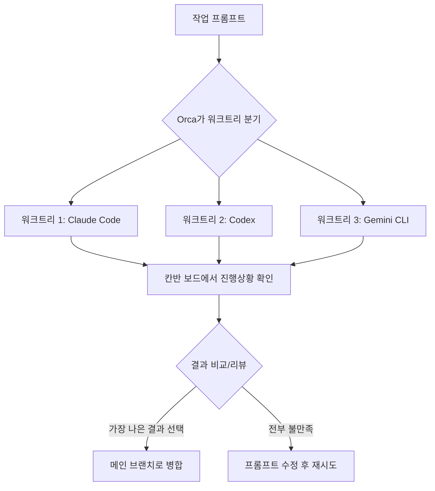

## 터미널 탭이 5개를 넘어가는 순간

Claude Code 하나 띄워놓고 작업하다가, 다른 기능도 병렬로 시켜보고 싶어서 터미널 탭을 하나 더 열고,
또 다른 브랜치에서 실험해보려고 `git worktree`를 하나 더 파고... 어느 순간 탭이 5개, 6개가 되어
있고 "어느 탭이 뭘 하고 있었더라"를 기억하는 게 코딩 자체보다 힘들어지는 순간이 옵니다.

이게 우연한 경험담이 아니라 요즘 개발 도구 업계가 통째로 반응하고 있는 문제입니다. AI 코딩
에이전트(Claude Code, Codex CLI 등)가 "혼자 코드를 짜주는 어시스턴트"에서 "동시에 여러 개를
굴리는 인력"으로 취급받기 시작하면서, 그걸 관리하기 위한 새 카테고리의 도구가 등장했습니다.
바로 **ADE(Agent Development Environment)** 입니다. 이번 글에서는 IDE와 ADE가 정확히 뭐가
다른지, 왜 지금 이 흐름이 뜨는지, 그리고 이 카테고리의 대표주자로 꼽히는 **Orca**를 실제
공식 자료 기준으로 파헤쳐봅니다.

## IDE와 ADE, 정의부터 다시 잡고 가자

**IDE(Integrated Development Environment)** 는 익숙하죠 — 에디터, 디버거, 터미널, 버전관리를
한 화면에 통합해서 **한 명의 개발자가 코드를 직접 작성**하는 걸 돕는 도구입니다. VS Code,
IntelliJ가 대표적입니다. 최근엔 여기에 AI 자동완성이나 인라인 채팅이 붙었지만, 여전히
"사람이 타이핑하는 걸 거든다"는 기본 구조는 그대로입니다.

**ADE(Agent Development Environment)** 는 전제가 다릅니다. 코드를 "짜는" 주체는 이미 AI
에이전트고, 사람은 그 에이전트들에게 작업을 배분하고, 여러 개가 동시에 낸 결과물을 비교하고,
승인하거나 반려하는 **관리자/리뷰어** 역할을 합니다. 하나의 프롬프트를 여러 에이전트에
동시에 던져서 결과를 비교한 뒤 가장 나은 것만 병합하는 식의 워크플로우가 기본 전제로
깔려 있습니다.

| | IDE (전통) | ADE |
|---|---|---|
| 코드를 직접 작성하는 주체 | 사람 | AI 에이전트(들) |
| 사람의 역할 | 작성 + 디버깅 | 지시 + 리뷰 + 병합 판단 |
| 기본 작업 단위 | 파일/함수 | 격리된 작업(워크트리) 단위 |
| 동시 작업 | 사실상 1개 컨텍스트 | 여러 에이전트 병렬 실행 |
| 상태 추적 | 열린 탭/브레이크포인트 | 칸반 보드 형태의 작업 카드 |

물론 이분법이 완벽히 딱 떨어지진 않습니다. Cursor나 Windsurf 같은 "AI-first IDE"는 IDE에
에이전트 기능을 강하게 얹은 중간 지점에 가깝고, 뒤에서 다룰 Google Antigravity도 VS Code
기반 에디터 위에 에이전트 오케스트레이션을 올린 형태라 IDE와 ADE의 경계에 걸쳐 있습니다.

## 왜 지금 이 흐름이 뜨는가

몇 가지 맞물린 변화가 있습니다.

1. **에이전트 CLI의 범람**: Claude Code, Codex CLI, Gemini CLI, OpenCode, Cursor CLI 등
   터미널에서 직접 돌리는 코딩 에이전트가 급격히 늘었습니다. 각자 자기 방식대로 세션과
   컨텍스트를 관리해서, 여러 개를 동시에 쓰려면 사람이 직접 tmux나 여러 터미널 창으로
   수동 관리해야 했습니다.
2. **git worktree의 재발견**: 같은 저장소에서 브랜치별로 완전히 독립된 작업 디렉터리를
   만드는 `git worktree`가, 에이전트를 서로 간섭 없이 병렬로 돌리기 위한 핵심 인프라로
   떠올랐습니다. Orca를 포함한 이 카테고리 도구 대부분이 이 위에서 동작합니다.
3. **빅테크의 참전**: Google이 2025년 11월 Gemini 3 발표와 함께 에이전트 오케스트레이션
   중심의 "Antigravity"를 내놓으면서, 개별 스타트업 실험을 넘어 플랫폼 차원의 트렌드로
   확인됐습니다.

이런 흐름을 종합해서 업계에서는 "개발자 한 명이 에이전트 3~5개를 동시에 굴리는" 것을
2026년의 새로운 작업 방식으로 이야기하는 시각이 있습니다. 다만 이건 도구 벤더/커뮤니티
쪽에서 나온 관측이라, 모든 개발자에게 보편적인 현실이라기보다는 "이 방향으로 도구가
빠르게 진화하고 있다" 정도로 받아들이는 게 정확합니다.


## Orca 파헤치기

**Orca**는 이 ADE 카테고리를 대표하는 오픈소스 도구로 자주 언급됩니다. 샌프란시스코의
**Stably Inc.**가 만들었고 Y Combinator의 지원을 받았습니다. MIT 라이선스로 완전히
공개되어 있고, GitHub 저장소(`stablyai/orca`)는 이 글 작성 시점 기준 1만 6천~1만 7천 개
사이의 스타를 받은 상태입니다(빠르게 늘고 있어 정확한 수치는 저장소에서 직접 확인하는
게 가장 정확합니다).

### 핵심 구조

- **병렬 워크트리(Parallel Worktrees)**: 작업(task) 하나마다 독립된 `git worktree`를
  자동으로 만들어줍니다. 하나의 프롬프트를 5개 에이전트에 동시에 뿌려서 결과를 비교하고,
  마음에 드는 것만 병합하는 식의 사용을 전제로 설계됐습니다.
- **내장 터미널 + 에디터**: Ghostty에서 영감받은 GPU 렌더링 터미널과, VS Code 기반 에디터를
  함께 품고 있습니다. 즉 ADE라고 해서 IDE 기능이 없는 게 아니라, 그 위에 오케스트레이션
  레이어를 얹은 구조에 가깝습니다.
- **Design Mode**: 워크트리별로 실제 크로미움(Chromium) 창을 띄워서, UI 요소를 클릭하면
  그 HTML/CSS와 스크린샷을 바로 에이전트에게 전달할 수 있습니다. "이 버튼 스타일 이상해"를
  말로 설명하는 대신 클릭 한 번으로 넘기는 셈입니다.
- **Git/PR·이슈 통합**: GitHub·Linear 연동으로 PR과 이슈를 앱 안에서 바로 보고, 디프에
  마크다운 코멘트를 남기면 그게 그대로 에이전트에게 전달됩니다.
- **모바일 컴패니언**: iOS/Android 앱으로 에이전트 진행 상황을 확인하고 원격으로 터미널
  작업을 이어갈 수 있습니다.
- **지원 에이전트**: Claude Code, Codex, OpenCode, Grok, Gemini, Cursor CLI, GitHub
  Copilot, Cline 등 25개 이상의 CLI 에이전트를 지원한다고 공식 사이트에 안내되어 있으며,
  "그 외 모든 CLI 에이전트"도 연결 가능하다고 되어 있습니다.

### 요금 구조

Orca 자체는 **MIT 라이선스로 무료**입니다. 대신 **BYOK(Bring Your Own Key)** 구조라서,
Claude Code나 Codex 등 실제로 돌리는 에이전트의 API/구독 비용은 각자 이미 갖고 있는
구독을 그대로 씁니다. 즉 Orca가 별도로 사용량 과금을 하는 게 아니라, "여러 에이전트를
띄우는 오케스트레이션 레이어"에만 값을 매기지 않는 구조입니다.

## 비슷한 도구들과 비교

이 카테고리를 다룬 국내외 비교 글들을 보면, Orca를 포함한 도구들을 대략 이렇게 나눕니다.

| 도구 | 유형 | 칸반 보드 | Git Worktree 격리 | 비고 |
|---|---|---|---|---|
| **Orca** | 전용 ADE (데스크톱 앱) | ✅ | ✅ | 멀티 에이전트 대규모 운용에 특화 |
| **Cline** | VS Code 확장 | ✅ | ✅ | 확장 형태라 가볍지만 VS Code 종속 |
| **Cursor** | AI-first IDE | ❌ | ❌ | 개인 코딩 보조 중심, 구독형 |
| **Windsurf** | AI-first IDE | ❌ | ❌ | Cursor와 유사한 포지션 |
| **Google Antigravity** | 에이전트 우선 플랫폼 | 에이전트 매니저 뷰 제공 | 워크스페이스 단위 병렬 | Gemini 3 계열 모델 기본 탑재, VS Code 기반 |
| **Claude Code / Codex CLI** | 터미널 에이전트 | ❌ | 수동 설정 시 가능 | Orca 등에서 "엔진"으로 얹어 쓰는 대상 |

여기서 중요한 포인트는, **Orca나 Cline처럼 "칸반 보드 + Git Worktree 격리"를 둘 다
갖춘 도구는 아직 소수**라는 겁니다. 이 조합이 바로 ADE를 전통 AI-IDE(Cursor, Windsurf류)와
구분 짓는 핵심 특징입니다. Cursor·Windsurf는 여전히 "한 세션에서 한 에이전트와 대화하며
코드를 짜는" 모델에 가깝고, Orca·Cline은 "여러 에이전트가 각자의 격리된 공간에서 동시에
일하고, 그 진행 상황을 칸반 카드처럼 한눈에 본다"는 모델입니다.



## 트레이드오프 분석: 나한테 ADE가 필요할까?

| 상황 | 그냥 IDE(+에이전트 확장)로 충분 | ADE(Orca류)가 유리 |
|---|---|---|
| 작업 성격 | 한 번에 하나의 기능/버그에 깊게 집중 | 서로 독립적인 작업 여러 개를 동시에 굴림(예: 프론트 컴포넌트 3개를 병렬 생성) |
| 팀 규모/역할 | 개인 코딩, 직접 타이핑도 자주 함 | 에이전트에게 위임하고 리뷰·병합에 시간을 더 씀 |
| 인프라 준비 | 별도 설정 없이 바로 시작하고 싶음 | 여러 API 구독(Claude/Codex/Gemini 등)을 이미 굴리고 있음 |
| 리뷰 방식 | 코드를 한 줄씩 직접 읽으며 작성 | "여러 후보 중 최선을 고르는" 방식이 익숙함 |

**한 줄 결론**: 지금 하는 작업이 "이 함수 하나를 정확히 고치는 것"이라면 IDE(+ 인라인 AI
보조)로 충분합니다. 반대로 "이 기능을 여러 방식으로 구현해보고 제일 나은 걸 고르고 싶다",
"서로 안 겹치는 작업 여러 개를 동시에 진행하고 싶다"는 상황이 반복된다면 ADE로 넘어갈
타이밍입니다. 두 도구가 배타적이지도 않습니다 — Orca 안에도 VS Code 기반 에디터가 들어있어서,
병렬로 안 돌릴 때는 그냥 평범한 IDE처럼 쓸 수 있습니다.


## 안티패턴 vs 권장 패턴

**안티패턴 — 터미널 탭으로 수동 병렬 관리**

에이전트를 여러 개 동시에 굴리고 싶을 때 흔히 이렇게 시작합니다.

```bash
# 터미널 1
git worktree add ../proj-featureA feature/a
cd ../proj-featureA && claude

# 터미널 2 (따로 열어서)
git worktree add ../proj-featureB feature/b
cd ../proj-featureB && claude

# 터미널 3 ... 이런 식으로 늘어남
```

동작은 합니다. 문제는 워크트리가 몇 개를 넘어가는 순간부터입니다. 어느 터미널이 어느
작업 중인지 기억이 안 나고, 다 끝난 워크트리를 정리(`git worktree remove`)하는 것도
잊어버리기 쉽고, 각 에이전트가 지금 뭘 하고 있는지 보려면 탭을 일일이 클릭해서 확인해야
합니다. 관리 비용이 작업 수에 비례해서 계속 커집니다.

**권장 패턴 — 오케스트레이션 레이어에 위임**

Orca 같은 ADE는 이 워크트리 생성·정리와 상태 추적을 도구 차원에서 대신 해줍니다. 사람은
"이 작업을 시작해줘"만 누르면 워크트리 생성부터 에이전트 실행까지 자동으로 이어지고,
진행 상황은 칸반 카드 하나로 요약되어 보입니다. 정확한 CLI 문법이나 GUI 조작 방식은
버전에 따라 달라질 수 있으니 공식 문서(GitHub 저장소의 README)를 확인하는 걸 권장하지만,
핵심 차이는 명확합니다 — **"병렬 작업의 부기(bookkeeping)를 사람이 할지, 도구가 할지"**
입니다. 작업이 2~3개 수준이면 체감 차이가 크지 않지만, 5개를 넘어가는 순간부터 이 차이가
급격히 벌어집니다.

## 흔한 오해 바로잡기

1. **"ADE는 IDE를 완전히 대체하는 도구다"** — 아닙니다. Orca도 내부에 VS Code 기반
   에디터를 그대로 품고 있습니다. ADE는 IDE 위에 "여러 에이전트를 오케스트레이션하는
   레이어"를 얹은 것에 가깝지, 에디터 자체를 새로 발명한 게 아닙니다.
2. **"에이전트를 여러 개 동시에 돌리면 무조건 더 빠르다"** — 병렬로 나온 결과물을
   비교하고 리뷰하는 데도 사람의 시간이 듭니다. 서로 완전히 독립적인 작업일 때는
   이득이 크지만, 결과물끼리 충돌 가능성이 있는 작업(같은 파일을 여러 에이전트가
   건드리는 경우)에서는 오히려 병합 충돌 정리 비용이 늘어날 수 있습니다.
3. **"오픈소스니까 완전히 공짜다"** — Orca 자체(오케스트레이션 레이어)는 MIT 라이선스로
   무료이지만, BYOK 구조라 Claude Code·Codex 등 실제로 돌리는 에이전트의 API/구독
   비용은 별도로 부담해야 합니다. "에이전트 여러 개를 동시에 돌린다"는 건 그만큼
   API 사용량도 동시에 여러 배로 나간다는 뜻이기도 합니다.

## 셀프 체크 질문

1. IDE와 ADE를 가르는 가장 핵심적인 구조적 차이는 무엇인가요?
2. Orca가 "칸반 보드 + Git Worktree 격리"를 둘 다 갖춘 몇 안 되는 도구로 꼽히는 이유는
   무엇인가요? 이 조합이 없다면 어떤 문제가 생길까요?
3. "에이전트를 병렬로 여러 개 돌리는 것"이 항상 이득은 아닌 상황은 어떤 경우일까요?

:::toggle 정답 보기
1. 코드를 직접 작성하는 주체가 사람(IDE)이냐 AI 에이전트(ADE)이냐입니다. 이 전제가
   바뀌면서 사람의 역할도 "작성자"에서 "지시자 겸 리뷰어"로 바뀌고, 도구가 지원해야
   하는 것도 에디팅 기능 중심에서 여러 작업의 상태 추적·격리·병합 판단 중심으로
   달라집니다.
2. Git Worktree 격리가 없으면 여러 에이전트가 같은 작업 디렉터리를 동시에 건드리면서
   서로의 변경사항을 덮어쓸 위험이 있고, 칸반 보드가 없으면 각 에이전트의 진행 상황을
   확인하려고 터미널을 일일이 열어봐야 합니다. 이 둘을 함께 갖춰야 "여러 작업을 안전하게
   병렬로 돌리면서도 한눈에 상태를 파악한다"는 ADE의 핵심 가치가 완성됩니다.
3. 여러 에이전트가 같은 파일이나 밀접하게 연관된 코드를 동시에 건드릴 가능성이 있는
   작업(예: 같은 모듈을 리팩터링하면서 동시에 기능도 추가하는 경우)에서는, 병렬로 나온
   결과물 사이에 충돌이 생기기 쉽고 그걸 정리하는 데 드는 시간이 병렬화로 아낀 시간보다
   커질 수 있습니다. 서로 독립적인 작업일 때만 병렬화의 이득이 온전히 남습니다.
:::

## 더 깊이 파고들기

- [Orca GitHub 저장소](https://github.com/stablyai/orca) — 가장 정확한 최신 기능 목록과
  설치 방법, 라이선스 원문을 확인할 수 있는 1차 자료입니다.
- [Orca 공식 사이트](https://www.onorca.dev/) — 기능별 소개와 데스크톱 앱 다운로드 링크가
  정리되어 있습니다.
- [Google Antigravity 공식 블로그](https://developers.googleblog.com/build-with-google-antigravity-our-new-agentic-development-platform/) —
  빅테크가 같은 문제를 어떻게 풀고 있는지 비교하며 읽으면 ADE 카테고리 전체를 더 입체적으로
  이해할 수 있습니다.
- Claude Code, Codex CLI 등 개별 에이전트 CLI의 공식 문서 — Orca는 이런 CLI 에이전트를
  "엔진"으로 얹어 쓰는 오케스트레이션 레이어이므로, 결국 각 에이전트 자체의 특성을 아는 게
  ADE를 잘 쓰는 전제 조건입니다.
