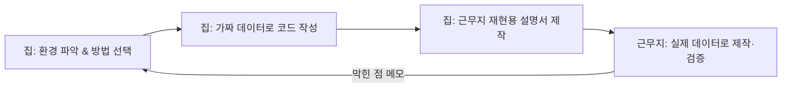

> 🤖 AI를 써보긴 했는데 "생각보다 별로네" 싶었던 분, 매번 원하는 답이 안 나와 답답했던 분,
> 코드나 새로운 지식을 AI로 제대로 공부해보고 싶은 직장인을 위한 글입니다.
> 개발자가 아니어도 읽을 수 있게 썼습니다.

---

## AX가 뭔가요 — AI는 "매우 빠른 인턴"입니다

**AX(AI Transformation)** 는 단순히 AI 도구를 "쓰는" 것을 넘어, 일하는 방식 자체를 AI 중심으로 바꾸는 것을 말합니다.

엑셀을 배웠다고 일 잘하는 사람이 되는 게 아니라, 엑셀로 *무엇을* 자동화할지 아는 사람이 일을 잘하듯이, AI도 똑같습니다.

핵심은 이겁니다. AI는 "답을 아는 기계"가 아니라 **"내가 시키는 대로 생각해주는 매우 빠른 인턴"** 입니다. 인턴에게 일을 잘 시키는 사람이 결과물도 좋습니다.


---

## 프롬프트의 기본 공식: 역할 + 맥락 + 요청 + 형식

프롬프트 엔지니어링은 거창한 기술이 아닙니다. **"어떻게 물어봐야 원하는 답이 나오는가"** 에 대한 요령의 모음입니다.

가장 먼저 외울 공식은 이것 하나입니다.

> **"너는 [역할]이야. [상황/배경]인데, [무엇]을 해줘. [형식/분량/톤]으로."**

각 요소가 왜 중요한지, 그리고 나머지 핵심 팁을 짧게 정리하면 이렇습니다.

- **역할 부여**: "너는 10년차 B2B 마케터야" 처럼 정체성을 주면 답변의 관점과 수준이 달라집니다.
- **맥락 제공**: 배경·목적·대상·제약조건을 알려줄수록 답이 정확해집니다.
- **형식 지정**: "표로", "불릿 5개로", "200자 이내로", "정중한 이메일 톤으로".
- **예시 제공(Few-shot)**: 원하는 스타일 샘플을 1~2개 붙이면 백 마디 설명보다 강력합니다.
- **단계적 사고**: 복잡한 문제는 "단계별로 차근차근 생각해서 풀어줘"라고 하면 정확도가 올라갑니다.
- **대화로 완성**: 첫 답은 초안일 뿐입니다. "더 짧게", "이 부분만 다시"로 계속 다듬으세요.

같은 질문도 역할과 맥락을 주면 결과가 확 달라집니다.

| 그냥 물어보기 | 역할·맥락을 준 프롬프트 |
| --- | --- |
| 마케팅 문구 좀 써줘 | 너는 10년차 B2B SaaS 마케터야. 40대 중소기업 대표를 타깃으로 한 광고 문구 3개를 써줘 |
| 이 계약서 봐줘 | 너는 계약 검토 경험이 많은 변호사야. 이 계약서에서 우리 회사에 불리할 수 있는 조항을 찾아줘 |

좋은 프롬프트는 결국 **신입에게 일을 시키는 것과 같습니다.** "보고서 써와"라고만 하면 엉뚱한 게 나오지만, "누구에게, 며칠까지, 몇 장으로, 어떤 톤으로"를 알려주면 제대로 나옵니다.

---

## 복붙해서 쓰는 실전 템플릿

아래는 그대로 복사해서 대괄호 부분만 바꿔 쓰면 되는 템플릿입니다.

**이메일 작성**

```text
너는 커뮤니케이션에 능숙한 직장인이야.
아래 상황에 맞는 이메일을 정중하지만 명확한 톤으로 써줘.
- 받는 사람: [예: 협력사 담당자]
- 목적: [예: 납품 일정 2주 연기 요청]
- 꼭 포함할 내용: [예: 사과, 변경 사유, 새 일정 제안]
- 분량: 10줄 이내
```

**자료/데이터 요약**

```text
아래 내용을 읽고,
1) 핵심 3줄 요약
2) 주요 숫자/사실
3) 내가 상사에게 보고할 때 강조할 포인트
로 정리해줘.

[텍스트 또는 표 붙여넣기]
```

**회의록 정리**

```text
아래 회의 내용을 정리해줘.
- 결정된 사항
- 담당자별 할 일(To-do)과 기한
- 다음 회의에서 논의할 안건
표 형태로.

[회의 메모 붙여넣기]
```

**어려운 개념 쉽게 이해하기**

```text
[개념/용어]를 나는 [비전공자/완전 초보]야.
1) 비유를 들어서 쉽게 설명하고
2) 실제 업무에서 어떻게 쓰이는지 예를 들고
3) 자주 하는 오해 하나를 짚어줘.
```

---

## AI로 코드·기술 공부하기

독학할 때 가장 큰 장벽은 "모르는 걸 물어볼 사람이 없다"는 것입니다. AI는 24시간 대기하는 개인 과외 선생님입니다.

다만 아무렇게나 물으면 아무 답이나 나옵니다. 체계적으로 쓰는 법이 있습니다.

**학습 로드맵부터 짜기** — "나는 [현재 수준]이고 [목표]를 하고 싶어. 4주 학습 계획을 주차별로, 배울 개념·실습 과제·예상 소요 시간을 표로 짜줘."

**코드를 한 줄씩 이해하기** — 모르는 코드는 통째로 보지 말고 "한 줄씩 주석을 달아 설명해줘. 전체가 뭘 하는지 먼저 1문장으로, 그다음 각 줄 역할을" 이라고 물어보세요.

**에러가 났을 때** — 에러 메시지는 잘라내지 말고 **전체를 통째로** 붙여넣으세요. 사람에겐 암호 같아도 AI에겐 가장 중요한 단서입니다.

가장 강력한 학습법은 설명을 듣는 게 아니라 **스스로 풀 때** 늡니다.

```text
방금 배운 [주제]에 대해 나를 퀴즈로 테스트해줘.
- 한 번에 한 문제씩
- 내가 답하면 채점하고, 틀리면 왜 틀렸는지 설명
- 쉬운 것부터 어려운 것 순서로
```

이 "이해 → 실습 → 검증 → 응용" 흐름을 사이클로 돌리면 됩니다.

| 단계 | 하는 일 | AI에게 시킬 것 |
| --- | --- | --- |
| 1. 이해 | 개념/코드 파악 | "쉽게 설명해줘", "비유로" |
| 2. 실습 | 직접 따라 쓰기 | "연습 문제 내줘" |
| 3. 검증 | 스스로 설명/테스트 | "나를 퀴즈로 테스트해줘" |
| 4. 응용 | 내 문제에 적용 | "내 상황 [X]에 맞게 바꿔줘" |

한 가지 주의. AI가 짠 코드를 그냥 복붙하지 마세요. 돌아가는 것과 이해하는 것은 다릅니다. 또한 AI는 가끔 그럴듯하지만 틀린 코드(환각)를 주므로 **반드시 직접 실행해 확인**해야 합니다.

---

## 실전: 집에서 배우고, 근무지에서 만드는 자동화

인터넷·AI 도구를 쓸 수 없는 보안 근무 환경(예: 폐쇄망)이라면, **집에서 미리 공부하고 코드를 만들어 둔 뒤 근무지에서 제작·적용**해야 합니다.

이 상황의 핵심은 하나입니다. 근무지엔 AI가 없으니, 집에서 만드는 결과물은 "그냥 돌아가는 코드"가 아니라 **"근무지에서 혼자 다시 만들고 고칠 수 있는 코드 + 설명서"** 여야 합니다.


가장 먼저 할 일은 **근무지 환경 파악**입니다. 파이썬을 설치할 수 있는지, 안 된다면 이미 깔린 엑셀 VBA·파워쿼리로 가능한지, 관리자 권한은 있는지를 확인하고 그 정보를 AI에게 알려줘야 현실적인 코드가 나옵니다.

> 파이썬 설치가 막혀 있다면 **엑셀 VBA(매크로)** 가 현실적인 대안입니다. 엑셀만 있으면 추가 설치 없이 근무지에서 바로 돌릴 수 있어 폐쇄망에서 특히 유리합니다.

전체 흐름은 이렇게 4단계입니다.



특히 **STEP 2에서는 실제 업무 데이터를 절대 집으로 가져오면 안 됩니다.** 보안 규정 위반일 뿐 아니라 AI에 입력하면 외부로 나갑니다. 반드시 직접 만든 샘플·가짜 데이터(예: "홍길동, 010-0000-0000")로 개발하세요.

그리고 **STEP 3이 이 워크플로우의 진짜 핵심**입니다. "위 코드를 근무지에서 나 혼자 재현·수정할 수 있게 작업 설명서를 만들어줘 — 요약, 줄마다 주석, 설치·실행 순서, 자주 나는 에러와 해결법, 나중에 바꿀 부분 위치까지" 라고 시키고, **스스로 설명할 수 있을 때까지** 되물어보세요. 근무지에서 막혔을 때 도와줄 AI가 없으니까요.

---

## 반드시 지킬 3가지 원칙

AI를 업무에 쓸 때 이 세 가지는 기술보다 먼저입니다.

1. **회사 기밀·개인정보를 함부로 입력하지 않습니다.** 고객 명단, 계약 금액, 미공개 실적 등은 회사의 AI 사용 정책을 먼저 확인하세요. 보안 근무자라면 데이터·문서의 외부 반출과 매체 반입 규정을 반드시 지켜야 합니다.
2. **AI의 답을 맹신하지 않습니다.** AI는 자신 있게 틀립니다. 숫자·인용·법률·의료 정보는 원출처로 재확인하세요.
3. **최종 판단과 책임은 사람의 몫입니다.** AI는 초안과 아이디어를 주는 도구이지, 결정을 대신하는 존재가 아닙니다.

---

## 셀프 체크 질문

1. 같은 질문인데 AI 답변 품질이 들쭉날쭉하다면, 프롬프트에서 가장 먼저 보강할 요소는 무엇일까요?
2. 폐쇄망 근무 환경에서 파이썬 설치가 불가능할 때, 추가 설치 없이 자동화를 구현할 수 있는 현실적인 대안은?
3. AI로 코드를 공부할 때 "설명을 듣는 것"보다 실력이 더 빨리 느는 방법은 무엇일까요?

:::toggle 정답 보기
1. **맥락(Context)** 입니다. 역할·배경·목적·제약조건을 구체적으로 주면 답의 편차가 크게 줄어듭니다. "역할 + 맥락 + 요청 + 형식" 공식을 떠올리세요.
2. **엑셀 VBA(매크로)** 나 파워쿼리처럼 이미 설치된 오피스 기능을 활용하는 것입니다. 별도 설치 없이 근무지에서 바로 실행할 수 있습니다.
3. AI에게 **"나를 퀴즈로 테스트해줘"** 라고 시켜 스스로 답하고 채점받는 것, 그리고 배운 내용을 내가 설명하고 AI가 교정하게 하는 **파인만 기법** 입니다.
:::

---

## 마무리

AI를 잘 쓰는 사람은 *답을 잘 아는 사람*이 아니라 *질문을 잘하는 사람*입니다.

오늘 딱 세 가지만 해보세요. 자주 쓰는 이메일 하나를 위 템플릿으로 시켜보기, 최근 이해 안 됐던 개념 하나를 "비유로 설명해줘"로 물어보기, 지금 하는 반복 업무 하나를 "이거 자동화할 방법 있어?"라고 물어보기.

그 작은 습관이 "AI를 써본 사람"과 "AI로 일하는 사람"을 가릅니다.
