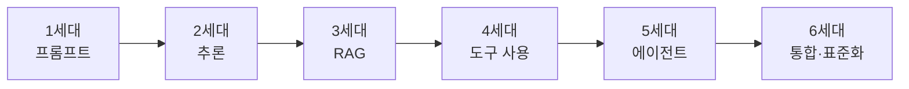

> 🧭 불과 2~3년 전까지만 해도 "프롬프트를 잘 쓰는 법"이 AI 활용의 전부였지만,
> 지금은 AI가 자료를 찾고, 도구를 쓰고, 스스로 일을 척척 진행합니다.
> 큰 흐름을 알면 "지금 뭘 배워야 하는지"가 보입니다.

---

## 한 줄 요약: 대화 상대에서 일하는 동료로

AI 활용의 역사는 **"말을 잘 걸어야 하는 대화 상대"** 에서 **"알아서 일을 해오는 동료"** 로 바뀌어온 과정입니다.

큰 흐름을 한 줄로 이으면 이렇습니다.

> 질문을 잘하기 → 생각을 깊게 하기 → 지식을 연결하기 → 도구를 쓰게 하기 → 스스로 일하게 하기

이 단계들은 이전 것을 버리고 새것으로 가는 게 아닙니다. 벽돌처럼 쌓입니다. 지금도 프롬프트를 잘 쓰는 능력(1세대)은 여전히 가장 중요한 기본기입니다.

---

## 1세대 — 프롬프트 엔지니어링: "질문을 잘하기"

2022년 말 ChatGPT가 등장하면서 누구나 AI와 대화하게 됐습니다. 이때 발견한 사실은 **똑같은 AI라도 어떻게 물어보느냐에 따라 답이 하늘과 땅 차이** 라는 것이었습니다.

역할을 부여하고("너는 변호사야"), 예시를 보여주고, 원하는 형식을 지정하는 요령이 여기서 나왔습니다.

한계도 분명했습니다. AI는 학습한 지식 안에서만 답했고, 최신 정보를 몰랐으며, 그럴듯하게 틀리기도 했고(환각), 계산이나 실제 작업은 못 했습니다. "말은 잘하는데 행동은 못 하는" 단계였죠.

## 2세대 — 추론(Reasoning): "생각을 깊게 하기"

또 하나의 발견은 **"단계별로 차근차근 생각해봐(Chain of Thought)"라고 시키면 정답률이 확 올라간다** 는 것이었습니다. 복잡한 계산·논리 문제에서 특히요.

이 아이디어가 발전해, 최근에는 아예 **답하기 전에 스스로 오래 '생각'하는 추론 모델**이 등장했습니다. 사용자가 시키지 않아도 내부적으로 여러 경로를 따져보고 답을 내놓습니다.

덕분에 어려운 분석·기획·문제풀이도 맡길 만해졌지만, "어떤 방향으로 생각할지"(맥락·조건)는 여전히 사람이 줘야 합니다.

---

## 3세대 — 지식 연결(RAG): "모르는 건 찾아서 답하기"

AI의 가장 큰 약점은 "학습 시점 이후의 일은 모른다", "우리 회사 내부 자료는 당연히 모른다"였습니다. 이를 해결한 것이 **RAG(검색 증강 생성)** 입니다.

작동 방식은 간단합니다. 질문이 들어오면 관련 문서를 **먼저 찾아서**, 그 내용을 AI에게 같이 건네주고, AI가 그 자료를 **근거로** 답합니다.

"우리 회사 규정 문서를 학습한 챗봇", "내 PDF에게 질문하기" 같은 서비스가 전부 이 원리입니다. 환각이 줄고, 출처를 댈 수 있게 된 것이 핵심 변화입니다.

## 4세대 — 도구 사용(Tool Use): "직접 행동하기"

말만 하던 AI가 **실제 도구를 쓰기 시작**한 단계입니다. AI가 필요하다고 판단하면 계산기를 쓰고, 웹을 검색하고, 코드를 실행하고, 외부 프로그램(캘린더·이메일·사내 시스템)을 호출합니다.

"파리 날씨 알려줘"라고 하면 아는 척 지어내는 게 아니라, **실제로 날씨 API를 호출해서** 답하는 식이죠. AI가 "아는 것"에서 **"할 수 있는 것"** 으로 넘어온 결정적 전환점입니다.

## 5세대 — AI 에이전트: "스스로 일하기"

도구를 쓸 수 있게 되자 자연스러운 다음 단계가 왔습니다. **목표만 주면 AI가 스스로 계획을 세우고, 여러 단계를 순서대로 실행하는 것.** 이것이 **에이전트(Agent)** 입니다.

예를 들어 "이 데이터 분석해서 보고서 만들어줘"라고 하면, 에이전트는 데이터를 읽고 → 코드를 짜서 분석하고 → 그래프를 그리고 → 결과를 글로 정리하는 과정을 알아서 반복합니다. 막히면 스스로 고쳐가면서요.

> 코딩 분야에서 가장 먼저 실용화됐습니다. Claude Code, Codex, Cursor 같은 도구는 "이 기능 만들어줘" 한마디에 파일을 읽고, 코드를 쓰고, 실행해 테스트하고, 에러를 고치는 것까지 스스로 합니다.

다만 에이전트는 스스로 행동하는 만큼, 무엇을 허용할지(파일 삭제·메일 발송 등)를 사람이 통제하고 확인하는 것이 중요해졌습니다. "자율성"과 "통제"의 균형이 이 시대의 숙제입니다.

## 6세대 — 통합과 표준화: MCP · 멀티모달 · 메모리

가장 최근 흐름은 **"흩어진 것들을 하나로 연결"** 하는 것입니다.

- **멀티모달**: 텍스트뿐 아니라 이미지·음성·영상·화면을 함께 이해하고 만들어냅니다.
- **긴 컨텍스트와 메모리**: 책 몇 권 분량을 한 번에 읽고, 지난 대화를 기억합니다.
- **MCP(Model Context Protocol)**: AI와 외부 도구·데이터를 잇는 표준 규격입니다. USB-C처럼, 한 번 만들어두면 여러 AI가 같은 방식으로 노션·구글드라이브·사내 시스템에 연결됩니다.

---

## 예전과 지금, 무엇이 달라졌나

| 구분 | 예전 (초기) | 지금 |
| --- | --- | --- |
| AI의 역할 | 질문에 답하는 상대 | 일을 대신 해주는 동료 |
| 사람이 하는 일 | 완벽한 질문을 짜내기 | 목표·맥락을 주고 결과를 검토하기 |
| 정보 출처 | AI가 외운 지식뿐 | 실시간 검색·내 문서·도구 |
| 할 수 있는 일 | 글쓰기·요약·대화 | 분석·코딩·자동화·실제 작업 실행 |

역설적이게도, AI가 똑똑해질수록 사람의 역할은 더 중요해집니다. 무엇을 시킬지 정하고(목표), 상황을 설명하고(맥락), 결과가 맞는지 판단하는(검토) 것은 여전히 사람의 몫이니까요.

## 핵심 용어 사전

| 용어 | 쉬운 뜻 |
| --- | --- |
| 프롬프트 | AI에게 주는 지시/질문 |
| Chain of Thought | 단계적으로 생각하게 시키기 |
| 추론 모델(Reasoning) | 답하기 전에 스스로 오래 생각하는 AI |
| 환각(Hallucination) | AI가 그럴듯하게 지어낸 거짓말 |
| RAG | 관련 문서를 찾아와 근거로 답하기 |
| 도구 사용(Tool Use) | AI가 검색·계산·프로그램을 직접 쓰기 |
| 에이전트(Agent) | 목표만 주면 여러 단계를 스스로 실행 |
| 멀티모달 | 글·이미지·음성·영상을 함께 다루기 |
| MCP | AI와 외부 도구를 잇는 표준 규격 |

---

## 셀프 체크 질문

1. RAG(검색 증강 생성)가 해결하려는 AI의 대표적 약점 두 가지는 무엇인가요?
2. "도구 사용(Tool Use)"과 "에이전트(Agent)"는 어떻게 다른가요?
3. AI가 발전할수록 오히려 더 중요해지는 사람의 역할은 무엇인가요?

:::toggle 정답 보기
1. ① 학습 시점 이후의 **최신 정보를 모른다는 점**, ② **회사 내부 자료 등 비공개 데이터를 모른다는 점** 입니다. RAG는 관련 문서를 찾아와 근거로 답하게 해 환각도 줄여줍니다.
2. **도구 사용**은 AI가 검색·계산·API 호출 등 개별 도구를 실행하는 능력입니다. **에이전트**는 그 도구들을 활용해 목표 달성까지 **여러 단계를 스스로 계획·반복 실행**하는 상위 개념입니다.
3. **방향을 정하는 일** 입니다. 무엇을 시킬지(목표), 어떤 상황인지(맥락), 결과가 맞는지(검토)를 판단하는 것은 어떤 세대의 AI가 와도 사람의 몫입니다.
:::

---

## 마무리

도구는 계속 바뀌지만, **"AI에게 무엇을·왜·어떻게 시킬지 아는 사람"** 은 늘 앞서갑니다.

새로 나오는 기능 이름을 전부 좇을 필요는 없습니다. 이 흐름의 방향(질문 → 추론 → 연결 → 행동 → 자율)을 이해하고, 프롬프트 기본기 위에 RAG·도구·에이전트를 하나씩 경험해보세요.

트렌드를 쫓기보다, 방향을 정하는 힘을 기르는 것 — 그게 어느 세대에나 통하는 AI 활용법입니다.
