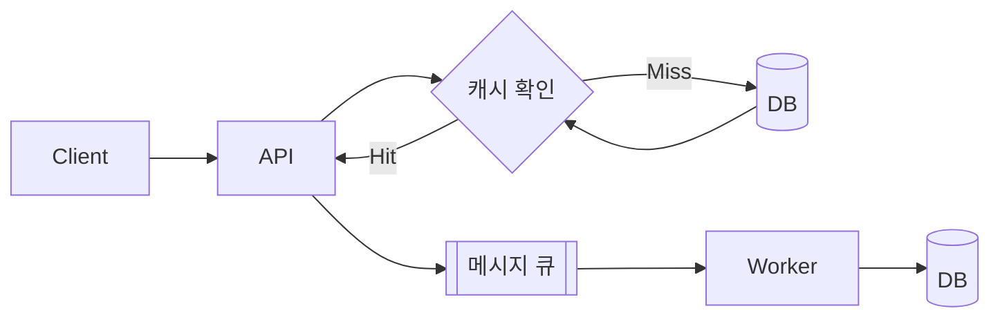

> "트래픽이 폭주해서 서버가 느려지면 어떻게 하시겠어요?"라는 질문에 "Redis 붙이겠습니다"부터
> 튀어나온다면 절반짜리 답변입니다. 캐시와 메시지 큐(MQ)는 애초에 서로 다른 병목을
> 겨냥하는 기술이라, 원인을 모르고 고르면 엉뚱한 약을 처방하는 셈이 됩니다.

---

## 밴더보다 먼저: 병목이 읽기인지 쓰기인지부터

Redis나 Kafka 같은 특정 밴더 이름부터 꺼내는 건 지엽적인 접근입니다. 그 전에 시스템의
병목이 **읽기(Read)**인지 **쓰기(Write)**인지부터 파악해야, 어느 자리에 무엇을
꽂을지가 정해집니다.



위 그림처럼 캐시는 **DB 앞단**에서 읽기 경로를 가로채고, MQ는 **API와 워커 사이**에서
쓰기 경로를 비동기로 흘려보냅니다. 이 위치 차이가 두 기술의 역할을 가릅니다.


## 캐시(Cache): 읽기 병목을 줄이는 재사용 저장소

캐시는 반복되는 조회나 무거운 계산 결과를 미리 저장해두고 재사용하는 기술입니다.
요청이 오면 캐시에 데이터가 있는지 먼저 확인(Cache Hit)하고, 없으면 DB에서 조회한 뒤
캐시에 채워 넣습니다(Cache Miss). 이렇게 "먼저 캐시를 보고, 없으면 DB를 보고 캐시를
채운다"는 흐름을 **Cache-Aside(Look-Aside) 패턴**이라고 부릅니다.

DB의 Select 작업이 몰려 병목이 생길 때 DB 앞단에 두는 것이 정석이고, 대표 기술은
Redis입니다.

## MQ(메시지 큐): 쓰기 병목을 비동기로 흘려보내는 대기열

MQ는 즉시 처리하기 무거운 요청을 대기열에 넣고 비동기로 처리해, 시스템 간 결합도를
낮추는 기술입니다. 클라이언트 요청을 큐에 넣은 뒤 바로 응답을 돌려주고, 백그라운드의
워커가 큐에서 메시지를 꺼내 DB 저장이나 이메일 발송 같은 무거운 작업을 순차 처리합니다.

주문·결제처럼 복잡한 Insert/Update로 지연이 생길 때 API와 워커 사이에 두며, 대표
기술은 Kafka입니다.

---

## 캐시 vs MQ, 언제 무엇을 쓰나

| 구분 | 캐시(Cache) | 메시지 큐(MQ) |
| --- | --- | --- |
| 목적 | 읽기 성능 최적화 | 쓰기/무거운 작업의 비동기 처리 |
| 배치 위치 | DB 앞단 | API와 워커 사이 |
| 병목 유형 | Select 위주 | Insert/Update 등 쓰기 위주, 처리 지연 |
| 대표 기술 | Redis | Kafka |
| 새로 생기는 문제 | 데이터 정합성, 만료 정책 | 시스템 복잡도 증가, 응답 지연 |

면접에서는 이 표를 한 문장으로 압축해 답하면 좋습니다.

> "먼저 모니터링 툴로 병목 지점을 확인하겠습니다. 조회 부하가 크면 Redis 같은 캐시로
> DB 부하를 줄이고, 처리 지연이 문제라면 Kafka 같은 MQ로 작업을 비동기 전환해
> 부하를 조절하겠습니다."

## 안티패턴 vs 권장 패턴: 캐시 스탬피드 막기

캐시를 붙였다고 끝이 아닙니다. 인기 있는 캐시 키 하나가 만료되는 순간, 동시에 들어온
요청 전부가 캐시 미스로 DB에 몰리는 **캐시 스탬피드(Cache Stampede)**가 생길 수
있습니다.

```javascript
// 안티패턴: 캐시 미스가 나면 각 요청이 개별적으로 DB를 조회
async function getUser(id) {
  const cached = await redis.get(`user:${id}`);
  if (cached) return JSON.parse(cached);

  const user = await db.query('SELECT * FROM users WHERE id = ?', [id]);
  // 동시에 100개 요청이 미스를 겪으면 DB도 100번 조회당한다
  await redis.set(`user:${id}`, JSON.stringify(user), 'EX', 60);
  return user;
}
```

```javascript
// 권장 패턴: 이미 조회 중인 요청은 그 결과를 함께 기다린다(in-flight 공유)
const inFlight = new Map();

async function getUser(id) {
  const cached = await redis.get(`user:${id}`);
  if (cached) return JSON.parse(cached);

  if (inFlight.has(id)) return inFlight.get(id);

  const promise = (async () => {
    const user = await db.query('SELECT * FROM users WHERE id = ?', [id]);
    await redis.set(`user:${id}`, JSON.stringify(user), 'EX', 60);
    return user;
  })();

  inFlight.set(id, promise);
  try {
    return await promise;
  } finally {
    inFlight.delete(id);
  }
}
```

같은 키를 향한 요청들이 DB 조회를 각자 반복하는 대신 진행 중인 조회 하나의 결과를
나눠 받으므로, DB로 몰리는 요청 수가 크게 줄어듭니다.

## 흔한 오해 바로잡기

1. **"캐시를 붙이면 무조건 빨라진다"** — 자주 바뀌어서 캐시 히트율이 낮은 데이터나,
   캐시 조회 자체의 네트워크 왕복 비용이 DB 조회보다 크지 않은 경우엔 효과가 제한적일
   수 있습니다. 캐시는 "같은 데이터가 반복해서 읽히는" 상황에서 힘을 발휘합니다.
2. **"MQ에 넣으면 메시지 처리 순서가 항상 보장된다"** — 브로커 구성에 따라 다릅니다.
   Kafka는 같은 파티션 안에서만 순서를 보장하며, 여러 파티션에 걸쳐 있으면 전체
   순서까지는 보장하지 않는다고 알려져 있습니다. 순서가 중요한 메시지는 같은 파티션
   키(예: 주문 ID)로 묶어야 합니다.
3. **"캐시와 MQ는 서로 대체 가능한 기술이다"** — 목적 자체가 다릅니다. 하나는 읽기
   최적화, 하나는 쓰기·비동기 처리 최적화이고, 트래픽이 큰 서비스는 병목 위치에 따라
   보통 둘 다 함께 씁니다.

---

## 실무 후속 질문 모범 답안

**MQ로 비동기 처리한 뒤, 사용자에게 최종 완료를 어떻게 알릴까요?** 클라이언트가 상태
API를 주기적으로 조회하는 **폴링**, 서버가 연결을 유지한 채 알려주는 **WebSocket/SSE
푸시**, 완료 시 등록된 URL을 호출하는 **웹훅(Webhook)**, 또는 이메일·앱 푸시 알림
중에서 서비스의 UX 요구사항에 맞게 고릅니다.

**캐시 스탬피드는 앞서 본 in-flight 공유 말고 다른 해법도 있나요?** 네, 두 가지가
자주 쓰인다고 알려져 있습니다. 만료 시간에 약간의 무작위 값(지터)을 더해 인기 키들이
한꺼번에 만료되지 않게 하는 방법, 그리고 실제 만료 전에 백그라운드에서 미리 값을
갱신해두는 논리적 만료(soft TTL) 방식입니다.

**Redis는 캐시 전용인가요, MQ 역할도 하나요?** Redis는 List나 Pub/Sub, Streams 같은
자료구조로 메시지 브로커 역할도 할 수 있습니다(Redis Streams는 컨슈머 그룹까지
지원합니다). 다만 디스크 기반 영속성이나 대용량 처리량, 메시지 재처리 같은 부분은
Kafka처럼 처음부터 그 목적으로 설계된 전용 MQ와 설계 지향점이 다르므로, 완전한
대체재로 보긴 어렵습니다.

## 셀프 체크 질문

1. 캐시와 MQ는 각각 어떤 병목(읽기/쓰기)을 겨냥한 기술인가요?
2. Cache-Aside 패턴에서 Cache Hit과 Cache Miss 시 흐름을 각각 설명할 수 있나요?
3. 캐시 스탬피드가 왜 생기고, 어떻게 막을 수 있나요?

:::toggle 정답 보기
1. 캐시는 Select 등 읽기 병목을, MQ는 Insert/Update 같은 쓰기 작업이나 무거운 처리로
   인한 지연(쓰기·비동기 병목)을 겨냥합니다.
2. Cache Hit이면 DB를 거치지 않고 캐시에서 바로 값을 반환합니다. Cache Miss면 DB에서
   조회한 뒤 그 값을 캐시에 채워 넣어, 다음 요청부터는 캐시에서 반환되도록 합니다.
3. 인기 있는 캐시 키가 만료되는 순간 동시에 들어온 요청 전부가 캐시 미스로 DB에 몰려
   생깁니다. 진행 중인 조회 결과를 다른 요청과 공유(in-flight 공유)하거나, 만료
   시간에 지터를 주거나, 만료 전에 미리 값을 갱신하는 방식으로 막을 수 있습니다.
:::

## 더 깊이 파고들기

- [Redis EXPIRE 공식 문서](https://redis.io/docs/latest/commands/expire/) — 만료 시간(TTL) 옵션의 정확한 동작을 1차 출처로 확인할 수 있습니다.
- [Apache Kafka 공식 문서](https://kafka.apache.org/documentation/) — 파티션과 메시지 순서 보장이 실제로 어떤 조건에서 성립하는지 전체 스펙을 다룹니다.
- [Redis Streams 공식 문서](https://redis.io/docs/latest/develop/data-types/streams/) — Redis가 컨슈머 그룹 기반 메시지 큐 역할을 어떻게 수행하는지 확인할 수 있습니다.

## 마치며

캐시와 MQ는 경쟁 관계가 아니라 **서로 다른 병목을 겨냥하는 도구**입니다. 조회가
느리면 캐시를, 처리가 밀리면 MQ를 놓는다는 원칙만 기억해도 절반은 맞힌 셈입니다.
나머지 절반은 도입 이후의 정합성·순서 보장·완료 알림 같은 디테일에서 갈리니, 이
글에서 다룬 후속 질문들까지 챙겨두면 면접에서든 실무에서든 든든할 거예요. 📬
