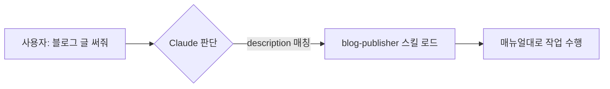

> 🤖 "AI한테 일 시켰더니 자꾸 똑같은 설명을 반복하게 되네..." 라고 느껴본 적 있나요?
> 그 반복을 끝내주는 게 바로 **Claude Code의 스킬(Skills)** 입니다.

## 들어가며: 신입에게 매번 똑같은 설명, 지치지 않나요?

새 직원이 들어올 때마다 "우리 회사 보고서는 이 양식으로, 폰트는 이거, 결재는 여기로..." 를 처음부터 설명하는 상황을 상상해 보세요. 한두 번은 괜찮지만 매번이면 진이 빠집니다.

AI도 똑같습니다. 똑똑하긴 한데, **우리 팀만의 규칙이나 반복 작업**은 매번 처음부터 떠먹여 줘야 했죠. **Claude Code의 스킬(Skills)** 은 이 문제를 우아하게 해결합니다. 한 줄로 요약하면 이렇습니다.

> **스킬 = AI에게 한 번 쥐여주면 계속 써먹는 '업무 매뉴얼 + 도구 세트'**


## 그래서 Claude Code가 뭔데요?

먼저 큰 그림부터. **Claude Code**는 Anthropic이 만든 AI 코딩 도구로, 터미널·IDE·앱에서 동작하는 'AI 페어 프로그래머'입니다. 단순히 코드를 짜주는 걸 넘어, 파일을 읽고 수정하고, 명령어를 실행하고, 여러 단계를 스스로 처리하는 **에이전트(agent)** 죠.

여기서 한 단계 더 나아간 게 **스킬**입니다. 기본기가 좋은 직원에게 *우리 회사 전용 매뉴얼*을 쥐여주는 것과 같아요.

## 스킬의 정체: 사실은 그냥 '폴더' 하나

거창해 보이지만, 스킬의 실체는 의외로 소박합니다. **`SKILL.md` 라는 설명서 파일을 담은 폴더** 하나가 전부예요.

```
my-skill/
├── SKILL.md          ← 핵심: "이 스킬은 뭐고 언제/어떻게 쓰는지"
├── scripts/          ← (선택) 실제로 실행할 파이썬·셸 스크립트
└── references/       ← (선택) 추가 설명, 예시, 양식 등
```

`SKILL.md` 의 맨 위에는 이런 **명함(메타데이터)** 이 붙습니다.

```markdown
---
name: blog-publisher
description: 블로그 글을 작성하고 노션/티스토리에 발행하는 스킬.
             "블로그 글 써줘", "포스팅 발행" 같은 요청에 사용.
---

# 실제 작업 지침을 여기에 마크다운으로...
```

## 핵심 마법 ①: '알아서' 꺼내 쓴다 (Model-invoked)

스킬의 진짜 매력은 **내가 일일이 호출하지 않아도 된다는 점**입니다.

슬래시 명령어(`/명령`)는 *사람이 직접* 버튼을 누르는 방식이라면, 스킬은 **AI가 상황을 보고 알아서** 적절한 스킬을 꺼내 씁니다. 위 예시처럼 description에 "블로그 글 써줘 같은 요청에 사용" 이라고 적어두면, 내가 "블로그 글 하나 써줘" 라고 말하는 순간 Claude가 *"아, 이건 blog-publisher 스킬 쓰면 되겠네"* 하고 스스로 판단하는 거죠.



## 핵심 마법 ②: 필요할 때만 펼친다 (Progressive Disclosure)

"스킬을 100개 깔면 AI가 헷갈리지 않나요?" 좋은 질문입니다. 여기서 두 번째 마법이 등장해요.

Claude는 평소엔 각 스킬의 **이름과 한 줄 설명(description)만** 슬쩍 봐둡니다. 마치 책장에 꽂힌 책의 *제목만* 훑는 것처럼요. 그러다 실제로 필요한 순간이 와야 그 책을 꺼내 **본문 전체를 펼쳐 읽습니다.**

이걸 **점진적 공개(Progressive Disclosure)** 라고 부릅니다. 덕분에 스킬이 아무리 많아도 AI의 '책상'은 깔끔하게 유지돼요. 필요한 매뉴얼만 그때그때 펼치니까요.

## 스킬 vs MCP vs 슬래시 명령어, 뭐가 다른가요?

입문자가 가장 헷갈려 하는 부분이라 표로 정리했습니다.

| 구분 | 한 줄 정의 | 비유 |
| --- | --- | --- |
| **스킬(Skills)** | 작업 방법(지침+스크립트)을 담은 매뉴얼 | 직원에게 주는 *업무 매뉴얼* |
| **MCP** | 외부 도구·데이터에 연결하는 통로 | 사무실에 까는 *전화선·인터넷* |
| **슬래시 명령어** | 사람이 직접 부르는 단축 명령 | 책상 위 *단축 버튼* |

셋은 경쟁 관계가 아니라 **찰떡궁합**입니다. 실제로 스킬 안에서 MCP로 노션에 연결하고, 슬래시 명령으로 트리거할 수도 있어요.

## 실전 사례: 제가 직접 만든 '자동 블로그 발행 스킬'

백 마디 설명보다 하나의 사례가 낫죠. 사실 **지금 읽고 계신 이 글도** 제가 만든 스킬의 도움을 받았습니다.

저는 평소 글을 쓰면 ① 마크다운 정리 → ② 이미지 생성 → ③ 티스토리 업로드 → ④ 노션에 백업, 이 과정을 매번 손으로 반복했어요. 그래서 이걸 통째로 `blog-publisher` 라는 스킬로 묶었습니다.

```bash
# 승인된 초안 하나를 한 방에 발행
python scripts/publish.py output/이번글/draft.md
#  → 이미지 생성 + 티스토리용 파일 + 노션 자동 업로드
```

이제 저는 "이 주제로 글 써줘" 한마디만 하면 됩니다. 초안·태그·SEO 요약·이미지 프롬프트까지 매뉴얼대로 척척 나오고, 제가 **승인 버튼만 누르면** 노션에는 자동 저장, 티스토리에는 붙여넣기 직전 상태의 파일이 만들어지죠. *반복 노동이 사라진 자리에 글쓰기 자체에 집중할 시간이 생겼습니다.*


## 마치며: 결국 'AI에게 일을 가르치는' 시대

스킬의 본질은 **"AI에게 한 번 가르치면, 그 다음부터는 알아서 한다"** 입니다. 거창한 코딩이 아니라, 내가 매번 반복하던 설명을 `SKILL.md` 한 장에 적어두는 것에서 출발해요.

오늘 당장 거대한 걸 만들 필요는 없습니다. *내가 AI에게 가장 자주 반복하는 설명* 한 가지를 떠올려 보세요. 그게 바로 당신의 첫 번째 스킬이 될 후보입니다. 🚀

> 다음 글에서는 **나만의 스킬을 처음부터 만들어보는 실습**으로 찾아올게요. 궁금한 점은 댓글로!
