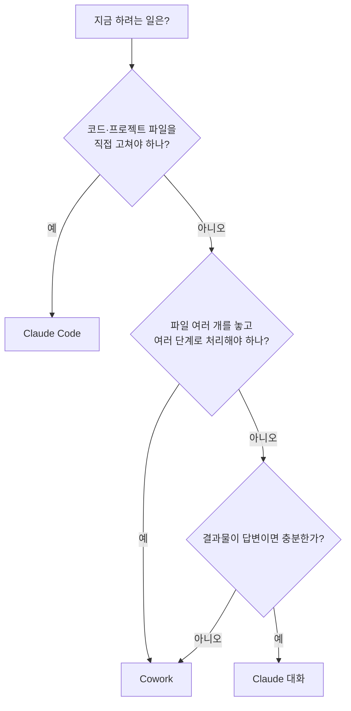

> 🖥️ 클로드를 브라우저 채팅으로만 써본 분, "클로드 코드"·"코워크"라는 말은 들었는데 뭐가 다른지 모르겠는 분,
> 데스크탑 앱을 깔아놓고 웹이랑 똑같이 쓰고 있는 분을 위한 글입니다. 개발자가 아니어도 읽을 수 있게 썼습니다.

---

## 앱을 깔았는데 웹이랑 똑같이 쓰고 있다면

데스크탑 앱을 설치하고 나서 하는 일이 "브라우저 대신 앱에서 채팅한다" 뿐이라면, 사실 앱의 절반도 못 쓰고 있는 겁니다.

앱의 진짜 차이는 창이 하나 더 생기는 게 아니라, **일을 맡기는 방식 자체가 세 가지로 갈라진다**는 데 있습니다.


이 글은 그 세 가지 — **Claude(대화), Cowork, Claude Code** — 를 언제 어떤 기준으로 골라 쓰는지에 대한 이야기입니다.

---

## 한 장 요약 — 같은 앱, 다른 작업 방식

먼저 큰 그림부터 잡고 갑시다.

| 구분 | Claude (대화) | Cowork | Claude Code |
| --- | --- | --- | --- |
| 한 줄 정의 | 물어보면 답해주는 대화형 비서 | 내 파일을 놓고 스스로 일하는 실무 에이전트 | 코드를 직접 읽고 고치는 개발 에이전트 |
| 작업 단위 | 질문 하나 → 답변 하나 | 업무 하나 (여러 단계) | 기능 하나 / 버그 하나 |
| 결과물 | 화면 속 답변·아티팩트 | 실제 파일 (문서·표·슬라이드 등) | 실제 코드 변경 |
| 내가 하는 일 | 계속 대화하며 다듬기 | 맡기고 결과를 **검수** | 방향 제시 + **코드 리뷰** |
| 비유 | 옆자리 똑똑한 동료 | 일을 시키는 인턴 | 내 프로젝트를 아는 페어 프로그래머 |

감각적으로 외우면 이렇습니다. **묻는 일이면 Claude, 맡기는 일이면 Cowork, 코드 일이면 Claude Code.**

말로만 보면 헷갈리니 결정 순서를 그림으로 정리해 봅시다.



> ⚠️ 세 기능의 노출 여부는 요금제와 앱 버전에 따라 다를 수 있습니다. 메뉴에 안 보이면 앱을 최신 버전으로 업데이트하고, 내 플랜에서 쓸 수 있는지 확인하세요. 이 글은 "쓸 수 있을 때 어떻게 쓰는가"를 다룹니다.

---

## 1. Claude(대화) — 왕복으로 다듬는 도구

대화형 클로드의 본질은 **왕복(iteration)** 입니다. 첫 답변은 초안이고, 내가 "더 짧게", "이 부분만 다시"를 반복하면서 완성해 갑니다.

데스크탑 앱에서 이 왕복이 빨라지는 이유는 단순합니다. 단축키 하나로 작업하던 화면 위에 바로 뜨고, 파일은 드래그해서 던지면 되니까요. **브라우저 탭을 찾아 들어가는 마찰이 사라지는 것**이 생각보다 큽니다.

여기서 꼭 챙겨야 할 기능이 두 가지 있습니다.

- **프로젝트(Projects)**: 주제별 작업 공간입니다. 자료와 지침을 한 번 올려두면 그 안의 모든 대화가 매번 설명하지 않아도 같은 맥락에서 시작합니다.
- **커넥터(Connectors)**: 노션·구글 드라이브 같은 외부 도구를 연결해, 붙여넣기 노동 없이 내 실제 자료를 읽고 쓰게 만듭니다.

커넥터는 **MCP(Model Context Protocol)** 라는 개방형 규격 위에서 동작합니다. "AI에게 외부 도구를 붙이는 표준 단자"라고 생각하면 됩니다.

다만 비유가 깨지는 지점이 하나 있습니다. 단자를 꽂았다고 아무거나 다 되는 게 아니라, **연결한 도구가 허용한 범위 안에서만** 읽고 씁니다.

프롬프트 품질을 올리는 공식은 하나만 외우면 충분합니다.

```text
너는 [역할]이야. [상황·배경]인데, [무엇]을 해줘. [분량·형식·톤]으로.
```

## 2. Cowork — 왕복을 없애고 맡기는 도구

대화가 "질문 → 답변"이라면, 코워크는 **"업무 지시 → 결과물"** 입니다.

일반 대화에서는 내가 자료를 붙여넣고, 답을 받고, 다시 다음 걸 붙여넣는 왕복이 필요합니다. 코워크에서는 작업할 파일을 건네고 목표를 말하면, 클로드가 파일을 열어 읽고 → 정리하고 → **결과 파일을 만들어 내놓습니다.**

즉 대화형과의 차이는 성능이 아니라 **주도권의 위치**입니다. 대화는 내가 매 단계를 운전하고, 코워크는 내가 목적지만 찍습니다.


그래서 코워크의 품질은 **처음 지시서**에서 거의 결정됩니다. 대화처럼 조금씩 고쳐 나가는 게 아니라 한 번에 끝까지 가기 때문입니다.

지시서에는 이 네 가지가 있어야 합니다. **목표 · 입력 자료 · 단계 · 결과물 형식.** 여기에 "하지 말 것"까지 적으면 재작업이 크게 줄어듭니다.

## 3. Claude Code — 코드베이스를 직접 만지는 도구

**Claude Code는 코드를 물어보는 도구가 아니라 코드를 직접 고치는 도구입니다.** 프로젝트 폴더를 스스로 탐색해 관련 파일을 찾고, 수정하고, 실행해 보고, 결과를 확인합니다.

터미널(CLI)에서 쓰는 방식이 가장 흔하지만, 데스크탑 앱이나 에디터 확장(VS Code, JetBrains)에서도 쓸 수 있습니다. 터미널이 낯설다면 앱에서 폴더를 열어 시작하는 쪽이 편합니다.

```bash
npm install -g @anthropic-ai/claude-code
```

설치 후 프로젝트 폴더에서 `claude` 를 실행하면 시작됩니다.

처음 쓸 때 가장 먼저 할 일은 `/init` 입니다. 프로젝트 구조와 규칙을 정리한 `CLAUDE.md` 파일이 만들어지고, 이 파일은 이후 모든 작업의 **상시 배경지식**이 됩니다. 매번 같은 설명을 반복하지 않게 해주는 메모라고 보면 됩니다.

큰 작업일수록 바로 시키지 말고 **"먼저 계획만 세워줘"** 를 한 단계 끼워 넣는 편이 안전합니다. 파일이 바뀌기 전에 방향을 검토할 수 있으니까요.

---

## 트레이드오프 — 언제 쓰고, 언제 쓰면 안 되는가

세 가지는 성능 순위가 아니라 **작업 형태에 대한 선택**입니다. 잘못 고르면 느려지거나, 검수 비용이 결과물의 가치를 넘어섭니다.

| 상황 | 권장 | 피해야 할 선택 | 이유 |
| --- | --- | --- | --- |
| 단어 뜻·짧은 문장 다듬기 | Claude 대화 | Cowork | 지시서 쓰는 시간이 작업 시간보다 길다 |
| 파일 3개를 합쳐 보고서 만들기 | Cowork | Claude 대화 | 붙여넣기 왕복이 반복되고 맥락이 끊긴다 |
| 내 판단이 매 문장 개입해야 하는 글 | Claude 대화 | Cowork | 한 번에 끝까지 가는 방식과 안 맞는다 |
| 실제 코드 수정·테스트 | Claude Code | Cowork·대화 | 코드를 실행해 확인하는 루프가 필요하다 |
| 엑셀 매크로·간단한 자동화 스크립트 | Claude Code | Cowork | 만들고 → 돌려보고 → 고치는 반복이 핵심 |

판단 기준을 한 줄로 줄이면 이렇습니다. **"내가 중간에 계속 개입해야 하는 일인가?"** 개입해야 하면 대화, 맡길 수 있으면 코워크, 실행해서 확인해야 하면 클로드 코드입니다.

## 안티패턴 vs 권장 패턴 — 지시서 한 장 차이

에이전트에게 일을 맡길 때 결과가 갈리는 지점은 거의 항상 지시서입니다.

**❌ 안티패턴 — 목표만 던지기**

```text
문의 데이터 정리해서 보고서 만들어줘.
```

이러면 클로드는 "보고서"의 정의를 스스로 정합니다. 분량도, 집계 기준도, 개인정보 처리 방침도 전부 추측이라 십중팔구 다시 시켜야 합니다.

**✅ 권장 패턴 — 목표 · 입력 · 단계 · 결과물 · 금지사항**

```text
[목표] 이번 분기 고객 문의 데이터를 정리해서 팀 공유용 보고서를 만들어줘.

[입력 자료] 폴더 안의 문의 내역 파일 3개 (형식은 제각각)

[해야 할 일]
1. 세 파일을 하나로 합치고 중복 문의 제거
2. 문의 유형별로 분류하고 건수 집계
3. 상위 5개 유형에 대해 원인 추정과 개선 제안 작성

[결과물]
- 요약 1장 + 표 + 제안 순서의 문서 파일 하나
- 집계 결과는 별도 표 파일로도

[주의]
- 고객 이름·연락처는 결과물에 넣지 말 것
- 추정한 내용은 추정이라고 명시할 것
```

차이는 문장 수가 아니라 **재작업 횟수**입니다. 앞의 것은 결과를 받은 뒤 다시 대화를 시작해야 하고, 뒤의 것은 검수만 하면 됩니다.

그리고 결과를 받았을 때는 세 가지를 습관처럼 확인하세요. **숫자는 표본으로 검산하기, 자료에 없던 주장이 섞였는지 보기, 원본 파일은 미리 백업해두기.**

---

## 흔한 오해 세 가지

**오해 1. Claude Code는 개발자만 쓰는 거다.**

아닙니다. 비개발자에게는 "엑셀 매크로나 간단한 자동화 스크립트를 만들고 고쳐주는 도구"에 가깝습니다. 다만 요청 방식을 바꿔야 합니다 — 초보도 이해할 수 있게 한 줄씩 주석을 달고, 실행 방법을 순서대로 알려주고, 나중에 어디를 고치면 무엇이 바뀌는지까지 정리해달라고 하세요.

**오해 2. 코워크가 대화보다 더 좋은 상위 버전이다.**

상하 관계가 아니라 용도 차이입니다. 짧은 질문에 코워크를 쓰는 건 편의점 갈 때 트럭을 부르는 것과 비슷합니다.

**오해 3. 에이전트가 알아서 하니까 검수는 대충 해도 된다.**

정반대입니다. 자동화된 단계가 늘어날수록 **내가 안 본 중간 결과가 늘어납니다.** 특히 집계 숫자와 자료에 없던 그럴듯한 문장은 사람이 확인해야 합니다.

## 보안은 이제 입력이 아니라 접근 범위의 문제

브라우저 채팅에서 보안 주의사항은 "무엇을 붙여넣느냐"였습니다.

코워크와 클로드 코드는 다릅니다. **내 컴퓨터의 실제 파일을 다루기 때문에, 어떤 폴더를 열어주느냐가 곧 어디까지 보여주느냐가 됩니다.**

그래서 이 두 가지가 기본기입니다.

- 작업용 폴더를 따로 두고, 그 폴더만 열어준다.
- 파일 작업은 백업 후에, 코드 작업은 git으로 버전 관리하며 한다.

되돌릴 수 있는 상태를 만들어두면 대부분의 사고는 사고가 아니게 됩니다. 회사 자료를 다룰 때 사내 AI 사용 정책을 먼저 확인해야 하는 건 물론이고요.

---

## 마무리 — 잘 쓰는 사람은 많이 묻는 사람이 아니다

세 가지를 다 알고 나면 질문이 바뀝니다. "이걸 어떻게 물어보지?"에서 **"이 일을 어느 방식으로 맡길까?"** 로요.

오늘 딱 하나만 해본다면, 평소 30분 걸리던 정리 작업 하나를 위의 지시서 형식(목표·입력·단계·결과물·금지사항)으로 적어서 맡겨보세요. 지시서를 쓰는 데 3분, 검수에 5분이면 끝나는 경험을 한 번 하고 나면 도구를 고르는 감각이 생깁니다.

## 셀프 체크 질문

1. 같은 자료 정리 작업인데 어떤 경우엔 대화가, 어떤 경우엔 코워크가 유리할까요? 판단 기준을 한 문장으로 말해보세요.
2. `CLAUDE.md` 는 무엇이고, 있으면 무엇이 줄어드나요?
3. 코워크·클로드 코드에서 보안 주의사항이 브라우저 채팅과 달라지는 지점은 어디인가요?

:::toggle 정답 보기
1. 기준은 **내가 중간에 계속 개입해야 하는가** 입니다. 문장 하나하나에 내 판단이 들어가야 하면 대화가 낫고, 목표와 형식만 정해주면 끝까지 갈 수 있는 일이면 코워크가 낫습니다. 짧은 작업에 지시서를 쓰는 비용이 작업 시간을 넘기면 그것도 대화 쪽입니다.
2. 프로젝트의 구조와 규칙을 적어두는 메모 파일이고, Claude Code에서 `/init` 으로 만들 수 있습니다. 이후 작업의 상시 배경지식이 되어 **매번 같은 설명을 반복하는 비용**이 줄어듭니다.
3. 브라우저 채팅에서는 무엇을 입력하느냐가 관건이지만, 코워크·클로드 코드는 내 컴퓨터의 실제 파일을 다루므로 **어떤 폴더에 접근 권한을 주느냐**가 관건이 됩니다. 그래서 작업용 폴더 분리, 백업, git 버전 관리가 기본기가 됩니다.
:::

## 더 깊이 파고들기

- [Claude 데스크탑 앱 다운로드](https://claude.ai/download) — Windows·macOS 앱을 받는 곳. 앱 버전에 따라 보이는 기능이 다르니 먼저 최신 버전인지 확인하세요.
- [Claude Code 공식 문서](https://docs.claude.com/en/docs/claude-code/overview) — 설치·기본 워크플로·설정을 확인할 수 있는 1차 출처. 기능이 자주 추가되므로 이 글보다 문서가 항상 최신입니다.
- [Model Context Protocol 공식 사이트](https://modelcontextprotocol.io/) — 커넥터가 동작하는 기반 규격. AI에 외부 도구를 붙이는 표준이 어떻게 생겼는지 궁금하다면 여기부터.
- [Anthropic 공식 소식](https://www.anthropic.com/news) — 새로 추가되는 기능은 여기서 먼저 공지됩니다. 요금제별 제공 범위도 함께 확인하세요.
