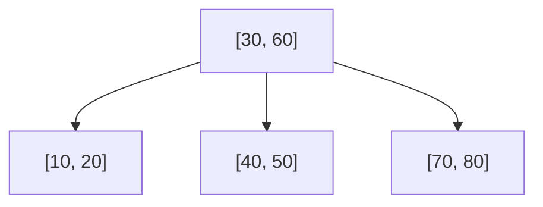
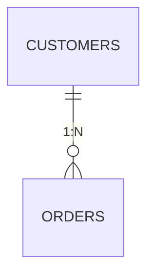
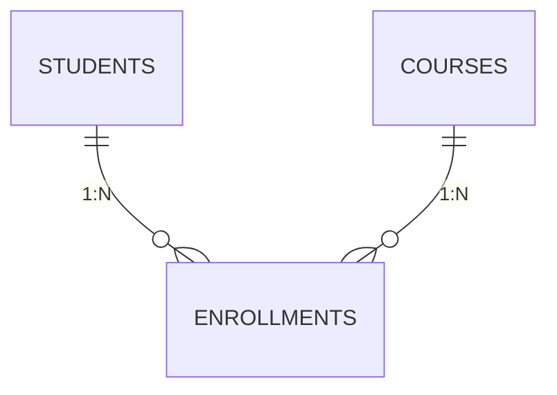

> 🗂️ DB 관련 면접에서 가장 자주 나오는 네 가지를 하나로 묶었습니다.
> "인덱스는 왜 빠른가요?", "정규화가 뭔가요?", "N:M 관계는 어떻게 설계하나요?" — 이 글 하나로 정리해드릴게요.
> (인덱스 구현 세부사항은 [PostgreSQL 공식 문서](https://www.postgresql.org/docs/current/btree.html) 기준으로 씁니다. MySQL InnoDB도 B+Tree를 쓰지만 세부 구현은 다를 수 있습니다.)

## 1. 인덱스(Index)는 왜 조회를 빠르게 할까

인덱스가 없으면 DB는 원하는 행을 찾기 위해 테이블 전체를 처음부터 끝까지 훑습니다. 이를 **풀 스캔(Full Scan)**이라고 합니다. 책에 비유하면, 목차나 색인 없이 500페이지 책에서 특정 단어를 찾으려고 한 장씩 넘기는 것과 같아요. (다만 이 비유는 딱 "미리 정렬해두면 빠르다"는 감만 줄 뿐, 실제 B-Tree가 왜 이진 탐색보다도 더 효율적인 구조인지는 설명하지 못합니다 — 그건 아래에서 다룹니다.)

**인덱스**는 특정 컬럼 값과 그 값이 저장된 위치(행 주소)를 별도의 **정렬된 자료구조**로 미리 만들어두는 것입니다. 책 뒤의 "찾아보기" 페이지처럼, 값으로 바로 위치를 찾아갈 수 있게 해줍니다.

```sql
CREATE INDEX idx_users_email ON users(email);

-- 인덱스가 없으면: users 테이블 전체를 훑음 (O(n))
-- 인덱스가 있으면: 정렬된 구조를 타고 내려가 바로 찾음 (O(log n))
SELECT * FROM users WHERE email = 'kim@example.com';
```


## 2. B-Tree — 인덱스의 대표 자료구조

대부분의 관계형 DB(MySQL InnoDB, PostgreSQL 등)는 인덱스를 **B-Tree(정확히는 B+Tree)** 구조로 저장합니다.

### B-Tree의 특징

- **정렬된 다지(多枝) 트리**: 각 노드가 여러 개의 키를 가질 수 있고, 자식도 여러 개일 수 있습니다.
- **모든 리프 노드가 같은 깊이**: 트리가 한쪽으로 치우치지 않고 균형을 유지합니다.
- **탐색/삽입/삭제가 모두 O(log n)**: 데이터가 아무리 많아져도 탐색 깊이가 완만하게 증가합니다.



값 `45`를 찾는다고 하면: 루트에서 `30`, `60`과 비교 → `30~60` 사이니 가운데 자식으로 이동 → `40`, `50`과 비교 → `40~50` 사이 위치를 찾습니다. 매 단계마다 **후보군을 몇 분의 1로 줄여나가기 때문에** 데이터가 100만 건이든 1억 건이든 탐색 깊이는 몇 단계 차이가 나지 않습니다.

### 왜 이진 트리가 아니라 B-Tree인가

이진 트리는 노드당 자식이 2개뿐이라 데이터가 많아지면 트리 높이가 깊어집니다. B-Tree는 노드 하나에 여러 키를 담아 **자식 수를 늘려(fan-out)** 트리의 높이를 낮게 유지합니다. [PostgreSQL 공식 문서](https://www.postgresql.org/docs/current/btree.html)에 따르면 B-Tree는 디스크에서 데이터를 읽어오는 단위(페이지)에 맞춰 설계되어, 디스크 I/O 횟수를 최소화하는 데 최적화된 구조입니다.

## 3. 정규화(Normalization) — 중복을 줄이는 설계 원칙

정규화는 테이블을 설계할 때 **데이터 중복을 최소화하고 이상 현상(anomaly)을 방지**하기 위한 단계적 규칙입니다.

### 정규화 전 (문제가 있는 테이블)

| 주문ID | 고객명 | 고객이메일 | 상품명 | 상품가격 |
| --- | --- | --- | --- | --- |
| 1 | 김철수 | kim@ex.com | 키보드 | 50000 |
| 2 | 김철수 | kim@ex.com | 마우스 | 20000 |

고객 정보가 주문마다 **중복 저장**되고 있습니다. 김철수의 이메일이 바뀌면 모든 행을 다 고쳐야 하죠.

### 1NF (제1정규형) — 원자값

한 컬럼에는 **하나의 값만** 있어야 합니다. `상품명: "키보드, 마우스"`처럼 여러 값을 콤마로 몰아넣으면 1NF 위반입니다.

### 2NF (제2정규형) — 부분 함수 종속 제거

기본키가 여러 컬럼으로 구성된 경우(복합키), **기본키 전체가 아니라 일부에만 종속되는 컬럼**을 분리합니다. 예를 들어 (주문ID, 상품ID)가 기본키인데 `상품가격`이 상품ID에만 종속된다면, 상품 정보는 별도 테이블로 빼야 합니다.

### 3NF (제3정규형) — 이행적 함수 종속 제거

기본키가 아닌 컬럼이 **또 다른 기본키 아닌 컬럼에 종속**되는 경우를 제거합니다. 예를 들어 `고객이메일`이 `고객명`을 통해서만 결정된다면(주문ID → 고객명 → 고객이메일), 고객 정보는 별도 테이블로 분리해야 합니다.

### 정규화 후

```sql
CREATE TABLE customers (
  id INT PRIMARY KEY,
  name VARCHAR(50),
  email VARCHAR(100)
);

CREATE TABLE products (
  id INT PRIMARY KEY,
  name VARCHAR(50),
  price INT
);

CREATE TABLE orders (
  id INT PRIMARY KEY,
  customer_id INT REFERENCES customers(id),
  product_id INT REFERENCES products(id)
);
```

이제 고객 정보는 `customers` 테이블 한 곳에만 있고, 주문은 그걸 참조(FK)만 합니다. 이메일이 바뀌어도 한 곳만 고치면 됩니다.


## 4. 테이블 관계 설계 — 1:N과 N:M

### 1:N (일대다)

하나의 고객이 여러 주문을 가질 수 있는 관계입니다. **N쪽 테이블에 FK(외래키)를 둡니다.**

```sql
CREATE TABLE orders (
  id INT PRIMARY KEY,
  customer_id INT REFERENCES customers(id)  -- N쪽(orders)에 FK
);
```



### N:M (다대다) — 매개 테이블(중간 테이블)이 필요한 이유

학생과 수업의 관계를 생각해보세요. 한 학생은 여러 수업을 듣고, 한 수업엔 여러 학생이 있습니다. 이런 **N:M 관계는 어느 한쪽에 FK를 넣는 방식으로 표현할 수 없습니다.** 그래서 관계 자체를 표현하는 **매개 테이블(junction table)**을 별도로 둡니다.

```sql
CREATE TABLE students (
  id INT PRIMARY KEY,
  name VARCHAR(50)
);

CREATE TABLE courses (
  id INT PRIMARY KEY,
  title VARCHAR(50)
);

CREATE TABLE enrollments (              -- 매개 테이블
  student_id INT REFERENCES students(id),
  course_id INT REFERENCES courses(id),
  enrolled_at DATE,
  PRIMARY KEY (student_id, course_id)   -- 복합 기본키로 중복 수강 방지
);
```



핵심은 **N:M을 두 개의 1:N 관계로 쪼개는 것**입니다. `enrollments` 테이블이 학생과 수업 사이의 "다리" 역할을 하면서, 동시에 수강일(`enrolled_at`)처럼 관계 자체에 딸린 추가 정보도 저장할 수 있다는 장점이 있습니다. (참고로 ORM을 쓰면 이 매개 테이블을 직접 SQL로 짜지 않고 모델 관계로 선언할 수 있는데, 그 장단점은 [ORM 관련 글](https://app.notion.com/p/SQL-ORM-3993fe934e8a8171af7fc28c0d52cc0a)에서 다뤘습니다.)

## 안티패턴 vs 권장 패턴

```sql
-- ❌ 안티패턴: 조회에 자주 쓰는 컬럼인데 인덱스가 없음
SELECT * FROM orders WHERE customer_id = 42;
-- customer_id에 인덱스가 없으면 테이블 전체를 풀 스캔
```

```sql
-- ✅ 권장 패턴: 조회/조인에 자주 쓰이는 FK 컬럼에 인덱스 추가
CREATE INDEX idx_orders_customer_id ON orders(customer_id);
```

FK 컬럼은 조인 조건으로 자주 쓰이는데, 관계형 DB가 FK를 걸었다고 **자동으로 인덱스를 만들어주지는 않는 경우가 많습니다**(DB 종류마다 다르므로 사용 중인 DB의 공식 문서 확인이 필요합니다). 반대로 모든 컬럼에 인덱스를 다는 것도 안티패턴입니다 — 인덱스는 조회는 빠르게 하지만, 데이터가 바뀔 때마다(INSERT/UPDATE/DELETE) 인덱스도 함께 갱신해야 해서 쓰기 성능이 떨어지는 트레이드오프가 있습니다. **조회 빈도가 높고 카디널리티(값의 다양성)가 높은 컬럼**을 우선 인덱싱하는 것이 일반적인 판단 기준입니다.

## 흔한 오해 바로잡기

1. **"인덱스는 많을수록 좋다"** — 아닙니다. 인덱스는 쓰기 성능을 희생해서 읽기 성능을 얻는 트레이드오프입니다. 자주 조회되지 않는 컬럼까지 인덱싱하면 쓰기만 느려지고 이득은 거의 없습니다.
2. **"정규화를 많이 할수록 무조건 좋은 설계다"** — 아닙니다. 정규화가 심할수록 조회 시 조인이 늘어나 오히려 느려질 수 있습니다. 그래서 조회 성능을 위해 일부러 중복을 허용하는 **비정규화(Denormalization)**를 트레이드오프로 선택하기도 합니다.
3. **"N:M 관계는 그냥 한쪽 테이블에 배열 컬럼으로 저장하면 된다"** — 관계형 DB에서는 권장되지 않습니다. 배열 컬럼에 ID를 몰아넣으면 참조 무결성(FK 제약)을 걸 수 없고, 관계 자체에 딸린 정보(수강일 등)를 저장할 곳도 없어집니다.

## 셀프 체크 질문

1. 인덱스는 왜 조회를 빠르게 하는지, 시간복잡도 관점에서 설명할 수 있나요?
2. 인덱스가 "많을수록 좋다"고 할 수 없는 이유는 무엇인가요?
3. N:M 관계를 FK 하나로 표현할 수 없는 이유와, 대신 어떻게 설계해야 하는지 설명할 수 있나요?

:::toggle 정답 보기
1. 인덱스가 없으면 테이블 전체를 순차 탐색(O(n))해야 하지만, B-Tree로 정렬된 인덱스가 있으면 트리를 타고 내려가며 후보군을 매 단계 줄여나가는 탐색(O(log n))이 가능하기 때문입니다.
2. 인덱스는 조회(SELECT)는 빠르게 해주지만, 데이터가 바뀔 때마다(INSERT/UPDATE/DELETE) 인덱스 구조도 함께 갱신해야 하므로 쓰기 성능이 떨어집니다. 자주 조회되지 않는 컬럼에 인덱스를 걸면 이 비용만 지불하고 얻는 이득은 적습니다.
3. FK 컬럼 하나는 값 하나만 가리킬 수 있는데, N:M은 한쪽이 여러 상대를 동시에 가리켜야 합니다. 그래서 두 테이블을 각각 1:N으로 참조하는 별도의 매개 테이블(junction table)을 두어, N:M을 두 개의 1:N 관계로 쪼개서 표현합니다.
:::

## 더 깊이 파고들기

- [PostgreSQL B-Tree Indexes 공식 문서](https://www.postgresql.org/docs/current/btree.html) — B-Tree 인덱스의 내부 구조와 지원 함수가 상세히 설명돼 있습니다.
- [PostgreSQL Indexes 개요](https://www.postgresql.org/docs/current/indexes.html) — B-Tree 외에 Hash, GIN, GiST 등 다른 인덱스 종류와 언제 무엇을 쓰는지 비교해볼 수 있습니다.

## 마치며

인덱스/B-Tree는 "조회를 빠르게 하는 방법", 정규화는 "중복 없이 안전하게 저장하는 방법", 테이블 관계 설계는 "현실의 관계를 테이블로 옮기는 방법"입니다. 넷 다 결국 **"데이터를 정확하고 효율적으로 다루기 위한 설계 원칙"**이라는 하나의 목적으로 이어져 있다는 걸 기억하면 면접에서도 훨씬 일관성 있게 답할 수 있습니다. 🗂️
