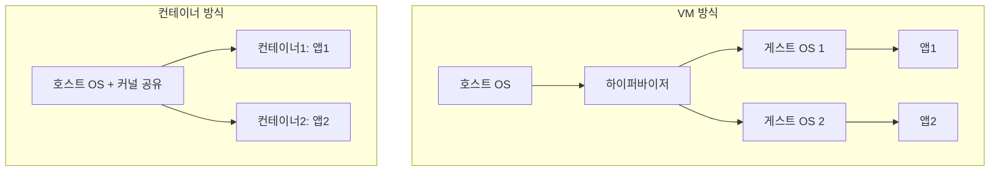

> 🐳 "도커 좀 쓸 줄 아세요?"라는 질문에 "네, `docker run` 해봤어요"라고만 답했다면,
> 이 글에서 도커·컨테이너·컴포즈의 관계를 한 번에 정리해 드릴게요.
> (Docker Engine 25 / Compose V2 CLI 플러그인 기준으로 씁니다.)

## 셋을 한 문장씩으로 구분하면

- **도커(Docker)**: 컨테이너를 만들고 실행하는 **도구(엔진)**.
- **컨테이너(Container)**: 애플리케이션과 그 실행 환경을 통째로 묶은 **격리된 실행 단위**.
- **도커 컴포즈(Docker Compose)**: **여러 컨테이너**를 하나의 설정 파일로 묶어 한 번에 관리하는 도구.

즉 도커는 "요리 도구", 컨테이너는 "완성된 도시락 하나", 컴포즈는 "여러 도시락을 한 번에 준비하는 레시피 세트"에 비유할 수 있어요. (다만 이 비유는 딱 "격리된 실행 단위를 묶어 관리한다"는 느낌을 전달하는 용도일 뿐, 실제로는 이미지의 레이어 캐싱이나 네트워크 격리 같은 동작까지 설명해주진 않습니다 — 그건 아래에서 따로 다룹니다.)


## 컨테이너: 가상머신(VM)과 뭐가 다른가

신입 때 가장 헷갈리는 지점이 "가상머신이랑 뭐가 다른데?"입니다.

| 구분 | 가상머신(VM) | 컨테이너 |
| --- | --- | --- |
| 격리 단위 | OS 전체 (게스트 OS 포함) | 프로세스 (호스트 OS 커널 공유) |
| 무게 | 무겁다 (GB 단위) | 가볍다 (MB 단위) |
| 부팅 속도 | 수 분 | 수 초 |
| 자원 효율 | 낮음 | 높음 |

컨테이너는 OS를 통째로 복제하지 않고, 호스트의 커널을 공유하면서 파일시스템·네트워크·프로세스만 격리합니다. Linux에서는 이 격리를 **네임스페이스(namespace)**로, 자원 사용량 제한은 **cgroups**로 구현합니다. 그래서 훨씬 가볍고 빠르게 뜨죠.



## 도커가 하는 일: 이미지 → 컨테이너

도커의 핵심 흐름은 딱 두 단계입니다.

1. **이미지(Image) 빌드**: `Dockerfile`에 적힌 대로 애플리케이션 + 실행 환경을 하나의 "설계도"로 만듭니다.
2. **컨테이너 실행**: 그 이미지를 바탕으로 실제로 동작하는 "인스턴스"를 띄웁니다.

```dockerfile
FROM node:20-alpine
WORKDIR /app
COPY . .
RUN npm install
CMD ["node", "server.js"]
```

```bash
docker build -t my-app .   # 이미지 빌드
docker run -p 3000:3000 my-app   # 컨테이너 실행
```

같은 이미지에서 컨테이너를 여러 개 띄울 수도 있습니다. 이미지는 "붕어빵 틀", 컨테이너는 "구워진 붕어빵"인 셈이에요. (단, 이 비유도 한계가 있습니다 — 실제 이미지는 하나의 틀이 아니라 `Dockerfile`의 각 명령어마다 쌓이는 **읽기 전용 레이어의 스택**입니다. 컨테이너를 실행하면 그 위에 얇은 쓰기 가능 레이어 하나가 얹히는 구조라, 여러 컨테이너가 같은 이미지 레이어를 디스크에서 공유할 수 있습니다.)

## 언제 도커 컴포즈가 필요할까

실무 서비스는 앱 하나만 달랑 뜨지 않습니다. 백엔드 + DB + 캐시(Redis) + 메시지 큐 등 여러 컨테이너가 함께 필요하죠. 이걸 매번 `docker run`으로 하나씩 띄우면 옵션이 너무 많아 실수하기 쉽습니다.

**도커 컴포즈**는 이 여러 컨테이너의 구성을 `compose.yaml` 하나에 선언해두고, 명령어 한 줄로 통째로 띄우고 내릴 수 있게 해줍니다.

```yaml
services:
  app:
    build: .
    ports:
      - "3000:3000"
    depends_on:
      - db
  db:
    image: postgres:16
    environment:
      POSTGRES_PASSWORD: example
    volumes:
      - db_data:/var/lib/postgresql/data

volumes:
  db_data:
```

```bash
docker compose up -d    # 정의된 컨테이너 전부 실행
docker compose down     # 전부 정리
```


## 안티패턴 vs 권장 패턴

| ❌ 안티패턴 | ✅ 권장 패턴 | 실질적 차이 |
| --- | --- | --- |
| `FROM node:latest` | `FROM node:20-alpine` | `latest`는 배포 시점마다 실제 버전이 달라져 "내 컴퓨터에선 됐는데" 문제의 원인이 됩니다. 버전을 고정하면 빌드가 재현 가능해집니다. |
| `COPY . .` 후 `RUN npm install` | `COPY package*.json ./` → `RUN npm install` → `COPY . .` | 소스 변경마다 의존성을 매번 재설치하지 않고, 레이어 캐시를 재사용해 빌드 속도가 크게 빨라집니다. |
| 컨테이너를 root로 실행 | `Dockerfile`에 `USER node` 지정 | 컨테이너가 뚫렸을 때 호스트 권한 상승 위험을 줄입니다. |
| `.dockerignore` 없이 빌드 | `node_modules`, `.git` 등을 `.dockerignore`에 명시 | 불필요한 파일이 빌드 컨텍스트로 전송되지 않아 빌드가 빨라지고 이미지가 가벼워집니다. |

## 흔한 오해 바로잡기

1. **"컨테이너는 가벼운 가상머신이다"** — 정확히는 가상머신이 아니라 **격리된 프로세스**입니다. 커널을 공유하기 때문에, 예를 들어 Windows 컨테이너를 Linux 호스트에서 네이티브로 못 돌리는 것도 이 때문입니다(Docker Desktop은 내부적으로 경량 VM을 별도로 띄워 이 문제를 우회합니다).
2. **"`docker-compose`와 `docker compose`는 같은 거다"** — 예전엔 `docker-compose`(하이픈, Python으로 작성된 V1 독립 실행파일)를 썼지만, 지금은 `docker compose`(공백, Go로 재작성된 V2, Docker CLI 플러그인)가 표준입니다. 대부분 호환되지만 완전히 같지는 않습니다.
3. **"이미지에 소스코드가 항상 통째로 들어 있어야 한다"** — 아닙니다. 로컬 개발 환경에서는 소스코드를 이미지에 굽지 않고 **볼륨(volume)**으로 마운트해서, 코드를 고칠 때마다 이미지를 다시 빌드하지 않아도 되게 구성하는 경우가 많습니다.

## 실무에서 언제 무엇을 쓰나

- **로컬 개발 환경 통일**: "제 컴퓨터에선 되는데요?" 문제를 없애기 위해 팀 전체가 같은 `compose.yaml`로 개발 환경을 맞춥니다.
- **단일 앱 배포**: 앱 하나만 컨테이너화해서 서버에 올릴 땐 도커 이미지 + `docker run`(혹은 이를 관리해주는 오케스트레이션 도구)으로 충분합니다.
- **여러 서비스 로컬 테스트**: 백엔드, DB, Redis 등을 로컬에서 한 번에 띄워 통합 테스트할 때 컴포즈가 진가를 발휘합니다.
- **프로덕션 대규모 운영**: 컨테이너 수가 많아지고 자동 복구·스케일링이 필요해지면 컴포즈를 넘어 쿠버네티스(Kubernetes) 같은 오케스트레이션 도구로 넘어갑니다. 일반적으로 컴포즈는 로컬/소규모 운영에, 쿠버네티스는 다중 서버에 걸친 대규모 운영에 쓰인다고 알려져 있습니다.

## 셀프 체크 질문

1. 컨테이너가 가상머신보다 가벼운 이유를 커널 관점에서 설명할 수 있나요?
2. `Dockerfile`에서 `COPY package*.json ./`을 `COPY . .`보다 먼저 쓰는 이유는 무엇인가요?
3. `docker-compose`(V1)와 `docker compose`(V2)의 차이를 설명할 수 있나요?

:::toggle 정답 보기
1. 컨테이너는 게스트 OS 전체를 띄우지 않고 호스트 커널을 네임스페이스로 격리해서 공유하기 때문에, OS 부팅 과정 없이 프로세스 하나를 격리해서 띄우는 것과 비슷한 무게로 동작합니다.
2. Docker 이미지는 명령어 단위로 레이어가 쌓이고 캐시됩니다. `package*.json`만 먼저 복사해 의존성을 설치해두면, 이후 소스코드(`COPY . .`)만 바뀌었을 때 의존성 설치 레이어는 캐시를 그대로 재사용해 빌드 속도가 빨라집니다.
3. V1(`docker-compose`)은 Python으로 작성된 별도 실행파일이고, V2(`docker compose`)는 Go로 재작성되어 Docker CLI에 플러그인 형태로 통합된 버전입니다. 문법은 대체로 호환되지만 완전히 동일하진 않으며, 현재는 V2가 표준입니다.
:::

## 더 깊이 파고들기

- [Docker Compose 공식 문서](https://docs.docker.com/compose/) — `compose.yaml` 전체 옵션과 최신 CLI 사용법이 정리돼 있습니다.
- [Dockerfile 레퍼런스](https://docs.docker.com/reference/dockerfile/) — `FROM`, `COPY`, `RUN` 등 모든 명령어의 정확한 동작이 궁금할 때 1차 출처로 확인하세요.

## 마치며

정리하면 **도커는 컨테이너를 다루는 엔진**, **컨테이너는 격리된 실행 단위**, **컴포즈는 여러 컨테이너를 한 번에 관리하는 도구**입니다. 신입 때는 우선 `Dockerfile` 하나로 이미지를 빌드해보고, 그다음 DB 하나를 추가해서 `compose.yaml`로 묶어보는 순서로 연습하면 감이 확 잡힙니다. 🐳
