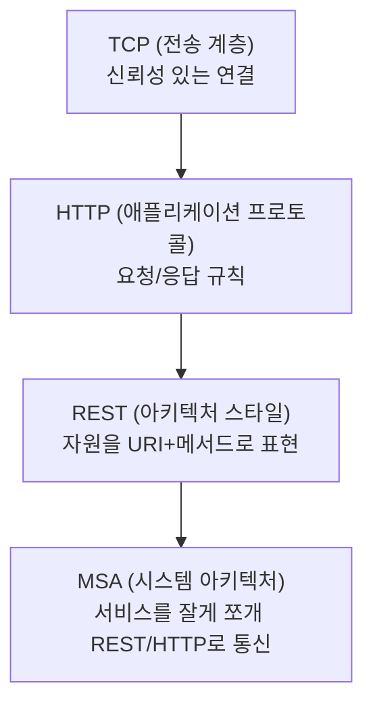
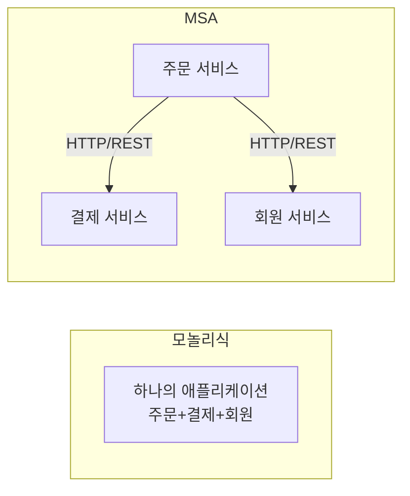
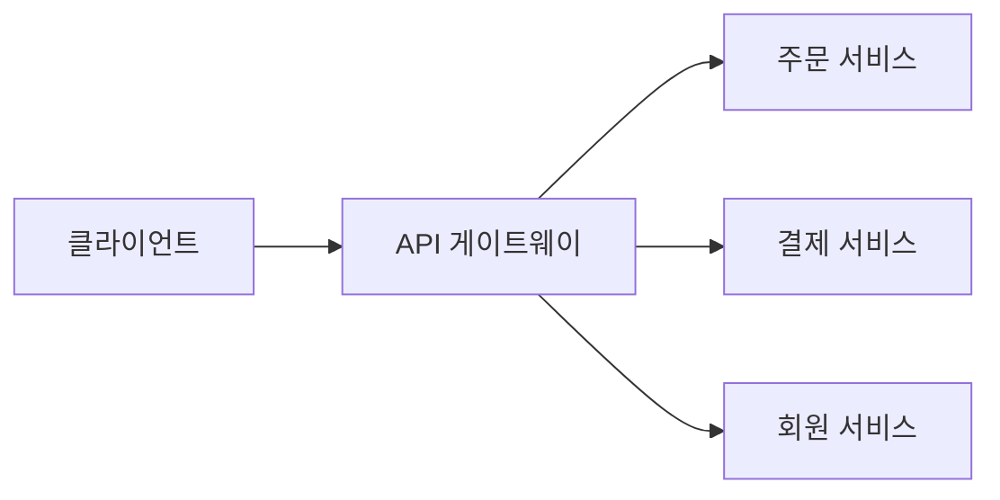

> 🧱 HTTP, REST, MSA — 각각 따로 배우면 왜 필요한지 잘 와닿지 않습니다.
> 이 셋은 사실 **아래에서 위로 쌓아 올라가는 하나의 이야기**입니다. TCP라는 단단한 바닥 위에
> HTTP가, HTTP 위에 REST가, REST 위에 MSA가 얹혀 있어요.

## 전체 그림 먼저 보기



각 층은 아래 층의 능력을 그대로 활용하면서, 자기 층만의 새로운 약속을 얹습니다. 하나씩 내려가면서 살펴볼게요. (탑 비유는 "아래 계층 위에 얹힌다"는 순서 감각은 잘 보여주지만, 실제로는 각 층이 완전히 독립된 블록이 아니라 — 예를 들어 REST 설계가 다시 HTTP의 캐시 헤더를 적극 활용하는 것처럼 — 서로 영향을 주고받는 관계라는 점은 유의해야 합니다.)


## 1층: TCP — 믿을 수 있는 배송망

가장 아래에는 **TCP**가 있습니다. TCP는 "데이터를 순서대로, 빠짐없이, 확실하게" 전달해주는 신뢰성 있는 연결을 제공합니다. (연결을 맺는 3-way handshake 과정은 [이전 글](https://app.notion.com/p/TCP-3-Way-Handshake-3993fe934e8a8125b326e55b15d4a29b)에서 자세히 다뤘습니다.) HTTP를 포함한 대부분의 웹 프로토콜은 이 TCP 위에서 동작합니다. TCP가 "믿을 수 있는 배송망"을 깔아주기 때문에, 그 위의 계층들은 "패킷이 유실되지 않을까" 같은 걱정 없이 자기 역할에만 집중할 수 있습니다.

## 2층: HTTP — 배송망 위의 "요청서 양식"

**HTTP(HyperText Transfer Protocol)**는 TCP라는 배송망 위에서, "요청은 이런 형식으로, 응답은 이런 형식으로 주고받자"는 **약속(프로토콜)**입니다. 현재 표준은 [RFC 9110(HTTP Semantics)](https://datatracker.ietf.org/doc/html/rfc9110)이 정의합니다.

```http
GET /users/1 HTTP/1.1
Host: api.example.com
Accept: application/json
```

```http
HTTP/1.1 200 OK
Content-Type: application/json

{ "id": 1, "name": "Kim" }
```

HTTP는 **메서드(GET, POST, PUT, DELETE...)**, **상태 코드(200, 404, 500...)**, **헤더** 같은 표준화된 요청/응답 형식을 정의합니다. 덕분에 브라우저든 모바일 앱이든 서버든, 이 형식만 지키면 서로 다른 기술로 만들어졌어도 문제없이 대화할 수 있습니다.

## 3층: REST — HTTP를 "잘 쓰는 방법"

HTTP 자체는 그냥 통신 규칙일 뿐, "URL을 어떻게 지어야 하는지", "무슨 메서드를 언제 써야 하는지"까지는 정해주지 않습니다. 여기서 **REST**가 등장합니다.

REST는 "**자원(Resource)을 URI로 식별하고, HTTP 메서드로 그 자원에 대한 행위를 표현하자**"는 설계 스타일입니다. (REST의 6가지 제약 조건은 [이전 글](https://app.notion.com/p/REST-6-3993fe934e8a81988c9bd96952076fdf)에서 자세히 다뤘습니다.)

```http
GET    /orders/42     → 42번 주문 조회
POST   /orders        → 새 주문 생성
PUT    /orders/42     → 42번 주문 전체 수정
DELETE /orders/42     → 42번 주문 삭제
```

이렇게 하면 URL과 메서드만 보고도 "이 API가 뭘 하는지" 예측할 수 있게 됩니다. REST는 HTTP라는 도구를 **일관성 있고 예측 가능하게 쓰는 방법론**인 셈입니다.

| 구분 | 역할 | 비유 |
| --- | --- | --- |
| TCP | 안전한 배송망 | 도로/택배 인프라 |
| HTTP | 요청서 양식 | 표준 주문서 |
| REST | 주문서 잘 쓰는 규칙 | 주문서 작성 가이드라인 |


## 4층: MSA — 왜 서비스들이 REST/HTTP로 대화하나

여기까지가 "API 하나"의 이야기라면, **MSA(Microservice Architecture, 마이크로서비스 아키텍처)**는 "여러 개의 작은 서비스들이 어떻게 협력할 것인가"의 이야기입니다.

### 모놀리식 vs 마이크로서비스

- **모놀리식(Monolith)**: 주문, 결제, 회원 기능이 **하나의 큰 애플리케이션**으로 묶여 있습니다. 배포도 한 번에, 함수 호출도 그냥 인메모리 호출입니다.
- **마이크로서비스(MSA)**: 주문, 결제, 회원을 **각각 독립된 서비스**로 쪼갭니다. 서비스마다 따로 배포하고, 따로 스케일링할 수 있습니다. [microservices.io](https://microservices.io/patterns/microservices.html)는 이를 "두 개 이상의 독립적으로 배포 가능하고 느슨하게 결합된 서비스로 애플리케이션을 구조화하는 아키텍처"로 정의합니다.



문제는 이겁니다. 서비스가 쪼개지는 순간, 예전엔 그냥 함수 호출이었던 것이 **네트워크를 건너야 하는 통신**이 됩니다. 이때 "서비스끼리 어떤 형식으로 대화할까?"를 정해야 하는데, 여기서 이미 널리 검증된 **HTTP + REST 조합**이 가장 흔한 선택지가 됩니다.

- 이미 모든 언어/프레임워크가 HTTP를 지원한다 (기술 독립적)
- REST 스타일이 이미 표준처럼 자리 잡아 새로 배울 게 적다
- 방화벽, 로드밸런서, 모니터링 등 기존 웹 인프라를 그대로 재사용할 수 있다

물론 서비스 간 통신이 아주 빈번하고 성능이 중요하면 gRPC 같은 대안도 쓰이지만, "일단 표준적이고 무난하게 가자"는 선택지에서는 여전히 HTTP/REST가 기본값입니다.

### API 게이트웨이의 등장

서비스가 여러 개로 쪼개지면 클라이언트가 각 서비스 주소를 일일이 알아야 하는 문제가 생깁니다. 그래서 보통 **API 게이트웨이**가 앞단에서 요청을 받아 적절한 서비스로 라우팅해줍니다.



## 안티패턴 vs 권장 패턴 — 서비스 간 동기 호출 체인

```text
❌ 안티패턴: 주문 서비스가 결제 서비스를 동기 호출하고,
            결제 서비스는 다시 알림 서비스를 동기 호출 (호출 체인)
   → 알림 서비스가 느려지거나 죽으면, 그 지연이 결제 → 주문까지 그대로 전파됨

✅ 권장 패턴: 꼭 즉시 응답이 필요한 호출만 동기(REST)로 남기고,
            "결제 완료 → 알림 발송"처럼 결과를 기다릴 필요 없는 흐름은
            메시지 큐를 통한 비동기 이벤트로 분리
```

서비스가 REST/HTTP로 동기 호출 체인을 만들면, 한 서비스의 장애나 지연이 체인 전체로 전파되는 문제가 생깁니다. 일반적으로 "즉시 응답이 필요한가?"를 기준으로 동기(REST) 호출과 비동기(메시지 큐) 호출을 구분해 섞어 쓰는 것이 MSA 설계에서 권장되는 패턴으로 알려져 있습니다.

## 흔한 오해 바로잡기

1. **"MSA를 하려면 반드시 REST를 써야 한다"** — 아닙니다. REST/HTTP가 가장 흔한 선택지일 뿐, gRPC(성능 중시), 메시지 큐 기반 비동기 통신(느슨한 결합 중시) 등 다른 선택지도 널리 쓰입니다.
2. **"MSA는 무조건 모놀리식보다 좋다"** — 아닙니다. 서비스가 쪼개질수록 네트워크 호출, 분산 트랜잭션, 장애 격리 같은 복잡도가 늘어납니다. 팀 규모가 작거나 서비스 경계가 아직 불확실한 초기 단계에는 모놀리식이 더 적합하다고 알려져 있습니다.
3. **"API 게이트웨이는 단순히 요청을 중계만 한다"** — 실제로는 인증, 속도 제한(rate limiting), 로깅, 응답 캐싱 같은 공통 관심사를 게이트웨이 계층에서 한 번에 처리하는 경우가 많습니다.

## 셀프 체크 질문

1. 마이크로서비스로 쪼개면서 새로 생기는 비용은 무엇인가요? (모놀리식과 비교해서)
2. MSA에서 서비스 간 통신에 REST/HTTP가 흔히 선택되는 이유 세 가지를 말할 수 있나요?
3. 서비스 간 동기 호출 체인이 왜 위험한지 설명할 수 있나요?

:::toggle 정답 보기
1. 예전엔 인메모리 함수 호출이던 것이 네트워크를 오가는 통신이 되면서, 지연·장애 가능성·직렬화 비용이 새로 생깁니다. 여러 서비스에 걸친 트랜잭션 관리(분산 트랜잭션)도 모놀리식보다 훨씬 까다로워집니다.
2. 기술 독립적(모든 언어가 HTTP를 지원), 이미 표준처럼 자리 잡아 학습 비용이 적음, 방화벽·로드밸런서·모니터링 같은 기존 웹 인프라를 그대로 재사용 가능하다는 점입니다.
3. 한 서비스가 느려지거나 장애가 나면, 그 서비스를 동기로 호출하는 상위 서비스까지 응답이 지연되거나 실패하고, 이 지연이 호출 체인을 따라 계속 전파되기 때문입니다.
:::

## 더 깊이 파고들기

- [RFC 9110 — HTTP Semantics](https://datatracker.ietf.org/doc/html/rfc9110) — HTTP 메서드/상태코드의 정확한 의미를 정의하는 표준 문서입니다.
- [microservices.io — Microservice Architecture pattern](https://microservices.io/patterns/microservices.html) — MSA의 정의와 장단점, 관련 패턴(API 게이트웨이, Saga 등)을 체계적으로 정리한 자료입니다.

## 마치며 — 결국 하나로 이어지는 이야기

정리하면 이렇습니다.

1. **TCP**가 신뢰성 있는 전송을 보장하고
2. 그 위에서 **HTTP**가 요청/응답의 표준 형식을 정하고
3. **REST**가 그 HTTP를 자원 중심으로 일관성 있게 쓰는 방법을 제시하고
4. **MSA**는 여러 서비스로 쪼개진 시스템이 결국 이 검증된 HTTP/REST 조합으로 서로 대화하기로 선택한 결과입니다.

네 가지를 따로따로 외우기보다, "왜 그 다음 계층이 필요해졌는가"를 순서대로 따라가면 훨씬 자연스럽게 이해됩니다. 🧱
