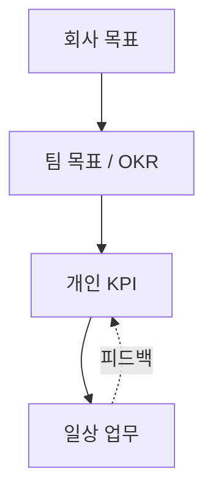

> 🙋 "이번 분기 KPI 잡아오세요"라는 말을 듣고 머릿속이 하얘진 적 있나요?
> 코드는 짤 줄 아는데, 내 성과를 숫자로 어떻게 설명해야 할지는 아무도 안 가르쳐줍니다.

## KPI가 대체 뭔가요?

**KPI(Key Performance Indicator, 핵심 성과 지표)**는 말 그대로 "목표를 향해 잘 가고 있는지 보여주는 숫자"입니다. 회사 전체 목표가 있고, 그걸 쪼갠 팀 목표가 있고, 그 팀 목표에 내가 기여하는 정도를 숫자로 보여주는 게 개인 KPI예요.

비유하자면 자동차 계기판과 비슷합니다. 목적지(회사 목표)까지 잘 가고 있는지, 속도계·연료계(KPI)를 보면서 확인하는 거죠. 계기판 숫자 자체가 목적지는 아니지만, 숫자가 이상하면 뭔가 잘못되고 있다는 신호입니다.




## 왜 개발자한테도 KPI 이야기가 나올까

"저는 그냥 코드만 잘 짜면 되는 거 아닌가요?"라고 생각할 수 있지만, 회사 입장에서는 개발자의 결과물도 결국 **비즈니스에 기여하는 정도**로 설명이 되어야 합니다. 다만 개발자 KPI는 영업 실적처럼 딱 떨어지지 않아서 오해가 많이 생기는 영역이기도 해요. 그래서 "이론"과 "실제 좋은 지표"를 구분해서 아는 게 중요합니다.

## 개발자에게 흔히 쓰이는 보편적 KPI

가장 널리 인정받는 기준은 소프트웨어 딜리버리 성과를 측정하는 **DORA 4대 지표**입니다. 팀 단위로 많이 쓰이지만, 내가 팀에 어떻게 기여하는지 이해하는 데도 큰 도움이 돼요.

| 지표 | 의미 | 좋다는 신호 |
| --- | --- | --- |
| 배포 빈도 (Deployment Frequency) | 얼마나 자주 배포하는가 | 잦고 작은 배포 |
| 변경 리드타임 (Lead Time for Changes) | 코드 커밋부터 배포까지 걸리는 시간 | 짧을수록 좋음 |
| 변경 실패율 (Change Failure Rate) | 배포 후 장애/롤백이 발생하는 비율 | 낮을수록 좋음 |
| 평균 복구 시간 (MTTR) | 장애 발생 후 복구까지 걸리는 시간 | 짧을수록 좋음 |

이 외에도 팀/조직에 따라 이런 지표들이 실무에서 자주 쓰입니다.

- **코드 리뷰 응답 시간**: PR을 올렸을 때 첫 리뷰까지 걸리는 시간
- **버그 재발률**: 고친 버그가 다시 터지는 비율
- **테스트 커버리지**: 코드가 테스트로 얼마나 보호되고 있는가
- **온콜/장애 대응 품질**: 장애 알림에 얼마나 침착하고 빠르게 대응했는가

## "좋은" 개발자 KPI의 조건

숫자라고 다 좋은 KPI는 아닙니다. 좋은 KPI에는 공통점이 있어요.

1. **내가 통제할 수 있어야 한다.** 시장 상황처럼 내 힘으로 못 바꾸는 숫자는 KPI로서 의미가 약합니다.
2. **결과뿐 아니라 행동을 반영한다.** "버그 0개"보다 "리뷰받고 테스트 작성하는 습관" 같은 과정도 함께 봐야 왜곡이 덜합니다.
3. **정성적 평가와 함께 간다.** 숫자 하나로 사람을 판단하지 않고, 동료 피드백·코드 품질 같은 정성 평가와 짝을 이룹니다.
4. **팀/회사 목표와 연결된다.** 내 KPI가 왜 중요한지 한 문장으로 설명할 수 있어야 합니다.

## 이런 KPI는 특히 조심하세요 — 흔한 부작용

지표 자체는 멀쩡한데, 목표로 삼는 순간 부작용을 낳는 경우가 있습니다. **"측정하는 순간 그 지표에 맞춰 행동이 왜곡된다"**는 굿하트의 법칙(Goodhart's Law)을 기억해두면 도움이 됩니다.

- **"버그 0개"를 목표로 잡으면** → 버그를 숨기거나, 쉬운 이슈만 골라 닫아버리는 부작용이 생깁니다. 발견율과 해결 속도를 함께 봐야 합니다.
- **"테스트 커버리지 100%"를 목표로 삼으면** → 의미 없는 테스트만 늘어나는 경우가 많습니다. 커버리지는 참고용 신호일 뿐, 그 자체가 목표가 되면 안 됩니다.
- **"배포 빈도만 최우선"으로 삼으면** → 리스크 큰 배포를 무리하게 밀어붙이는 문제가 생길 수 있어요. 변경 실패율과 항상 짝을 이뤄야 균형이 맞습니다.
- **"처리한 티켓 개수"를 KPI로 삼으면** → 어렵고 중요한 작업 대신 쉬운 티켓만 골라 처리하는 "편식"이 생깁니다.

공통점은 하나입니다. **지표 하나만 단독으로 보면 반드시 게임(왜곡)당한다.** 그래서 실무에서는 상반된 지표를 짝으로 묶어(예: 속도 ↔ 실패율, 처리량 ↔ 난이도) 균형을 잡습니다. 매니저가 어떤 KPI를 제시하면, "이 지표 하나만 극단적으로 밀어붙이면 어떤 부작용이 생길까?"를 한 번쯤 스스로 물어보세요.

## 신입이 빠지기 쉬운 "가짜 KPI" 함정

숫자가 크다고 좋은 게 아닙니다. 아래는 흔히 착각하는 지표들이에요.

- **커밋 수**: 커밋을 잘게 쪼개면 얼마든지 늘릴 수 있는 숫자입니다. 많다고 생산적인 게 아니에요.
- **코드 라인 수**: 오히려 짧고 명확한 코드가 더 좋은 코드인 경우가 많습니다.
- **야근 시간**: 오래 앉아있는 것과 성과는 별개입니다. 이걸 KPI처럼 착각하면 번아웃만 옵니다.
- **혼자 처리한 티켓 수**: 협업하며 남을 도운 시간은 숫자에 안 잡히지만 팀에는 똑같이 중요합니다.

이런 지표들을 **허영 지표(vanity metric)**라고 부릅니다. 보기엔 그럴싸하지만 실제 성과와는 거리가 있는 숫자라는 뜻이죠.


## 실전 꿀팁: 신입/주니어가 지금 당장 할 수 있는 것

**1. 1:1 미팅에서 이렇게 물어보세요.**
- "제 KPI 중에 이번 분기에 가장 중요하게 보시는 게 뭔가요?"
- "제가 통제할 수 없는 부분인데 KPI에 포함된 게 있을까요?"

이 질문만 던져도 매니저와 기대치를 맞추는 데 큰 도움이 됩니다.

**2. 나만의 성과 노트를 만드세요.** 리뷰 시즌에 몰아서 기억하려 하지 말고, 매주 짧게 기록해두면 평가 시즌에 훨씬 수월합니다.

```text
- 이번 주 배포 2건, 장애 0건
- PR 리뷰 5건 남김, 리뷰 응답 평균 4시간
- 신규 기능 A 설계 문서 작성 → 팀 리드 승인
```

**3. OKR과 KPI를 헷갈리지 마세요.** OKR(Objectives and Key Results)은 "우리가 이루고 싶은 방향"이고, KPI는 "그 방향으로 잘 가고 있는지 재는 자"입니다. OKR이 나침반이라면 KPI는 계기판이에요.

**4. 숫자 뒤의 맥락을 항상 함께 말하세요.** "배포 실패율이 높았다"보다 "신규 결제 모듈 도입 초기라 실패율이 일시적으로 올랐고, 다음 스프린트엔 롤백 자동화로 개선 예정"처럼 이야기로 풀면 평가자도 훨씬 신뢰합니다.

## 마치며

KPI는 나를 옥죄는 숫자가 아니라, **내 성장과 기여를 남에게 설명하는 언어**입니다. 처음엔 낯설어도, 매니저와 대화하면서 내 상황에 맞는 지표를 함께 찾아가는 과정 자체가 커리어 초반에 큰 자산이 됩니다.

오늘 소개한 지표 중 하나만이라도 이번 주부터 슬쩍 기록해보세요. 다음 1:1 미팅이 훨씬 편해질 거예요. 🚀
