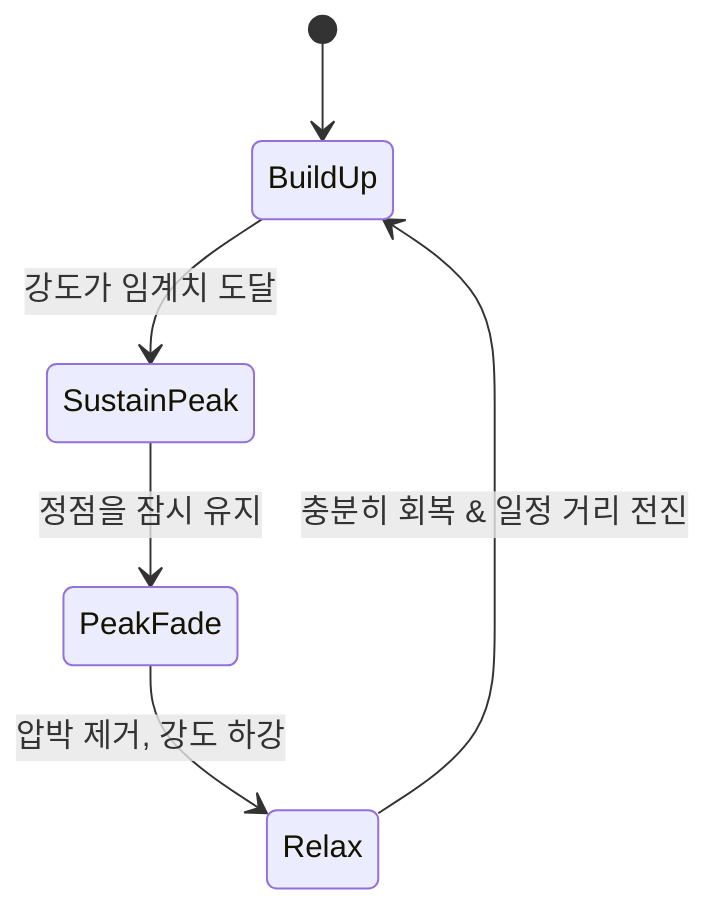

> 2009년에 나온 좀비 게임이 아직도 스팀 동시접속 순위에 얼굴을 내밉니다. 그래픽 때문일 리는 없고요. 이유는 매번 다르게 흘러가도록 만드는 **보이지 않는 감독** 하나에 있습니다.

---

## 30초 요약 — 레프트 4 데드 2가 뭔가요?

**레프트 4 데드 2(Left 4 Dead 2)** 는 밸브(Valve)가 2009년 11월 17일에 출시한 **4인 협동 좀비 FPS** 입니다. 전작 *레프트 4 데드*(2008, Turtle Rock Studios 개발)의 후속작이고, 두 작품 모두 밸브의 Source 엔진으로 만들어졌습니다.

규칙은 단순합니다. 생존자 네 명(코치, 엘리스, 닉, 로셸)이 **안전실에서 다음 안전실까지** 좀비 떼를 뚫고 이동하고, 마지막에 구조를 기다리는 피날레를 버텨내면 캠페인 하나가 끝납니다.

여기까지만 보면 흔한 좀비 게임입니다. 이 게임이 교과서 취급을 받는 이유는 **"같은 맵을 다시 해도 같은 판이 나오지 않는다"** 는 점에 있습니다.

<!-- 이미지 없음: hero (output/left-4-dead-2-ai-director/images/hero.* 확인) -->

---

## 게임의 뼈대 — 안전실, 크레센도, 피날레

캠페인 한 판의 리듬은 세 가지 장치로 만들어집니다.

**안전실(Safe Room)** 은 철문으로 잠기는 방입니다. 여기서만 체력을 회복하고 무기를 정비할 수 있으며, 네 명이 모두 들어와야 다음 챕터로 넘어갑니다. 즉 "뒤처진 동료를 버리고 갈 수 없게" 만드는 구조적 장치입니다.

**크레센도 이벤트(Crescendo Event)** 는 문을 열거나 엘리베이터 버튼을 누르는 순간 경보가 울리며 좀비가 몰려오는 구간입니다. 플레이어가 스스로 위험을 **선택하는 시점**을 만들어 준다는 점이 중요합니다.

**피날레**는 구조가 올 때까지 정해진 자리를 사수하는 마지막 시험대입니다. 이동이 사라지고 진형과 자원 관리만 남습니다.

---

## 특수 감염자 — 협동을 '강제'하는 설계

일반 좀비는 사실 위협이 아닙니다. 진짜 위협은 **특수 감염자(Special Infected)** 이고, 이들의 공통 설계 의도는 하나로 요약됩니다. **혼자 있으면 죽는다.**

| 특수 감염자 | 하는 일 | 강제되는 협동 행동 |
|---|---|---|
| 부머(Boomer) | 담즙을 뒤집어씌워 좀비 떼를 유인 | 뭉쳐 있을 때 터뜨리면 전멸 → **적절한 간격 유지** |
| 스모커(Smoker) | 혀로 감아 멀리 끌고 감 | 동료가 혀를 끊어줘야 생존 → **시야 공유** |
| 헌터(Hunter) | 덮쳐 눕히고 지속 피해 | 밀쳐내 줄 사람이 필요 → **후방 경계** |
| 차저(Charger) | 돌진해 한 명을 물고 이탈 | 진형이 강제로 찢어짐 → **분리 대응** |
| 자키(Jockey) | 올라타서 이동 방향을 조종 | 위험 지역으로 끌려감 → **즉시 사격** |
| 스피터(Spitter) | 산성 웅덩이를 생성 | 버티던 자리를 포기해야 함 → **재배치** |
| 탱크(Tank) | 거대한 체력과 물체 투척 | 화력 집중과 킷팅 → **역할 분담** |
| 위치(Witch) | 건드리면 즉사급 반격 | 우회하거나 조용히 처리 → **합의** |

차저·자키·스피터는 2편에서 새로 추가된 셋입니다. 셋 다 "**뭉쳐 있는 진형을 흐트러뜨리는**" 역할이라는 공통점이 있는데, 1편에서 플레이어들이 한 덩어리로 붙어 다니는 전략에 정착해 버린 것에 대한 대응으로 읽힙니다.

2편에서 함께 추가된 **근접 무기**(프라이팬, 기타, 도끼 등)도 같은 맥락입니다. 탄약을 아끼며 근접 좀비를 처리할 수 있게 되면서, 플레이어의 선택지가 "쏜다" 하나에서 "쏜다 / 민다 / 벤다"로 늘어났습니다.

---

## 본론 — AI 디렉터, 이 게임의 진짜 주인공

여기서부터가 이 글의 핵심입니다.

보통의 게임은 적을 **맵에 미리 배치**합니다. 레벨 디자이너가 "이 모퉁이에 3마리, 저 옥상에 저격수 1명"을 찍어 두는 방식이죠. 이 방식은 연출을 정밀하게 통제할 수 있지만, 치명적인 약점이 있습니다. **두 번째 플레이부터는 정답지를 아는 시험**이 된다는 것.

레프트 4 데드 시리즈는 이 배치를 사람이 아니라 **AI 디렉터(AI Director)** 라는 시스템에 맡깁니다.

<!-- 이미지 없음: director (output/left-4-dead-2-ai-director/images/director.* 확인) -->

### 디렉터는 무엇을 보는가 — 강도(Intensity)

디렉터는 플레이어가 "지금 얼마나 쥐어짜이고 있는지"를 수치로 추적합니다. 밸브는 이를 생존자별 **감정적 강도(emotional intensity)** 라고 설명했습니다. 값을 끌어올리는 입력은 대략 이런 것들입니다.

- 피해를 입었다
- 특수 감염자에게 붙잡혀 무력화됐다
- 근처에서 적이 죽거나, 적에게 둘러싸여 있다

그리고 이 값은 **시간이 지나면 서서히 내려갑니다.** 즉 디렉터가 보는 것은 "적을 몇 마리 죽였나"가 아니라 **"플레이어의 스트레스 곡선이 지금 어느 지점인가"** 입니다.

### 페이싱 사이클 — 올렸으면 반드시 내린다

디렉터는 이 강도 값을 기준으로 상태를 오갑니다. 공포 영화가 비명 뒤에 반드시 정적을 넣는 것과 같은 원리입니다.



- **Build Up**: 좀비를 조금씩 풀며 압박을 쌓는다.
- **Sustain Peak**: 정점을 아주 잠깐만 유지한다.
- **Peak Fade / Relax**: **일부러 아무것도 내보내지 않는다.** 이 구간에서 플레이어는 "지금 너무 조용한데?"라며 오히려 더 긴장합니다.

핵심은 마지막 줄입니다. 디렉터의 가장 중요한 기능은 적을 소환하는 게 아니라 **적을 소환하지 않기로 결정하는 것**입니다.

### 2편의 디렉터는 무대까지 바꾼다

1편의 디렉터가 주로 **스폰과 아이템 배치**를 담당했다면, 2편에서는 역할이 더 넓어졌습니다. 진행 상황에 따라 통행 가능한 경로가 달라지거나, 날씨가 바뀌어 시야와 이동이 제약되기도 합니다. 대표적으로 *하드 레인* 캠페인의 폭풍우는 "환경 자체가 난이도"가 되는 장면으로 자주 언급됩니다.

정리하면 이렇습니다. **레벨 디자이너는 무대와 가능한 배치 후보를 설계하고, 디렉터는 그중 무엇을 언제 쓸지 실시간으로 고른다.**

<!-- 이미지 없음: pacing (output/left-4-dead-2-ai-director/images/pacing.* 확인) -->

---

## 코드로 상상해보기 — 순수 랜덤 vs 피드백 기반

개념만 보면 "랜덤 스폰이랑 뭐가 다르냐" 싶습니다. 차이가 드러나는 지점을 코드로 비교해 보겠습니다. (실제 밸브 구현이 아니라, **원리를 보여주기 위한 유니티/C# 예시**입니다.)

### ❌ 안티패턴 — 시간 기반 랜덤 스폰

```csharp
using UnityEngine;

public class NaiveSpawner : MonoBehaviour
{
    [SerializeField] private GameObject enemyPrefab;
    [SerializeField] private float interval = 8f;

    private float timer;

    private void Update()
    {
        timer += Time.deltaTime;
        if (timer < interval) return;

        timer = 0f;
        int count = Random.Range(3, 12);      // 그냥 랜덤
        for (int i = 0; i < count; i++)
            Instantiate(enemyPrefab, RandomPointNearPlayer(), Quaternion.identity);
    }

    private Vector3 RandomPointNearPlayer() => /* ... */ Vector3.zero;
}
```

이 코드의 문제는 "랜덤이라서"가 아닙니다. **플레이어 상태를 전혀 읽지 않는다**는 것입니다. 체력 5로 기어가는 팀에게도, 방금 안전실을 나선 만피 팀에게도 똑같은 확률로 떼가 몰려옵니다.

그 결과는 두 가지로 갈립니다. 운 나쁘면 부당하게 느껴지는 죽음, 운 좋으면 아무 일도 없는 밋밋한 구간. 둘 다 설계자가 의도한 경험이 아닙니다.

### ✅ 권장 패턴 — 강도를 읽고 페이싱을 결정

```csharp
using UnityEngine;

public enum PacingState { BuildUp, SustainPeak, PeakFade, Relax }

public class PacingDirector : MonoBehaviour
{
    [SerializeField] private float peakThreshold = 0.85f;
    [SerializeField] private float relaxThreshold = 0.25f;
    [SerializeField] private float sustainSeconds = 4f;
    [SerializeField] private float minRelaxSeconds = 15f;
    [SerializeField] private float decayPerSecond = 0.12f;

    private PacingState state = PacingState.BuildUp;
    private float intensity;      // 0.0 ~ 1.0
    private float stateTimer;

    // 피격·무력화 등 '압박 이벤트'가 발생하면 게임플레이 쪽에서 호출한다.
    public void AddStress(float amount) =>
        intensity = Mathf.Clamp01(intensity + amount);

    private void Update()
    {
        float dt = Time.deltaTime;
        intensity = Mathf.Clamp01(intensity - decayPerSecond * dt);
        stateTimer += dt;

        switch (state)
        {
            case PacingState.BuildUp:
                TrySpawnPressure(dt);
                if (intensity >= peakThreshold) Enter(PacingState.SustainPeak);
                break;

            case PacingState.SustainPeak:
                if (stateTimer >= sustainSeconds) Enter(PacingState.PeakFade);
                break;

            case PacingState.PeakFade:
                // 새 적을 내보내지 않고, 남은 적이 정리되길 기다린다.
                if (intensity <= relaxThreshold) Enter(PacingState.Relax);
                break;

            case PacingState.Relax:
                // 의도적인 정적 구간. 여기서 아이템을 배치한다.
                if (stateTimer >= minRelaxSeconds) Enter(PacingState.BuildUp);
                break;
        }
    }

    private void Enter(PacingState next)
    {
        state = next;
        stateTimer = 0f;
    }

    private void TrySpawnPressure(float dt) { /* 스폰 후보 중 선택 */ }
}
```

차이는 코드량이 아니라 **결정의 근거**입니다. 뒤 코드에서 스폰은 시계가 아니라 **플레이어의 현재 상태**가 부릅니다. 그래서 "빡셌다 → 숨 돌렸다 → 다시 빡세졌다"는 리듬이 자동으로 만들어지고, 이 리듬이 곧 플레이어가 체감하는 '연출'이 됩니다.

### 참고: 실제 게임에서는 VScript로 건드린다

레프트 4 데드 2는 **VScript**(Squirrel 언어)를 지원해서, 맵 제작자가 디렉터의 동작 범위를 직접 조정할 수 있습니다. 커스텀 캠페인이나 뮤테이션이 만들어지는 방식이 이것입니다.

```squirrel
// 예시: 디렉터가 사용할 파라미터를 맵 스크립트에서 지정
DirectorOptions <- {
    MobMinSize = 10,
    MobMaxSize = 25,
    MobSpawnMinTime = 60,
    MobSpawnMaxTime = 90,
    TankLimit = 1,
    WitchLimit = 0
}
```

사용 가능한 키 목록과 정확한 표기는 게임 버전에 따라 다를 수 있으니, 실제로 만들 때는 [Valve Developer Community의 VScript 문서](https://developer.valvesoftware.com/wiki/VScript)에서 확인하는 것이 좋습니다.

---

## 트레이드오프 — 절차적 페이싱 vs 수동 스크립팅

AI 디렉터가 언제나 정답이라는 뜻은 아닙니다. 두 방식은 목적이 다릅니다.

| 기준 | 절차적 페이싱 (AI 디렉터) | 수동 배치·스크립팅 |
|---|---|---|
| 반복 플레이 가치 | 높음 — 판마다 달라짐 | 낮음 — 두 번째부터 외워짐 |
| 연출 정밀도 | 낮음 — "그 순간"을 못 박기 어려움 | 높음 — 프레임 단위 통제 가능 |
| 밸런스 검증 | 어려움 — 경우의 수가 폭발 | 쉬움 — 테스트 대상이 유한 |
| 개발 비용 | 초기 시스템 구축비 큼 | 콘텐츠 양에 비례해 선형 증가 |
| e스포츠 공정성 | 불리 — 팀마다 다른 판을 받음 | 유리 — 동일 조건 보장 |

**절차적 페이싱을 쓸 때**: 짧은 세션을 수십 번 반복하는 게임(로그라이크, 협동 서바이벌, 익스트랙션 슈터), 콘텐츠 양보다 반복 가치가 중요한 게임.

**쓰면 안 되는 때**: 스토리 연출이 핵심인 선형 캠페인, 랭크 경쟁의 공정성이 중요한 대전 게임, 정밀한 난이도 곡선이 학습 목표인 게임(예: 패턴 암기형 보스). 레프트 4 데드 2조차 **피날레와 크레센도 이벤트의 뼈대는 수동으로 설계**해 두고, 그 안의 변주만 디렉터에게 맡깁니다.

즉 현실적인 선택은 "둘 중 하나"가 아니라 **"고정 뼈대 + 가변 살점"** 의 비율을 정하는 문제입니다.

---

## 흔한 오해 바로잡기

**오해 1. "디렉터가 알아서 난이도를 낮춰주니까 어려운 난이도도 결국 비슷하다."**
아닙니다. 난이도 설정(쉬움~전문가)은 피해량·체력 같은 **수치 규칙**을 바꾸고, 디렉터는 그 규칙 위에서 **언제 무엇을 얼마나 보낼지**를 조절합니다. 층위가 다릅니다. 디렉터는 팀이 무너지고 있을 때 압박을 잠시 거두어 줄 수는 있어도, 전문가 난이도의 한 방을 솜방망이로 만들어 주지는 않습니다.

**오해 2. "매번 완전히 새로운 맵이 생성된다."**
아닙니다. 맵의 지형·경로·이벤트 위치는 **고정**입니다. 달라지는 것은 좀비와 아이템의 배치, 특수 감염자의 등장 타이밍과 조합, 일부 통로·환경 변화입니다. 절차적 생성(procedural generation)이 아니라 **절차적 페이싱(procedural pacing)** 이라고 부르는 편이 정확합니다.

**오해 3. "AI 디렉터는 머신러닝 모델이다."**
그렇게 볼 근거는 없습니다. 공개된 설명에 따르면 핵심은 **규칙 기반 상태 기계와 휴리스틱**입니다. 여기서 얻을 교훈이 오히려 중요합니다. "AI처럼 느껴지는 경험"을 만드는 데 학습 모델이 필수는 아니며, **플레이어 상태를 읽는 좋은 지표 하나와 정직한 상태 기계**로도 충분한 경우가 많습니다.

---

## 2026년에 처음 시작한다면

- **모드**: 캠페인(협동), 대전(Versus, 한 팀이 특수 감염자를 조작), 생존(Survival), 스캐빈지(Scavenge), 리얼리즘(Realism), 그리고 규칙을 바꿔 노는 **뮤테이션(Mutations)**.
- **업데이트**: 2020년 9월, 커뮤니티 제작진이 참여한 대형 무료 업데이트 **The Last Stand** 가 배포되며 콘텐츠와 밸런스가 갱신됐습니다. 출시 11년 차 게임에 붙은 업데이트라는 점에서 이례적인 사례입니다.
- **워크샵**: 스팀 창작마당에 캠페인·모델·뮤테이션이 방대하게 쌓여 있습니다. 위에서 본 VScript가 그 토대입니다.
- **입문 팁**: 처음이라면 캠페인 '보통' 난이도로 시작하고, **뭉치되 부머 반경만큼은 벌리는** 감각부터 익히면 됩니다. 이 게임의 사망 원인 1위는 좀비가 아니라 **혼자 앞서간 팀원**입니다.

---

## 셀프 체크 질문

1. AI 디렉터가 "적을 더 보내는 것"보다 중요하게 수행하는 결정은 무엇이고, 그 이유는 무엇인가요?
2. 레프트 4 데드 2의 방식을 랭크 기반 경쟁 대전 게임에 그대로 적용하면 어떤 문제가 생기나요?
3. 특수 감염자 설계에서 반복적으로 관찰되는 공통 목적을 한 문장으로 말해보세요.

:::toggle 정답 보기
1. **적을 보내지 않기로 결정하는 것**(Peak Fade / Relax 구간)입니다. 압박이 계속되면 플레이어는 그 강도에 적응해 버려 긴장이 사라지고 피로만 남습니다. 정점 뒤에 정적을 넣어야 다음 정점이 다시 정점으로 느껴지고, 회복·재정비라는 의사결정 구간도 이때 생깁니다.
2. **팀마다 서로 다른 판을 받게 되어 공정성이 깨집니다.** 실력 차이와 디렉터가 만든 상황 차이를 분리할 수 없으니 순위의 정당성이 흔들립니다. 경쟁 모드에서는 동일 조건 보장이 반복 플레이 가치보다 우선하는 경우가 많습니다.
3. **"혼자 있으면 죽고, 뭉치기만 해도 죽는" 상태를 만들어 팀을 계속 재배치시키는 것.** 스모커·헌터·자키·차저는 고립을 처벌하고, 부머·스피터·탱크는 과도한 밀집을 처벌합니다. 그래서 플레이어는 매 순간 간격을 다시 계산해야 합니다.
:::

---

## 더 깊이 파고들기

- [Valve Publications](https://www.valvesoftware.com/en/publications) — 밸브가 공개한 발표 자료 모음. 마이클 부스(Michael Booth)의 *The AI Systems of Left 4 Dead*(AIIDE 2009), *Replayable Cooperative Game Design: Left 4 Dead*(GDC 2009)가 디렉터 설계의 1차 자료입니다.
- [Valve Developer Community — Left 4 Dead 2](https://developer.valvesoftware.com/wiki/Left_4_Dead_2) — 맵 제작·엔티티·디렉터 관련 문서의 출발점. 실제로 만들어 보려면 여기부터.
- [Valve Developer Community — VScript](https://developer.valvesoftware.com/wiki/VScript) — 디렉터 파라미터를 스크립트로 제어하는 방법. 뮤테이션과 커스텀 캠페인의 근간입니다.
- [Left 4 Dead 2 (Steam 상점 페이지)](https://store.steampowered.com/app/550/Left_4_Dead_2/) — 게임 모드·업데이트 내역·시스템 요구사항 확인용.

---

좋은 게임 시스템은 플레이어에게 보이지 않습니다. 레프트 4 데드 2를 하면서 "여기서 탱크가 나오다니 미쳤다"고 소리치는 순간, 사실 우리는 **잘 설계된 상태 기계 하나에 감탄하고 있는 것**입니다.

만들고 있는 게임에 반복 플레이 가치가 필요하다면, 콘텐츠를 두 배로 찍어내기 전에 이 질문을 먼저 해보면 좋겠습니다. **"지금 우리 게임은 플레이어의 어떤 상태를 읽고 있는가?"**
