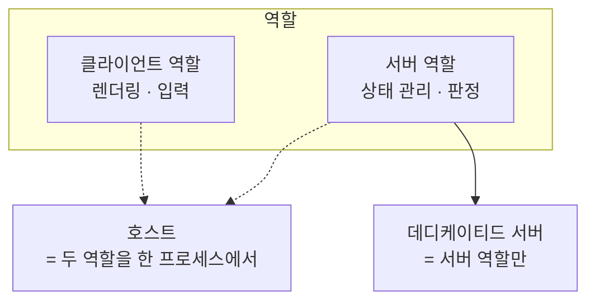
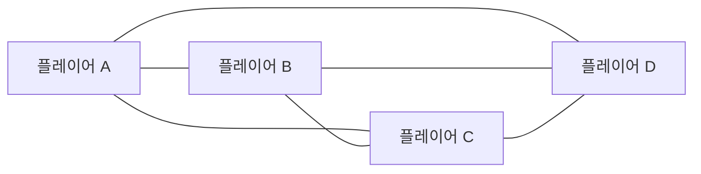
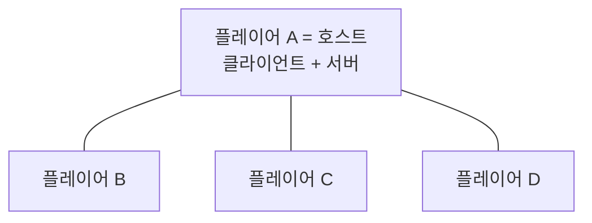
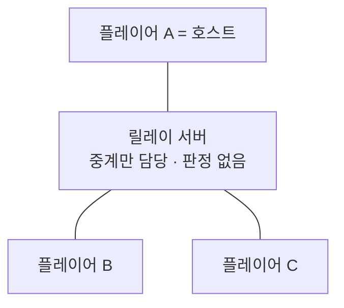
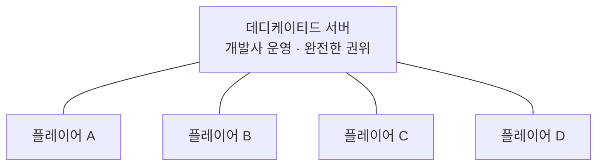
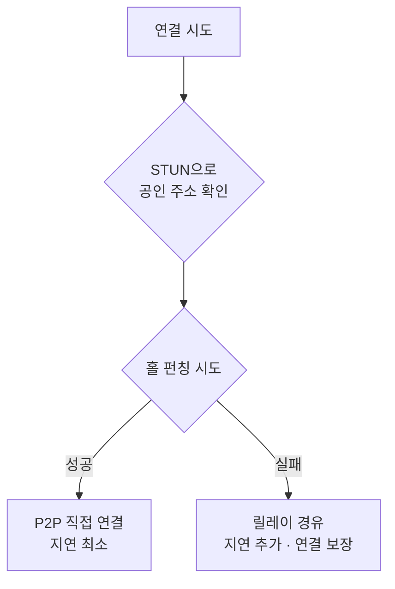

> "친구 방에 들어가서 같이 게임했다"는 한 문장 뒤에는, 누가 진실을 판정할 것인가에 대한 꽤 무거운 설계 결정이 숨어 있습니다.

---

## 시작하기 전에: 멀티플레이가 어려운 진짜 이유

멀티플레이 게임을 만든다고 하면 보통 "데이터를 주고받으면 되는 거 아냐?"라고 생각합니다. 그런데 실제로 부딪히는 벽은 통신이 아니라 **의견 충돌**입니다.

내 화면에서는 내가 총알을 피했습니다. 상대 화면에서는 내가 맞았습니다. 두 컴퓨터는 물리적으로 떨어져 있고, 그 사이를 오가는 패킷은 빛의 속도라는 상한선과 라우터라는 현실적인 병목을 넘지 못합니다. 그래서 **두 화면은 절대로 완벽히 같을 수 없습니다.**

그렇다면 남은 질문은 하나입니다. *"누구 화면이 진짜인가?"*

이 질문에 답하는 주체를 게임 네트워크에서는 **권위(authority)** 를 가진다고 표현합니다. 그리고 이 글에서 다룰 "멀티 서버 구현 방식"이란, 결국 **그 권위를 어느 컴퓨터에 맡길 것인가**를 정하는 구조 설계입니다.


---

## 등장인물 정리 — 클라이언트, 서버, 호스트, 피어

구조를 비교하기 전에 용어부터 짚고 갑시다. 이 네 단어를 헷갈리면 이후 설명이 전부 뒤엉킵니다.

- **클라이언트(Client)**: 플레이어가 직접 조작하는 게임 프로그램. 화면을 그리고 입력을 받습니다.
- **서버(Server)**: 게임 세계의 상태를 관리하고 판정을 내리는 프로그램. **꼭 데이터센터에 있어야 하는 건 아닙니다.**
- **호스트(Host)**: 클라이언트와 서버 역할을 **한 프로세스에서 동시에** 수행하는 플레이어. "방장"이 여기에 해당합니다.
- **피어(Peer)**: 상하 관계 없이 서로 동등하게 통신하는 참여자. P2P의 P가 이겁니다.

여기서 초심자가 가장 자주 놓치는 지점이 있습니다. **"서버"는 하드웨어가 아니라 역할입니다.** 친구가 방을 열었을 때 그 친구의 게임용 노트북도 그 순간에는 완벽하게 "서버"입니다.



---

## 방식 1 — P2P 풀 메시 (모두가 모두에게)

가장 원초적인 형태입니다. **서버라는 존재 자체가 없습니다.** 참가자 전원이 나머지 전원과 직접 연결을 맺고, 자기 상태를 모두에게 뿌립니다.

4명이 플레이한다면 연결은 6개(4×3÷2), 8명이면 28개가 생깁니다. 연결 수는 인원의 **제곱에 비례**해서 늘어납니다. 이게 P2P의 확장성을 가장 먼저 무너뜨리는 요인입니다.



**장점**은 명확합니다. 서버 운영비가 0원이고, 패킷이 중간 경유지 없이 상대에게 직행하므로 이론상 지연이 가장 낮습니다.

**단점**도 그만큼 명확합니다. 인원이 늘면 각자가 감당할 업로드 대역폭이 폭증하고, 판정을 내려줄 심판이 없어서 상태가 서로 어긋나기 쉽습니다. 그리고 서로의 IP 주소가 그대로 노출되기 때문에, 지고 있는 상대가 내 회선을 공격하는 사고가 실제로 보고되는 구조입니다.

그럼에도 P2P가 여전히 쓰이는 이유는, 뒤에서 설명할 **결정론적 락스텝**과 결합했을 때 "판정 심판이 없어도 모두가 같은 결론에 도달"하게 만들 수 있기 때문입니다. 고전 RTS와 대전 격투 게임 계열이 이 조합을 씁니다.

---

## 방식 2 — 리슨 서버 / 호스트 방식 (유저가 방을 열면 그 유저가 서버)

"방을 만들기"를 눌렀을 때 그 사람의 게임 프로세스가 **서버 역할을 겸임**하는 방식입니다. 영어로는 리슨 서버(listen server)라고 부릅니다. 서버 로직이 돌면서 화면도 같이 "듣고" 그린다는 의미입니다.

콘솔 협동 게임이나 캐주얼 파티 게임에서 압도적으로 흔한 구조입니다. 나머지 플레이어는 전부 순수 클라이언트가 되고, 판정은 호스트 한 명이 전담합니다.



P2P와 비교하면 **구조적으로 훨씬 건강합니다.** 심판이 한 명으로 정해졌기 때문에 상태 불일치가 원천적으로 줄어들고, 연결 수도 인원에 비례해서만 늘어납니다. 코드도 단순해집니다. 대부분의 게임 네트워킹 라이브러리가 호스트 모드를 기본 제공하는 이유입니다.

다만 **호스트라는 존재가 특권이자 단일 실패 지점**이 됩니다.

첫째, **호스트 어드밴티지**. 호스트의 입력은 네트워크를 타지 않고 곧바로 서버 로직에 반영되므로, 호스트만 사실상 지연 0으로 플레이합니다. 경쟁 게임에서는 이것만으로도 공정성이 무너집니다.

둘째, **호스트 이탈**. 방장이 게임을 끄면 세션 전체가 증발합니다. 이걸 막으려면 **호스트 마이그레이션**, 즉 남은 플레이어 중 하나를 새 호스트로 승격시키고 게임 상태를 넘겨주는 절차를 직접 구현해야 합니다. 말은 간단하지만, 상태를 통째로 직렬화해서 전송하고 그 사이의 입력 유실을 처리하는 작업이라 난이도가 상당합니다.

셋째, **호스트가 곧 치터일 수 있습니다**. 판정 코드가 그 사람의 PC 메모리 안에서 도는 이상, 메모리를 조작하는 호스트를 막을 방법이 사실상 없습니다.

넷째, **방의 품질이 호스트의 회선과 성능에 종속됩니다.** 호스트의 업로드 속도가 느리면 나머지 전원이 렉을 겪습니다.

---

## 방식 3 — 릴레이 서버 (호스트는 유저, 우편 배달만 회사가)

리슨 서버 방식을 쓰되, 패킷이 서로에게 직접 가지 않고 **개발사가 운영하는 중계 서버를 한 번 경유**하게 만드는 방식입니다.

여기서 아주 중요한 포인트가 있습니다. **릴레이는 판정을 하지 않습니다.** 게임 로직을 전혀 모른 채, 받은 패킷을 지정된 상대에게 그대로 넘겨주기만 합니다. 즉 릴레이는 "누가 서버냐"를 바꾸는 게 아니라 **"패킷이 어떤 경로로 가느냐"만 바꾸는 옵션**입니다. 권위는 여전히 호스트에게 있습니다.



그럼 왜 굳이 한 번 더 거치게 만들까요? 두 가지 실질적인 문제를 해결해 주기 때문입니다.

**첫째, 연결이 그냥 됩니다.** 뒤에서 설명할 NAT 문제 때문에 P2P 직접 연결은 생각보다 자주 실패합니다. 릴레이는 양쪽 모두가 "밖으로 나가는 연결"만 맺으면 되므로 성공률이 훨씬 높습니다.

**둘째, IP가 숨겨집니다.** 플레이어끼리 서로의 실제 주소를 알 수 없으니 회선 공격 위험이 사라집니다.

비용 측면에서도 매력적입니다. 릴레이는 게임 시뮬레이션을 돌리지 않고 패킷만 넘기므로, 완전한 데디케이티드 서버보다 인스턴스당 훨씬 많은 세션을 감당할 수 있습니다. 대신 **경유하는 만큼 지연이 추가되고**, 호스트 어드밴티지와 호스트 치팅 문제는 하나도 해결되지 않습니다.

Unity Gaming Services의 Relay, Steam의 Steam Datagram Relay, Photon의 룸 기반 통신이 모두 이 계열에 속합니다.

---

## 방식 4 — 데디케이티드 서버 (개발사가 서버를 돌린다)

개발사가 **화면 출력 없는 전용 서버 빌드(헤드리스 빌드)** 를 데이터센터나 클라우드에 띄워두고, 플레이어는 전원 순수 클라이언트로 접속하는 방식입니다. 경쟁 FPS, 배틀로얄, MMO가 이 구조를 택합니다.



**모든 공정성 문제가 여기서 해결됩니다.** 판정 코드가 개발사 통제 하의 머신에서만 돌기 때문에 클라이언트 메모리를 아무리 조작해도 게임 규칙 자체를 바꿀 수 없습니다. 모든 플레이어가 동등하게 네트워크 지연을 겪으므로 호스트 어드밴티지도 없습니다. 누가 나가든 서버는 계속 돌아가고, 서버 성능이 허락하는 한 인원도 늘릴 수 있습니다.

대가는 **돈과 운영 복잡도**입니다.

동시 접속자가 늘어나면 서버 인스턴스도 비례해서 늘려야 하고, 그건 그대로 클라우드 요금이 됩니다. 게다가 한국 플레이어를 미국 서버에 붙일 수는 없으니 **지역별로 서버를 배치**해야 하고, 매치가 끝날 때마다 인스턴스를 정리하고 새 매치를 위해 띄우는 **오케스트레이션**이 필요합니다. 이 영역을 위한 오픈소스가 Kubernetes 기반의 Agones입니다.

개발 난이도도 올라갑니다. "서버에만 있어야 할 코드"와 "클라이언트에만 있어야 할 코드"를 처음부터 분리해서 설계해야 하는데, 이걸 나중에 하려고 하면 사실상 재작성에 가까운 작업이 됩니다.


---

## 방식 5 — 하이브리드 (실제로 상용 게임이 하는 것)

여기까지 읽고 "그래서 뭘 골라야 하지?"라고 생각했다면, 현실의 답은 **"하나만 고르지 않는다"** 입니다.

거의 모든 상용 멀티플레이 게임은 기능별로 다른 구조를 씁니다.

- **계정, 친구 목록, 상점, 전적, 매치메이킹** → 언제나 개발사의 백엔드 서버 (권위가 절대 클라이언트에 있으면 안 되는 영역)
- **로비와 방 목록** → 개발사의 로비 서버
- **실제 게임플레이** → 게임 장르에 따라 P2P / 호스트 / 릴레이 / 데디케이티드 중 선택

즉 "우리 게임은 P2P입니다"라고 말하는 게임도, 매치를 잡아주는 순간까지는 회사 서버를 씁니다. 캐주얼 게임이 협동 모드는 호스트 방식으로, 랭크 모드만 데디케이티드로 돌리는 식으로 **모드별로 다르게 가는 경우도 흔합니다.**

MMO는 여기서 한 단계 더 나아가, 하나의 거대한 세계를 **존(zone)이나 샤드(shard) 단위로 쪼개 여러 서버 프로세스에 나눠 담고** 플레이어가 경계를 넘을 때 서버 간에 핸드오프를 합니다. 데디케이티드 방식의 확장형이라고 보면 됩니다.

---

## NAT 뚫기 — P2P가 생각보다 어려운 이유

P2P나 호스트 방식을 이야기할 때 반드시 따라오는 벽이 **NAT**입니다. 초심자가 "그냥 IP로 연결하면 되지 않나?"라고 생각했다가 가장 크게 데이는 지점이라 따로 다룹니다.

집에 있는 공유기는 여러 기기가 하나의 공인 IP를 나눠 쓰게 해줍니다. 이 과정을 NAT(Network Address Translation)라고 합니다. 문제는 **밖에서 안으로 먼저 들어오는 연결은 공유기가 막는다**는 점입니다. 공유기 입장에서는 그 패킷을 집 안의 어느 기기에 줘야 할지 알 수 없으니까요.

즉 친구의 게임이 내 게임에 직접 접속하려고 하면, 내 공유기가 그 패킷을 버립니다. 양쪽 다 마찬가지입니다.

이걸 해결하는 표준적인 절차가 있습니다.

1. **STUN** — 공용 서버에 물어봐서 "밖에서 본 내 주소와 포트"를 알아냅니다.
2. **홀 펀칭** — 양쪽이 *동시에* 상대에게 패킷을 먼저 쏩니다. 그러면 각자의 공유기에 "이 상대와 통신 중"이라는 임시 통로가 뚫려서, 뒤이어 오는 상대 패킷이 통과합니다.
3. **TURN** — 위 방법이 실패하면 중계 서버를 거칩니다. 앞서 본 릴레이가 바로 이 폴백입니다.
4. **ICE** — 위 후보들을 전부 시도해보고 되는 경로를 고르는 프레임워크입니다.

홀 펀칭은 꽤 잘 동작하지만 **모든 경우에 되지는 않습니다.** 특히 목적지마다 다른 포트를 배정하는 유형의 NAT(대칭형 NAT)에서는 예측이 빗나가 실패합니다. 기업망이나 일부 통신사 환경에서 유독 P2P 연결이 안 되는 이유가 이겁니다.

**그래서 실무의 결론은 이렇습니다. P2P를 쓰더라도 릴레이 폴백은 반드시 준비해야 합니다.** "대부분 되니까 괜찮겠지"로 출시하면, 연결 실패 문의가 그대로 쌓입니다.



---

## 트레이드오프 한눈에 보기

| 기준 | P2P 풀 메시 | 리슨 서버(호스트) | 릴레이 + 호스트 | 데디케이티드 |
|---|---|---|---|---|
| 서버 운영비 | 없음 | 없음 | 트래픽 비례(저렴) | 동접 비례(비쌈) |
| 지연 | 가장 낮음 | 낮음 | 중간(경유 추가) | 중간(거리 의존) |
| 치팅 방어 | 매우 취약 | 취약(호스트) | 취약(호스트) | 강함 |
| 공정성 | 판정 주체 모호 | 호스트 어드밴티지 | 호스트 어드밴티지 | 전원 동등 |
| 최대 인원 | 소규모(대략 4~8) | 중소규모 | 중소규모 | 대규모 |
| 호스트 이탈 | 세션 붕괴 | 마이그레이션 필요 | 마이그레이션 필요 | 영향 없음 |
| IP 노출 | 노출됨 | 노출됨 | 숨겨짐 | 숨겨짐 |
| 구현 난이도 | 높음(동기화) | 낮음 | 낮음 | 높음(운영 포함) |

**언제 무엇을 쓰는가**에 대한 구체적인 판단 기준을 정리하면 이렇습니다.

**데디케이티드를 써야 하는 경우**: 랭크나 승패 기록이 존재하는 경쟁 게임, 아이템·재화 등 경제 시스템이 있는 게임, 동시 인원이 16명을 넘는 게임, 세션이 끝나도 세계가 유지돼야 하는 게임. 이 조건 중 하나라도 해당하면 다른 선택지는 사실상 없습니다.

**호스트/릴레이 방식으로 충분한 경우**: 친구끼리 하는 협동 게임, 승패가 기록되지 않는 캐주얼 게임, 인원이 8명 이하인 게임, 서버 비용을 감당할 수익 모델이 아직 없는 프로젝트.

**P2P를 고려할 만한 경우**: 결정론적 시뮬레이션이 가능한 장르(대전 격투, 고전 RTS), 인원이 4명 이하이면서 프레임 단위 반응 속도가 게임성의 핵심인 경우.

**절대 하지 말아야 할 선택**: 경쟁 게임을 클라이언트 권위 P2P로 만드는 것. 출시 직후 치팅으로 게임이 무너집니다.

---

## 안티패턴 vs 권장 패턴

토폴로지 선택에서 가장 자주 나오는 실수는, **판정 주체를 정하지 않고 각자 판정한 결과를 서로에게 통보**하는 것입니다.

아래는 개념을 보여주기 위한 의사코드입니다. 특정 엔진 API가 아니라, 어떤 구조를 짜면 안 되는지를 보여주는 예시로 읽어주세요.

```csharp
// ❌ 안티패턴: 각 피어가 스스로 판정하고 결과만 통보한다
void OnFireButtonPressed(Vector3 aimDirection)
{
    // 내 컴퓨터에서 맞았는지 판정해버린다
    if (Physics.Raycast(transform.position, aimDirection, out RaycastHit hit))
    {
        var target = hit.collider.GetComponent<Player>();
        target.health -= 20;                     // 남의 체력을 내가 깎는다

        // "쟤 체력 이제 이거야" 라고 전원에게 통보
        BroadcastToAllPeers(new HealthUpdate(target.id, target.health));
    }
}
```

이 코드는 두 가지가 동시에 무너집니다. 첫째, 두 피어가 같은 순간에 서로를 쐈다면 각자 자기 총알만 맞췄다고 주장하게 되어 **상태가 영구적으로 갈라집니다.** 둘째, 메모리를 조작한 클라이언트가 `health = 0`을 통보하면 **아무도 반박할 수 없습니다.**

```csharp
// ✅ 권장 패턴: 클라이언트는 '입력'만 보내고, 판정은 권위 주체가 한다
// [클라이언트]
void OnFireButtonPressed(Vector3 aimDirection)
{
    // 결과가 아니라 의도만 전송한다
    SendToAuthority(new FireInput(aimDirection, clientTick));

    PlayMuzzleFlashEffect();   // 연출은 즉시 (판정과 무관한 시각 효과)
}

// [권위 주체 = 데디케이티드 서버 또는 호스트]
void HandleFireInput(int shooterId, FireInput input)
{
    var shooter = world.GetPlayer(shooterId);

    // 서버가 가진 '진짜' 월드 상태로 다시 판정한다
    if (!world.Raycast(shooter.position, input.aimDirection, out var hitId))
        return;

    world.ApplyDamage(hitId, weaponTable[shooter.weapon].damage);

    // 결과는 서버만 브로드캐스트한다
    BroadcastToAllClients(new HealthChanged(hitId, world.GetPlayer(hitId).health));
}
```

핵심 차이는 **전송하는 데이터의 성격**입니다. 안티패턴은 "결과"를 보내고, 권장 패턴은 "의도"를 보냅니다. 데미지 수치도 클라이언트가 보낸 값이 아니라 **서버가 가진 테이블에서 조회**한다는 점을 눈여겨보세요.

주의할 점은, 이 구조를 그대로 적용하면 **버튼을 눌러도 서버 응답이 올 때까지 반응이 없는 것처럼 느껴진다**는 것입니다. 이 체감 지연을 없애는 기법(클라이언트 예측, 서버 재조정, 랙 보상)이 2편의 주제입니다.

---

## 흔한 오해 바로잡기

**오해 1: "P2P는 서버가 없으니까 무조건 싸고 좋다"**

게임플레이 트래픽 비용은 줄어들지만, 매치메이킹 서버·STUN 서버·릴레이 폴백은 여전히 필요합니다. 완전히 공짜인 구조는 없습니다. 게다가 P2P에서 상태를 어긋나지 않게 유지하는 일은 서버 방식보다 **훨씬 어렵습니다.** 인프라 비용을 개발 난이도로 치환한 것에 가깝습니다.

**오해 2: "데디케이티드 서버를 쓰면 치팅이 사라진다"**

게임 규칙을 조작하는 치팅은 막습니다. 하지만 클라이언트에서만 판단할 수 있는 정보를 이용하는 치팅은 별개입니다. 예를 들어 조준을 대신해주는 프로그램(에임봇)은 클라이언트가 보낸 조준 방향 자체가 정상 범위이므로 서버가 규칙 위반으로 판정할 수 없습니다. 벽 너머 적 위치를 보는 치팅(월핵)도 **서버가 보이지 않는 적 정보를 애초에 안 보내는 설계**를 해야 막을 수 있습니다. 데디케이티드는 필요조건이지 충분조건이 아닙니다.

**오해 3: "릴레이 서버 = 데디케이티드 서버"**

가장 흔한 혼동입니다. 릴레이는 패킷을 넘겨주기만 하고 **게임 로직을 전혀 모릅니다.** 판정 권한은 여전히 플레이어 중 한 명에게 있습니다. 릴레이를 쓴다고 해서 호스트 치팅이나 호스트 어드밴티지가 해결되지 않습니다.

**오해 4: "일단 호스트 방식으로 만들고 나중에 데디케이티드로 바꾸면 된다"**

가능은 하지만, **처음부터 서버 코드와 클라이언트 코드를 분리해 두었을 때만** 현실적입니다. 렌더링·입력·UI 코드가 게임 로직과 뒤엉켜 있으면 헤드리스 빌드를 만드는 것부터 막힙니다. 호스트 방식으로 시작하더라도 "이 함수는 권위 주체에서만 실행된다"는 경계선은 첫날부터 그어두는 편이 안전합니다.

---

## 셀프 체크 질문

1. 리슨 서버(호스트) 방식과 데디케이티드 서버 방식의 가장 근본적인 차이는 무엇이며, 그 차이 때문에 발생하는 공정성 문제는 무엇인가요?
2. 릴레이 서버를 도입하면 해결되는 문제와, 여전히 해결되지 않는 문제를 각각 하나씩 설명해 보세요.
3. NAT 홀 펀칭이 실패할 수 있는 이유는 무엇이며, 그럴 때 어떤 대비책이 필요한가요?

:::toggle 정답 보기
1. **권위(판정 주체)가 플레이어의 PC에 있느냐, 개발사가 통제하는 머신에 있느냐**가 근본 차이입니다. 호스트 방식에서는 호스트의 입력이 네트워크를 거치지 않고 즉시 서버 로직에 반영되므로 호스트만 사실상 지연 0으로 플레이하게 되는 **호스트 어드밴티지**가 생깁니다. 또한 판정 코드가 호스트의 메모리에서 돌기 때문에 호스트의 치팅을 구조적으로 막을 수 없고, 호스트가 나가면 세션이 붕괴하므로 호스트 마이그레이션을 별도로 구현해야 합니다.

2. **해결되는 것**: NAT/방화벽 때문에 직접 연결이 실패하는 문제(양쪽 모두 바깥으로 나가는 연결만 맺으면 되므로 성공률이 높아짐)와 플레이어 간 IP 노출 문제(서로의 실주소를 알 수 없게 됨)입니다. **해결되지 않는 것**: 릴레이는 패킷을 중계만 할 뿐 게임 로직을 판정하지 않으므로, 권위는 여전히 호스트에게 있습니다. 따라서 호스트 어드밴티지와 호스트 치팅 문제는 그대로 남고, 경유하는 만큼 지연이 오히려 추가됩니다.

3. 홀 펀칭은 "내 공유기가 밖에서 본 내 주소와 포트"를 STUN으로 알아낸 뒤, 그 포트로 상대 패킷이 들어올 것이라고 전제합니다. 그런데 목적지마다 다른 포트를 새로 배정하는 유형의 NAT(대칭형 NAT)에서는 이 예측이 빗나가 통로가 열리지 않습니다. 기업망이나 일부 통신사 환경에서 특히 자주 발생합니다. 대비책은 **TURN 계열의 릴레이 폴백을 반드시 준비하는 것**입니다. P2P를 주 경로로 쓰더라도 실패 시 중계 경로로 자동 전환되게 설계해야 연결 실패 문의를 줄일 수 있습니다.
:::

---

## 더 깊이 파고들기

- [Valve — Source Multiplayer Networking](https://developer.valvesoftware.com/wiki/Source_Multiplayer_Networking) — 데디케이티드 서버 기반 FPS가 실제로 어떻게 동작하는지 원저자 측 설명으로 볼 수 있습니다. 2편의 랙 보상 내용을 읽기 전에 훑어두면 좋습니다.
- [Gabriel Gambetta — Fast-Paced Multiplayer](https://www.gabrielgambetta.com/client-server-game-architecture.html) — 클라이언트 예측과 서버 재조정을 인터랙티브 데모로 설명합니다. 글로 이해가 안 되던 부분이 데모 한 번에 풀리는 자료입니다.
- [RFC 8445 — ICE](https://datatracker.ietf.org/doc/html/rfc8445) — NAT 통과 후보 경로를 어떻게 수집하고 고르는지에 대한 표준 문서입니다. 홀 펀칭이 "운"이 아니라 절차라는 걸 확인할 수 있습니다.
- [Agones 공식 문서](https://agones.dev/site/docs/) — 데디케이티드 서버를 Kubernetes 위에서 어떻게 띄우고 정리하는지, 오케스트레이션이라는 영역이 실제로 무슨 일을 하는지 감을 잡을 수 있습니다.

---

## 다음 편 예고

이번 편에서는 **"누가 서버가 될 것인가"**, 즉 물리적인 연결 구조를 정리했습니다.

하지만 구조를 정했다고 게임이 부드럽게 돌아가지는 않습니다. 서버가 판정을 내리는 동안 내 캐릭터는 왜 멈춰 있지 않는지, 다른 플레이어는 어떻게 부드럽게 움직이는지, 분명히 맞췄는데 왜 안 맞은 판정이 나오는지 — 이 모든 것이 **동기화 기법**의 영역입니다.

2편에서는 서버 권위 모델, 클라이언트 예측과 서버 재조정, 엔티티 보간, 랙 보상, 그리고 결정론적 락스텝과 롤백 넷코드를 다루겠습니다.
