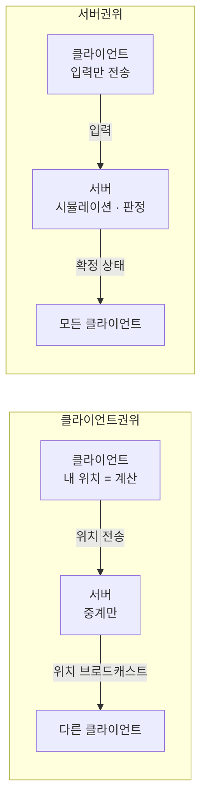
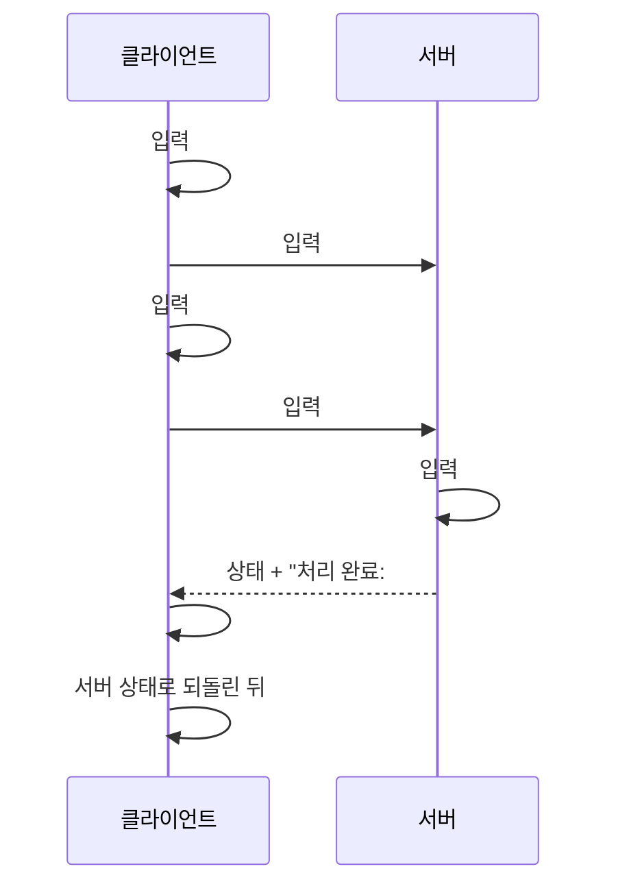
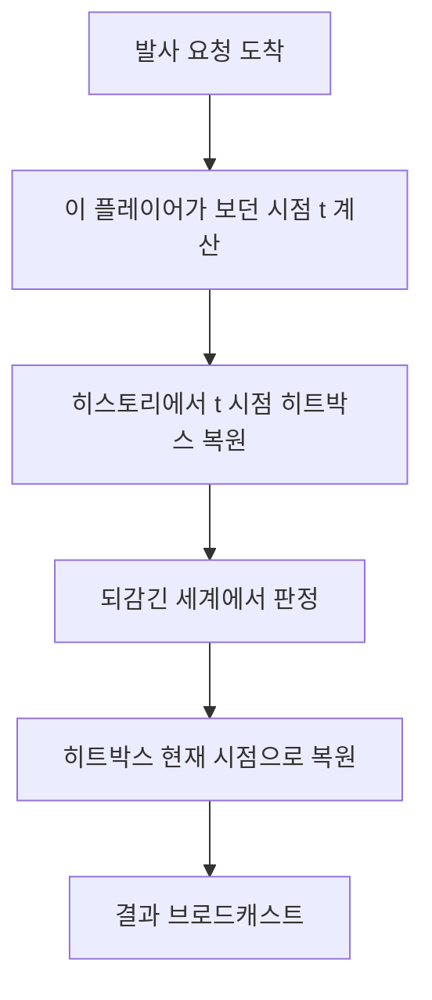
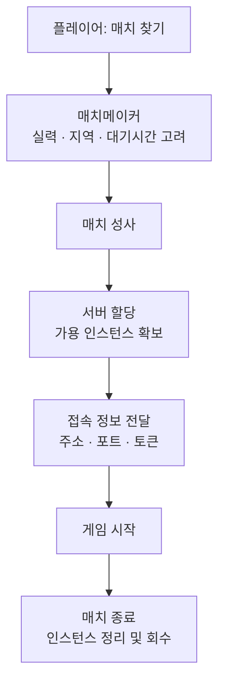
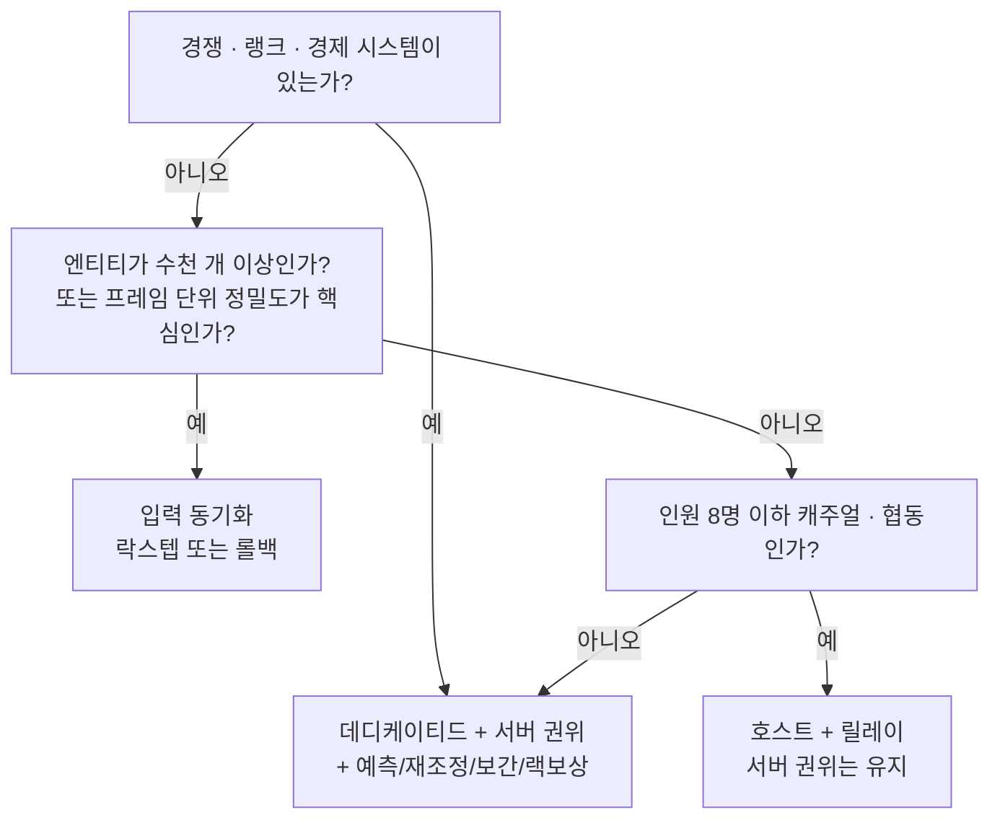

> 좋은 넷코드란 지연을 없애는 기술이 아닙니다. 없앨 수 없는 지연을 플레이어가 눈치채지 못하게 숨기는 기술입니다.

---

## 1편에서 정한 것, 이번에 정할 것

[1편](https://bluehamster.tistory.com)에서는 **"누가 서버가 될 것인가"** 를 다뤘습니다. P2P, 리슨 서버(호스트), 릴레이, 데디케이티드 — 판정 권한을 어느 컴퓨터에 맡길지에 대한 선택지였죠.

그런데 구조를 정했다고 게임이 부드러워지지는 않습니다. 1편 마지막에서 이런 코드를 봤습니다. 클라이언트는 "쐈다는 의도"만 보내고, 서버가 판정한 결과를 다시 받아온다는 구조요.

이 구조를 그대로 구현하면 **버튼을 눌러도 캐릭터가 즉시 반응하지 않습니다.** 서버까지 갔다 오는 왕복 시간만큼 모든 조작이 밀립니다. 핑이 60ms라면 내 캐릭터는 항상 0.06초 늦게 움직입니다. 게임으로서는 이미 실격입니다.

이번 편의 주제가 바로 이것입니다. **권위는 서버에 두면서도, 어떻게 즉각적인 조작감을 만들어낼 것인가.**


---

## 권위(Authority)란 정확히 무엇인가

1편에서 "권위"라는 단어를 썼는데, 이번 편에서는 이걸 좀 더 정밀하게 정의하고 가야 합니다.

**권위란 "특정 데이터에 대해 최종 결정권을 가진 주체"** 입니다. 중요한 건 이게 게임 전체에 하나로 적용되는 게 아니라, **데이터 조각마다 따로 정할 수 있다**는 점입니다.

예를 들어 이런 식으로 나뉩니다.

| 데이터 | 보통 누가 권위를 갖는가 | 이유 |
|---|---|---|
| 캐릭터 위치 | 서버 | 조작하면 순간이동·스피드핵이 됩니다 |
| 체력, 데미지 | 서버 | 조작하면 무적이 됩니다 |
| 아이템 획득 | 서버 | 조작하면 아이템 복사가 됩니다 |
| 조준 방향 | 클라이언트 | 서버가 대신 결정할 수 없는 값입니다 |
| 카메라 각도 | 클라이언트 | 게임 규칙과 무관합니다 |
| 이모트, 피격 이펙트 | 클라이언트 | 순수 연출입니다 |

여기서 초심자가 자주 놓치는 판단 기준이 있습니다. **"이 값을 플레이어가 마음대로 바꿨을 때 게임이 망가지는가?"** 망가진다면 서버 권위여야 하고, 안 망가진다면 클라이언트에 맡겨도 됩니다.

조준 방향이 클라이언트 권위인 게 이상하게 느껴질 수 있습니다. 하지만 서버는 플레이어가 마우스를 어디로 움직였는지 알 방법이 없습니다. 그래서 조준 방향 자체는 받아들이되, **그 방향으로 쐈을 때 뭐가 맞았는지는 서버가 다시 계산**합니다. 이 분리가 핵심입니다.

---

## 클라이언트 권위 vs 서버 권위

두 모델을 나란히 놓고 보겠습니다.

**클라이언트 권위** 모델에서는 각 플레이어의 클라이언트가 자기 캐릭터의 상태를 결정하고, 서버는 그걸 받아서 다른 사람들에게 뿌리기만 합니다. 서버는 우체국이지 심판이 아닙니다.

구현이 압도적으로 쉽습니다. 조작 지연도 0입니다. 내 캐릭터는 내 컴퓨터가 직접 움직이니까요. 그래서 프로토타입이나 캐주얼 협동 게임에서 자주 보입니다.

문제는 **메모리를 조작한 클라이언트가 무엇이든 주장할 수 있다**는 점입니다. "나 지금 좌표 (9999, 0, 9999)에 있어", "나 체력 만이야" 같은 주장을 서버가 그대로 믿습니다.

**서버 권위** 모델에서는 클라이언트가 **입력만** 보냅니다. "W키를 눌렀다", "이 방향으로 쐈다". 서버가 그 입력을 받아 시뮬레이션을 돌리고, 결과 상태를 모두에게 뿌립니다.

치팅 방어가 근본적으로 해결되지만, 앞서 말한 **입력 지연**이라는 대가가 따라옵니다.



**현대 상용 게임의 표준은 서버 권위입니다.** 그리고 그 입력 지연을 지금부터 설명할 네 가지 기법으로 숨깁니다.

---

## 기법 1 — 클라이언트 예측 (내 캐릭터는 기다리지 않는다)

가장 먼저 떠올려야 할 발상은 이겁니다. **"서버가 어떻게 판정할지 클라이언트도 이미 알고 있다."**

W키를 누르면 캐릭터가 앞으로 걸어간다는 규칙은 서버와 클라이언트가 똑같이 갖고 있는 코드입니다. 그렇다면 서버 응답을 기다릴 이유가 없습니다. **일단 내 컴퓨터에서 먼저 실행해버리면 됩니다.**

이게 **클라이언트 예측(client-side prediction)** 입니다.

동작 순서는 이렇습니다.

1. 입력을 감지하면 **번호(시퀀스 넘버)를 붙여서** 서버로 보냅니다.
2. 동시에 그 입력을 **내 로컬 시뮬레이션에도 즉시 적용**합니다. 화면상 캐릭터는 바로 움직입니다.
3. 보낸 입력은 아직 서버가 확인하지 않았으므로 **대기 버퍼에 보관**합니다.

여기까지만 하면 조작 지연이 사라집니다. 문제는 "예측"이라는 단어가 붙은 이유죠. **예측은 틀릴 수 있습니다.**

내가 앞으로 걸어가는 동안 다른 플레이어가 나를 밀쳤을 수도 있고, 서버에만 있는 정보 때문에 결과가 달라졌을 수도 있습니다. 그래서 다음 기법이 필요합니다.

---

## 기법 2 — 서버 재조정 (틀렸으면 되감아 다시 계산한다)

서버는 상태를 보낼 때 **"내가 마지막으로 처리한 입력 번호"** 를 함께 보냅니다. 이 번호 하나가 모든 걸 가능하게 합니다.

클라이언트는 서버 상태를 받으면 이렇게 합니다.

1. 대기 버퍼에서 **서버가 이미 처리한 입력들을 버립니다.** (더 이상 예측할 필요가 없으므로)
2. 내 캐릭터를 **서버가 보낸 확정 상태로 되돌립니다.**
3. 버퍼에 **남아 있는 입력들을 그 상태 위에 다시 순서대로 적용**합니다.

이 과정을 **서버 재조정(server reconciliation)** 이라고 합니다.

예측이 정확했다면 재계산 결과가 원래 화면과 똑같이 나오므로 **플레이어는 아무것도 눈치채지 못합니다.** 예측이 틀렸을 때만 캐릭터가 보정됩니다. 이 보정이 크게 튀는 현상이 흔히 말하는 **고무줄 현상(rubber banding)** 입니다.



**예측과 재조정은 반드시 한 쌍으로 구현해야 합니다.** 예측만 하고 재조정을 하지 않으면 로컬 상태가 서버 상태에서 조금씩 멀어지다가 어느 순간 크게 튑니다. 반대로 재조정만 있고 예측이 없으면 조작 지연이 그대로 남습니다.

---

## 기법 3 — 엔티티 보간 (다른 플레이어는 과거를 본다)

내 캐릭터 문제는 해결했습니다. 그럼 **다른 플레이어**는요?

다른 플레이어의 입력은 예측할 수 없습니다. 그 사람이 다음 순간 왼쪽으로 갈지 오른쪽으로 갈지 내 컴퓨터가 알 리가 없죠. 그래서 다른 플레이어는 **서버가 보내주는 상태 스냅샷에 전적으로 의존**합니다.

문제는 스냅샷이 **연속적으로 오지 않는다**는 겁니다. 서버는 보통 초당 20~60회 정도의 고정 주기로 상태를 보냅니다. 반면 게임 화면은 초당 60~144프레임으로 그려집니다. 스냅샷이 도착한 순간에만 캐릭터를 옮기면 **뚝뚝 끊겨 보입니다.**

해결책이 **엔티티 보간(entity interpolation)** 입니다. 발상은 조금 이상하게 들립니다.

**"다른 플레이어를 의도적으로 과거 시점으로 그린다."**

구체적으로는, 렌더링 시각을 현재보다 **한두 스냅샷 간격만큼 뒤로 미룹니다.** 그러면 그 시각 앞뒤로 이미 도착한 스냅샷 두 개가 항상 존재하게 되고, 그 사이를 부드럽게 이어서 그릴 수 있습니다.

대가는 **다른 플레이어가 실제보다 조금 과거의 위치에 보인다**는 것입니다. 이건 버그가 아니라 의도된 설계입니다. 끊김을 없애기 위해 지연을 감수하는 명시적 교환입니다.

보간 대신 **외삽(extrapolation)**, 즉 마지막으로 알던 속도로 앞으로 밀어서 예측하는 방법도 있습니다. 지연은 줄지만 상대가 갑자기 방향을 바꾸면 예측이 크게 빗나가 보정이 튑니다. 이동이 예측 가능한 장르(레이싱, 비행)에서 상대적으로 잘 맞고, 급격한 방향 전환이 잦은 장르에서는 위험합니다.

---

## 기법 4 — 랙 보상 (서버가 시간을 되감는다)

여기서 문제가 하나 더 생깁니다. 위 기법들을 종합하면 이런 상황이 만들어집니다.

내 화면에서 상대는 **과거 위치**에 그려져 있습니다(보간 때문에). 그 위치를 정확히 조준해서 쐈습니다. 그런데 서버의 **현재** 시점에서 상대는 이미 다른 곳에 가 있습니다.

서버가 자기 현재 상태로 판정하면 **분명히 조준선 안에 있었는데 빗나갑니다.** 플레이어 입장에서는 도저히 납득할 수 없는 결과입니다.

이걸 해결하는 게 **랙 보상(lag compensation)** 입니다.

서버는 각 클라이언트가 **어느 시점의 세계를 보고 있었는지** 추정할 수 있습니다. 그 사람의 네트워크 지연과 보간 지연을 알고 있으니까요. 그래서 발사 요청이 오면 서버는 이렇게 합니다.

1. 이 플레이어가 쐈을 때 보고 있던 시점을 계산합니다.
2. 저장해 둔 히스토리에서 **다른 플레이어들의 히트박스를 그 시점 위치로 되돌립니다.**
3. **그 되감긴 세계에서** 히트 판정을 합니다.
4. 판정이 끝나면 히트박스를 현재 위치로 복원합니다.



**"보이는 대로 맞는다"** 는 감각이 이 기법으로 만들어집니다.

다만 여기에는 피할 수 없는 대가가 있습니다. **누군가는 반드시 손해를 봅니다.** 내가 엄폐물 뒤로 완전히 숨었다고 생각한 순간에도, 상대가 보던 과거 시점에서는 내가 아직 노출돼 있었다면 서버는 명중으로 판정합니다. 이게 흔히 말하는 **"엄폐 뒤에서 죽었다"** 는 체감입니다.

즉 랙 보상은 **쏘는 쪽에 유리하고 피하는 쪽에 불리한** 방향으로 공정성을 재분배하는 선택입니다. 대부분의 FPS가 이 선택을 하는 이유는, "쐈는데 안 맞는 것"이 "숨었는데 맞는 것"보다 플레이어에게 더 큰 좌절을 주기 때문입니다. 옳고 그름의 문제가 아니라 **어느 쪽 불만을 감수할 것인가**의 설계 결정입니다.


---

## 다른 계열 — 결정론적 락스텝

지금까지 설명한 방식은 전부 **상태 동기화(state synchronization)** 계열입니다. 서버가 "지금 세계는 이렇다"는 결과를 계속 내려보내는 방식이죠.

완전히 다른 접근이 있습니다. **결정론적 락스텝(deterministic lockstep)** 입니다.

핵심 아이디어는 이렇습니다. **모든 참가자가 완전히 동일한 시뮬레이션 코드를 돌린다면, 같은 입력을 넣었을 때 반드시 같은 결과가 나온다.** 그렇다면 결과를 주고받을 필요가 없습니다. **입력만 주고받으면 됩니다.**

각 참가자는 매 틱마다 자기 입력을 모두에게 보내고, **전원의 입력이 도착할 때까지 기다렸다가** 그 틱을 동시에 진행합니다. "락스텝(발맞춰 걷기)"이라는 이름이 여기서 나옵니다.

**장점이 아주 강력합니다.** 전송량이 유닛 수와 무관합니다. 유닛이 3천 개든 3만 개든 오가는 건 "마우스 클릭 몇 번"뿐입니다. 그래서 대규모 RTS가 전통적으로 이 방식을 씁니다. 1편에서 본 P2P 구조와도 잘 맞습니다. 심판이 없어도 모두가 같은 결론에 도달하니까요.

**대가는 만만치 않습니다.**

첫째, **입력 지연이 구조적으로 발생합니다.** 가장 느린 참가자의 입력이 도착해야 진행할 수 있으므로, 전원이 최악의 지연에 맞춰집니다. RTS에서 클릭 후 유닛 반응이 약간 늦은 것이 자연스럽게 느껴지는 건 이 때문입니다.

둘째, **완벽한 결정성을 확보하는 게 매우 어렵습니다.** 부동소수점 연산이 CPU나 컴파일러 최적화에 따라 미세하게 다른 결과를 낼 수 있고, 컬렉션 순회 순서가 실행마다 달라질 수 있으며, 난수 시드가 어긋날 수도 있습니다. 이런 차이가 단 한 번만 생겨도 시뮬레이션이 갈라지는 **데싱크(desync)** 가 발생합니다.

셋째, **데싱크 디버깅이 지옥입니다.** 증상은 "10분 뒤에 서로 다른 게임을 하고 있다"인데, 원인은 그보다 훨씬 전의 한 번의 미세한 오차입니다. 그래서 이 방식을 쓰는 팀은 매 틱 상태 체크섬을 비교하는 장치를 필수로 만들어 둡니다.

---

## 롤백 넷코드 — 락스텝의 지연을 지운 버전

락스텝의 입력 지연이 치명적인 장르가 있습니다. 프레임 단위 반응이 게임성의 전부인 **대전 격투 게임**입니다.

그래서 나온 게 **롤백 넷코드(rollback netcode)** 입니다. 발상은 클라이언트 예측과 비슷하지만, 예측 대상이 다릅니다.

**"상대 입력이 아직 안 왔다면, 상대가 방금 하던 걸 계속한다고 가정하고 그냥 진행한다."**

그리고 실제 입력이 도착했을 때 예측과 달랐다면, **그 프레임으로 되감아서 진짜 입력으로 다시 시뮬레이션**합니다. 이 과정이 몇 프레임 안에 끝나므로 대부분의 경우 플레이어는 알아채지 못합니다.

락스텝과 마찬가지로 **완전한 결정성**이 필요하고, 추가로 **게임 상태를 매 프레임 저장하고 복원하는 동작이 매우 빨라야** 합니다. 되감을 때마다 상태를 불러와 여러 프레임을 재계산해야 하니까요.

이 방식이 격투 게임에서 사실상 표준이 된 이유는, 입력 지연을 넣지 않고도 원거리 대전을 성립시키는 유일한 실용적 방법이기 때문입니다.

---

## 상태 동기화 vs 입력 동기화

두 계열을 정리하면 이렇습니다.

| 기준 | 상태 동기화 | 입력 동기화(락스텝/롤백) |
|---|---|---|
| 전송 내용 | 월드 상태 스냅샷 | 플레이어 입력 |
| 전송량 | 엔티티 수에 비례 | 플레이어 수에만 비례 |
| 결정성 요구 | 불필요 | **필수** |
| 신규 참가/재접속 | 쉬움(현재 상태 전송) | 어려움(처음부터 재생 필요) |
| 치팅 방어 | 서버 권위로 가능 | 어려움(전체 상태를 모두가 가짐) |
| 전형적 장르 | FPS, MMO, 액션 | RTS, 대전 격투 |

**언제 무엇을 고르는가**는 이렇게 판단하면 됩니다.

**상태 동기화를 골라야 하는 경우**: 치팅 방어가 중요한 경쟁 게임, 도중 참가나 재접속이 필요한 게임, 결정성을 보장하기 어려운 물리 엔진을 그대로 쓰는 게임. 대부분의 프로젝트가 여기 해당합니다.

**입력 동기화를 고려할 경우**: 엔티티 수가 수천 개를 넘어 상태 전송이 현실적으로 불가능한 게임, 프레임 단위 정밀도가 게임성의 핵심인 게임, 그리고 **결정성 확보에 들어갈 공수를 팀이 감당할 수 있을 때**. 마지막 조건을 과소평가하면 프로젝트가 데싱크 추적에 잠깁니다.

---

## 대역폭 아끼기 — 실전에서 반드시 하는 세 가지

이론이 맞아도 대역폭이 터지면 게임은 돌아가지 않습니다. 상태 동기화 방식에서 거의 항상 함께 쓰이는 최적화 세 가지를 정리합니다.

**1. 틱레이트와 전송률 분리**

서버가 시뮬레이션을 돌리는 주기(틱레이트)와 클라이언트에 상태를 보내는 주기는 **달라도 됩니다.** 판정 정밀도를 위해 시뮬레이션은 자주 돌리고, 전송은 그보다 드물게 하는 조합이 일반적입니다. 틱레이트를 올리면 판정이 정밀해지지만 CPU 비용이 그대로 올라가므로, 서버 한 대가 감당할 매치 수와 직결되는 비용 문제이기도 합니다.

**2. 델타 압축**

매번 전체 상태를 보내는 대신, **클라이언트가 마지막으로 받았다고 확인한 스냅샷과의 차이만** 보냅니다. 대부분의 오브젝트는 프레임 사이에 변하지 않으므로 절감 효과가 큽니다. 다만 기준 스냅샷을 서버가 클라이언트별로 기억해야 하므로 메모리와 구현 복잡도가 늘어납니다.

**3. 관심 영역 필터링**

플레이어에게 **의미 있는 엔티티만** 보냅니다. 맵 반대편에 있는 적의 좌표는 애초에 보내지 않는 것이죠.

이건 대역폭 최적화이면서 동시에 **가장 확실한 월핵 방어**입니다. 1편에서 "데디케이티드 서버를 써도 월핵은 별개"라고 했던 이유가 여기 있습니다. 서버가 안 보이는 적의 위치를 친절하게 보내주고 있다면, 클라이언트가 그걸 화면에 그리는 걸 막을 방법이 없습니다. **보내지 않는 것만이 유일한 방어입니다.**

---

## 매치메이킹과 서버 오케스트레이션

마지막으로 게임플레이 바깥의 인프라를 짚고 갑니다. 데디케이티드 서버를 선택하면 반드시 만나게 되는 영역입니다.

플레이어가 "매치 찾기"를 누른 뒤 실제로 게임에 들어가기까지의 흐름은 대략 이렇습니다.



여기서 매치메이커가 균형을 잡아야 하는 값이 셋입니다. **실력 매칭의 정확도**, **지역(지연) 적합성**, 그리고 **대기 시간**입니다. 셋을 동시에 최적화할 수는 없습니다. 실력을 정밀하게 맞추려면 오래 기다려야 하고, 빨리 잡으려면 실력 차나 핑을 감수해야 합니다. 그래서 실무에서는 **대기 시간이 길어질수록 조건을 점진적으로 완화**하는 방식이 흔히 쓰입니다.

서버 할당 쪽에서는 **매치가 끝날 때마다 인스턴스를 정리하고 새로 띄우는 자동화**가 필요합니다. 1편에서 언급한 Agones가 이 영역의 대표적인 오픈소스이고, Unity의 Multiplay 같은 관리형 서비스도 같은 문제를 다룹니다.

---

## 안티패턴 vs 권장 패턴

가장 흔한 실수는 **예측은 구현했는데 재조정을 빠뜨리는 것**입니다.

아래는 개념 설명용 의사코드입니다. 특정 엔진의 API가 아니라 구조를 보여주는 예시로 읽어주세요.

```csharp
// ❌ 안티패턴 A: 예측만 하고 서버 상태를 무시한다
void Update()
{
    var input = ReadInput();
    ApplyMovement(input);          // 로컬에서만 계속 굴린다
    SendToServer(input);
}

void OnServerState(StatePacket s)
{
    // 서버가 뭐라고 하든 신경 쓰지 않는다
    // → 로컬 상태가 서버와 조금씩 멀어지다가 어느 순간 크게 튄다
}
```

```csharp
// ❌ 안티패턴 B: 서버 상태가 올 때마다 무조건 덮어쓴다
void OnServerState(StatePacket s)
{
    transform.position = s.position;
    // → 서버 상태는 항상 '과거'다. 매 패킷마다 뒤로 끌려가
    //    이동 중 계속 덜덜 떨리는 현상이 생긴다
}
```

두 안티패턴은 정반대 방향으로 실패합니다. A는 서버를 무시해서 어긋나고, B는 서버만 믿어서 예측의 이점을 통째로 버립니다.

```csharp
// ✅ 권장 패턴: 예측 + 대기 버퍼 + 재조정
private readonly List<PendingInput> pending = new();
private uint sequence = 0;

void Update()
{
    var input = new PendingInput {
        sequence = ++sequence,
        move     = ReadInput(),
        deltaTime = Time.fixedDeltaTime
    };

    ApplyMovement(input);        // 1. 즉시 로컬 적용 (예측)
    SendToServer(input);         // 2. 서버로 전송
    pending.Add(input);          // 3. 확인 전까지 보관
}

void OnServerState(StatePacket s)
{
    // 4. 서버가 이미 처리한 입력은 버린다
    pending.RemoveAll(p => p.sequence <= s.lastProcessedInput);

    // 5. 서버가 확정한 상태로 되돌린다
    transform.position = s.position;
    velocity           = s.velocity;

    // 6. 아직 확인 안 된 입력들을 다시 적용한다 (재조정)
    foreach (var p in pending)
        ApplyMovement(p);
}
```

`ApplyMovement`가 **서버와 클라이언트에서 완전히 같은 코드여야 한다**는 점이 이 구조의 전제입니다. 이동 로직이 클라이언트에만 있거나 두 쪽 구현이 미묘하게 다르면, 재조정할 때마다 결과가 어긋나 오히려 더 심하게 튑니다. 그래서 이런 게임은 **이동·물리 로직을 공유 모듈로 분리**해 양쪽이 같은 코드를 참조하도록 설계합니다.

한 가지 더. 실무에서는 5번 단계에서 위치를 즉시 덮어쓰는 대신, **오차가 작으면 여러 프레임에 걸쳐 부드럽게 수렴시키고 오차가 클 때만 즉시 보정**하는 방식을 씁니다. 작은 오차까지 매번 튕기면 화면이 떨리기 때문입니다.

---

## 흔한 오해 바로잡기

**오해 1: "핑만 낮으면 다 해결된다"**

플레이어가 체감하는 지연은 네트워크 왕복 시간만이 아닙니다. **서버 틱 간격 + 전송 간격 + 보간 지연 + 클라이언트 프레임 시간**이 모두 더해집니다. 핑이 아무리 낮아도 보간 지연을 두 스냅샷 간격으로 잡아뒀다면 그만큼은 구조적으로 존재합니다. 그래서 "핑은 낮은데 반응이 굼뜨다"는 체감이 실제로 가능합니다.

**오해 2: "랙 보상이 있으면 완전히 공정하다"**

랙 보상은 불공정을 없애는 게 아니라 **불공정의 방향을 옮깁니다.** 쏘는 쪽 기준으로 판정하므로 피하는 쪽이 손해를 봅니다. "엄폐물 뒤에서 죽었다"는 경험은 버그가 아니라 이 설계의 정직한 부작용입니다.

**오해 3: "게임에도 TCP를 쓰면 안정적이다"**

TCP는 패킷 순서를 보장하기 위해, 중간에 하나가 유실되면 **뒤에 도착한 멀쩡한 패킷들까지 붙잡아 둡니다.** 이걸 헤드 오브 라인 블로킹이라고 합니다. 그런데 실시간 게임에서 0.1초 전 위치 정보는 이미 쓸모가 없습니다. 늦게 정확히 오는 것보다 **버리고 다음 걸 받는 게 낫습니다.** 그래서 실시간 게임플레이는 UDP 기반에, 필요한 메시지에만 선택적으로 신뢰성을 얹는 구조를 씁니다. 반대로 채팅·상점·전적처럼 유실되면 안 되는 데이터는 TCP 계열이 적합합니다. **한쪽이 우월한 게 아니라 용도가 다릅니다.**

**오해 4: "결정론적 락스텝은 대역폭이 적으니 무조건 유리하다"**

대역폭만 보면 그렇습니다. 하지만 **부동소수점 결정성 확보, 데싱크 검출 장치, 재접속 처리**에 들어가는 공수가 그 이득을 쉽게 넘어섭니다. 대규모 유닛이나 프레임 단위 정밀도라는 명확한 이유가 없다면 상태 동기화가 훨씬 안전한 선택입니다.

**오해 5: "다른 플레이어를 과거로 그린다니 버그 아닌가"**

의도된 설계입니다. 스냅샷은 띄엄띄엄 도착하므로, 부드럽게 그리려면 **양쪽 스냅샷이 다 도착한 구간**만 그릴 수 있습니다. 그러려면 렌더링 시점을 뒤로 미룰 수밖에 없습니다. 끊김과 지연 중 지연을 택한 명시적 교환입니다.

---

## 그래서 내 게임은 무엇을 써야 하나

1편과 2편의 결정을 하나의 흐름으로 합치면 이렇습니다.



여기에 규모와 무관하게 항상 적용되는 원칙 세 가지를 덧붙입니다.

**첫째, 권위 경계선은 첫날에 긋습니다.** 호스트 방식으로 시작하더라도 "이 함수는 권위 주체에서만 실행된다"는 구분을 코드에 새겨두면, 나중에 데디케이티드로 옮기는 비용이 극적으로 줄어듭니다.

**둘째, 이동·물리 로직은 공유 모듈로 분리합니다.** 예측과 재조정의 전제 조건이며, 이걸 나중에 하려면 사실상 재작성입니다.

**셋째, 클라이언트가 보낸 값은 검증 없이 쓰지 않습니다.** 데미지 수치, 이동 거리, 쿨다운 — 전부 서버가 가진 테이블과 이전 상태로 다시 계산하거나 최소한 범위를 검증해야 합니다.

---

## 셀프 체크 질문

1. 클라이언트 예측과 서버 재조정을 반드시 함께 구현해야 하는 이유는 무엇인가요? 하나만 구현하면 각각 어떤 문제가 생기나요?
2. 랙 보상이 "공정성을 회복하는 기술"이 아니라 "불공정의 방향을 옮기는 선택"인 이유를 설명해 보세요.
3. 데디케이티드 서버로 완전한 서버 권위를 구현했는데도 월핵을 막지 못할 수 있습니다. 왜 그런지, 그리고 어떻게 막아야 하는지 설명해 보세요.

:::toggle 정답 보기
1. **예측만 구현하면** 로컬 시뮬레이션이 서버의 확정 상태와 조금씩 어긋나고, 그 오차가 누적되다가 어느 순간 크게 튀는 고무줄 현상이 생깁니다. 서버에만 있는 정보(다른 플레이어의 충돌 등)를 클라이언트가 알 수 없기 때문에 예측은 반드시 틀릴 수 있습니다. **재조정만 구현하면** 매번 서버 응답을 기다린 뒤에야 캐릭터가 움직이므로 왕복 지연이 그대로 조작 지연으로 나타납니다. 예측은 즉각적인 조작감을, 재조정은 서버와의 일치를 담당하므로 둘은 한 쌍입니다.

2. 랙 보상은 서버가 **쏜 사람이 보고 있던 과거 시점으로 히트박스를 되감아** 판정합니다. 그래서 쏜 사람 기준으로는 "보이는 대로 맞는" 감각이 완성되지만, 표적이 된 사람 기준으로는 **이미 엄폐물 뒤로 피한 뒤에 피격 판정을 받는** 상황이 생깁니다. 지연이 존재하는 이상 두 사람이 보는 세계는 다르고, 어느 한쪽의 시점을 진실로 채택하면 다른 쪽은 반드시 손해를 봅니다. 대부분의 FPS는 "쐈는데 안 맞는" 좌절이 더 크다고 판단해 쏘는 쪽을 택한 것이며, 이는 기술적 정답이 아니라 설계 결정입니다.

3. 서버 권위는 **게임 규칙을 조작하는 치팅**(무적, 스피드핵, 데미지 조작)을 막습니다. 하지만 월핵은 규칙을 어기지 않습니다. 서버가 보내준 데이터를 화면에 더 많이 그릴 뿐입니다. 서버가 맵 반대편 적의 좌표까지 모든 클라이언트에 보내고 있다면, 클라이언트가 그 값을 어떻게 쓰는지는 통제할 수 없습니다. 따라서 유일한 근본 대책은 **관심 영역 필터링**, 즉 해당 플레이어에게 보일 수 없는 엔티티의 정보를 애초에 전송하지 않는 것입니다. 이는 동시에 대역폭 절감 효과도 있습니다.
:::

---

## 더 깊이 파고들기

- [Gabriel Gambetta — Fast-Paced Multiplayer](https://www.gabrielgambetta.com/client-server-game-architecture.html) — 예측·재조정·보간·랙보상을 인터랙티브 데모로 직접 조작해볼 수 있습니다. 이 글에서 개념을 잡았다면 여기서 감각을 잡으세요.
- [Valve — Latency Compensating Methods in Client/Server In-game Protocol Design](https://developer.valvesoftware.com/wiki/Latency_Compensating_Methods_in_Client/Server_In-game_Protocol_Design_and_Optimization) — 랙 보상을 실제 상용 FPS에서 어떻게 구현했는지 설명한 원문 성격의 문서입니다.
- [Gaffer On Games — Networked Physics](https://gafferongames.com/categories/networked-physics/) — 물리 시뮬레이션 동기화, 스냅샷 압축, 신뢰성 계층을 UDP 위에 직접 쌓는 방법까지 다룹니다. 직접 넷코드를 짜볼 생각이라면 필독입니다.
- [GGPO (오픈소스 롤백 넷코드 라이브러리)](https://github.com/pond3r/ggpo) — 롤백이 실제 코드에서 어떤 모양인지 확인할 수 있습니다. 상태 저장/복원 콜백 구조를 보면 "왜 결정성과 빠른 스냅샷이 필수인지"가 바로 이해됩니다.

---

## 마무리

두 편에 걸쳐 정리한 내용을 한 문장으로 압축하면 이렇습니다.

**1편은 "누구를 믿을 것인가"를 정하는 일이었고, 2편은 "믿을 수 있는 답이 늦게 도착한다는 사실을 어떻게 감출 것인가"를 다뤘습니다.**

멀티플레이 넷코드에 마법은 없습니다. 빛의 속도를 이기는 기법은 존재하지 않고, 지금까지 본 모든 기술은 예외 없이 **무언가를 내주고 무언가를 얻는 교환**이었습니다. 예측은 정확성을 내주고 반응성을 얻었고, 보간은 최신성을 내주고 부드러움을 얻었고, 랙 보상은 피하는 쪽의 공정성을 내주고 쏘는 쪽의 납득감을 얻었습니다.

그래서 좋은 설계란 최고의 기법을 고르는 일이 아니라, **내 게임이 무엇을 포기해도 되는지 정확히 아는 일**에 가깝습니다.
