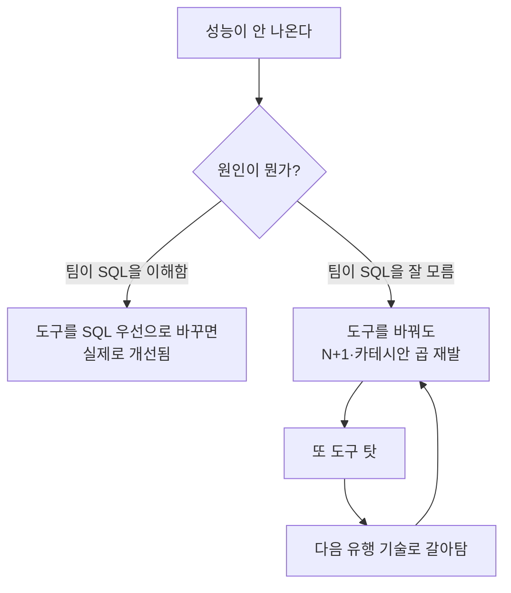

> "AI가 SQL을 다 짜주는데, 이제 ORM 같은 건 배울 필요 없는 거 아니야?"
> 요즘 이 질문을 한 번쯤 안 해본 백엔드 개발자는 없을 겁니다. 그런데 정작 하이버네이트를 만든 사람들은 여기에 아주 담담하게 대답합니다. "그건 ORM이 뭘 하는 물건인지 오해한 거예요."

---

## 질문 자체가 함정입니다

이 글은 하이버네이트/JPA 전문가(강연자)의 인터뷰 영상 **["AI가 SQL 작성이 가능한데도 ORM을 써야 할까?"](https://www.youtube.com/watch?v=BUCIC6-LSv8)** 를 분석하고, 거기에 "그래서 실무에서 어떻게 판단해야 하는가"를 더한 정리입니다.

먼저 질문을 뜯어봅시다. **"AI가 SQL을 짜주니 ORM이 필요 없다"** 는 문장에는 숨은 전제가 하나 깔려 있습니다.

바로 *"ORM = SQL을 대신 써주는 도구"* 라는 전제죠.


강연자의 첫 반박이 정확히 이 지점을 겨냥합니다. ORM은 SQL 생성기가 **아닙니다**. SQL 자동 생성은 ORM이 하는 여러 일 중 겉으로 보이는 일부일 뿐입니다.

---

## ORM은 "쿼리 생성기"가 아니라 "엔지니어링 패턴의 집약체"

JPA와 하이버네이트는 마틴 파울러(Martin Fowler)가 저서 *Patterns of Enterprise Application Architecture* 에서 정리한 엔터프라이즈 패턴들을 코드로 구현해 둔 물건입니다.

즉, ORM을 쓴다는 건 단순히 `SELECT`를 안 타이핑하는 게 아니라, **지난 20년간 수많은 기업이 데이터 정합성 때문에 피 흘리며 만든 해결책들을 통째로 빌려 쓰는 것**입니다.

구체적으로 JPA/하이버네이트가 우리 몰래 처리해주는 것들은 이렇습니다.

| 기능 | 하는 일 | 직접 구현하면? |
|---|---|---|
| **영속성 컨텍스트(1차 캐시)** | 같은 트랜잭션 안에서 동일 엔티티 조회를 캐싱해 중복 쿼리 제거 | 요청 스코프 캐시를 직접 관리 |
| **더티 체킹(Dirty Checking)** | 객체 필드만 바꾸면 변경분을 감지해 자동 `UPDATE` | 변경 전/후 스냅샷 비교 로직 직접 작성 |
| **쓰기 지연(Write-behind)** | `INSERT/UPDATE`를 모아 트랜잭션 커밋 시점에 한 번에 flush | 실행 순서·타이밍을 수동 제어 |
| **낙관적 락 (`@Version`)** | 버전 컬럼으로 동시 수정 충돌을 자동 감지 | 버전 비교 SQL을 모든 UPDATE에 수동 삽입 |
| **비관적 락** | `SELECT ... FOR UPDATE`를 추상화 | DB 방언별로 락 구문 분기 |
| **JDBC 배치** | 다건 INSERT를 배치로 묶어 왕복(round-trip) 최소화 | 배치 사이즈·flush 타이밍 직접 튜닝 |

강연자의 표현을 빌리면, 순수 JDBC와 AI를 조합해서 이걸 **못 만드는 건 아닙니다.** 만들 수는 있어요.

문제는 그렇게 만든 락/배치/캐시 로직을 **직접 유지보수**해야 한다는 것입니다. 그리고 이건 "AI야 SQL 짜줘"의 난이도가 아니라, "동시성 버그가 프로덕션에서 3주에 한 번씩 터지는데 재현이 안 되는" 난이도입니다.

```java
// AI가 짜주는 "SQL" 은 보통 여기까지입니다.
String sql = "UPDATE account SET balance = ? WHERE id = ?";

// 하지만 실무에서 진짜 필요한 건 이겁니다:
// - 두 사용자가 동시에 잔액을 수정하면?  (동시성 충돌)
// - 이 UPDATE 가 앞선 10개의 INSERT 와 같은 트랜잭션인가?
// - 커밋 실패 시 롤백 경계는 어디인가?
// 이 "보이지 않는 요구사항" 이 바로 ORM 이 대신 짊어지는 부분입니다.
```

JPA에서는 위 시나리오가 이렇게 정리됩니다.

```java
@Entity
class Account {
    @Id Long id;

    @Version           // ← 이 한 줄이 낙관적 락 전체를 담당한다
    Long version;

    BigDecimal balance;
}

// 필드만 바꾸면 끝. UPDATE 문도, 버전 비교도, 충돌 감지도 자동.
account.setBalance(account.getBalance().subtract(amount));
```

`@Version` 한 줄의 뒤편에는 "동시에 같은 계좌를 건드리면 나중 트랜잭션을 실패시킨다"는 안전장치가 통째로 들어 있습니다. AI에게 `UPDATE` 문을 시키는 것과는 **다루는 문제의 층위 자체가 다릅니다.**

---

## 그럼 ORM을 무조건 써야 하나? — 아니요, 기준은 '팀'입니다

여기서 강연자는 ORM 옹호론자로 흘러가지 않습니다. 오히려 냉정하게 선을 긋습니다.

> **기술 선택의 기준은 '유행'이 아니라 '팀의 역량'이다.**

팀이 SQL 튜닝, 윈도우 함수(Window Function), CTE(Common Table Expression) 같은 것에 **정말 능숙하다면**, JDBC나 [jOOQ](https://www.jooq.org/)(타입 세이프 SQL 빌더) 같은 SQL 우선 도구를 쓰는 건 훌륭한 선택입니다.

반대로 여기서 흔한 착각이 하나 나옵니다.

*"우리 팀 지금 JPA로 성능이 안 나와. ORM을 버리고 SQL 직접 짜면 빨라지겠지?"*

강연자의 대답은 뼈아픕니다. **SQL을 깊이 모르는 팀이 도구만 바꾸면, 똑같은 성능 문제를 다른 도구에서 다시 만납니다.**

N+1 문제, 카테시안 곱(Cartesian Product) 같은 것은 ORM의 죄가 아니라 **관계형 데이터 접근 자체의 함정**입니다. raw SQL로 가도 조인을 잘못 짜면 카테시안 곱은 똑같이 터지고, 반복 조회를 루프 안에 넣으면 N+1도 똑같이 납니다.

그러면 결국 이렇게 됩니다. "거봐, jOOQ도 별로네" — **도구 탓만 하고 끝나는 것**이죠.



핵심은 이겁니다. **문제는 도구가 아니라 이해도**입니다. SQL을 이해하는 팀은 어떤 도구를 써도 잘하고, 이해 못 하는 팀은 도구를 바꿔도 같은 자리를 맴돕니다.

---

## AI 과장 광고를 걸러 듣는 법 — "코딩은 타이핑이 아니다"

이 영상에서 가장 중요한 통찰은 사실 ORM 얘기가 아닙니다. **AI에 대한 태도**입니다.

강연자는 이렇게 말합니다. 실제로 코드를 *타이핑하는* 시간은 전체 개발 과정의 **10~15%에 불과하다**고요.

나머지 85~90%는 뭘까요? 요구사항을 분석하고, 엣지 케이스를 상상하고, 시스템을 설계하고, "이 결정이 6개월 뒤에 어떤 빚으로 돌아올까"를 고민하는 **생각의 시간**입니다.

그래서 강연자는 코딩을 *"생각하는 비즈니스(thinking business)"* 라고 부릅니다.

AI 코드 어시스턴트가 줄여주는 건 바로 그 10~15%입니다. 엄청나게 유용하죠. 하지만 그게 곧 "개발자가 필요 없어진다"는 뜻은 아닙니다. **가장 어려운 85%는 여전히 사람의 몫**이기 때문입니다.

흥미로운 건 강연자 본인의 사용 방식입니다.

- **가벼운 데모, 문서 작성(LaTeX 등)** → AI 적극 사용
- **완벽한 통제와 원리 이해가 필요한 핵심 프로젝트(오픈소스 유지보수)** → AI를 **전혀** 쓰지 않음

이게 위선이 아니라 정확한 선 긋기입니다. "내가 100% 책임지고 원리를 이해해야 하는 코드"에는 블랙박스를 끼워 넣지 않는다는 원칙이죠.

그리고 한 가지 경고를 덧붙입니다. *"AI 에이전트가 다 해준다"* 는 테크 기업들의 메시지에는 **자사 주식(IPO)을 팔려는 동기**가 섞여 있으니 걸러 들으라는 것. 마케팅과 엔지니어링 현실을 분리해서 보라는 조언입니다.

---

## 그래서, 써야 하나 말아야 하나? — 실무 판단 기준

영상의 논지를 실무 의사결정으로 번역하면 이렇게 정리됩니다. **"ORM이냐 SQL이냐"는 종교 전쟁이 아니라, 상황별 트레이드오프**입니다.

### 트레이드오프 한눈에 보기

| 상황 | 추천 | 왜 |
|---|---|---|
| CRUD 위주 엔터프라이즈 앱, 동시성·트랜잭션 정합성이 중요 | **JPA/하이버네이트** | 락·캐시·배치를 검증된 형태로 제공 |
| 팀이 SQL에 매우 능숙, 복잡한 분석 쿼리·리포팅 중심 | **jOOQ / raw SQL** | ORM 추상화가 오히려 방해, 타입 세이프하게 SQL 통제 |
| 빠르게 만들고 버릴 프로토타입/데모 | **AI + 아무 도구나** | 유지보수 책임이 없으니 속도가 최우선 |
| 20년 유지보수할 은행·보험 코어 시스템 | **ORM + 사람의 검증** | 신뢰가 자산, 블랙박스 코드 맹신 금지 |
| ORM에서 딱 몇 개의 무거운 쿼리만 느림 | **ORM 유지 + 그 쿼리만 네이티브 SQL** | 하이브리드가 정답. 전면 교체는 과잉 대응 |

가장 현실적인 정답은 마지막 줄입니다. **대부분의 프로젝트는 "ORM을 기본으로 쓰되, 무거운 쿼리 몇 개만 네이티브 SQL로 내려가는" 하이브리드**로 충분합니다. JPA도 `@Query(nativeQuery = true)`나 `EntityManager.createNativeQuery()`로 이걸 공식 지원합니다.

ORM 전체를 버릴 이유는, 팀이 SQL 전문가 집단이거나 도메인이 극단적으로 쿼리 중심일 때뿐입니다.

---

## 안티패턴 vs 권장 패턴 — AI가 짜준 SQL을 대하는 자세

AI 시대의 진짜 안티패턴은 "ORM을 쓰는 것"도 "SQL을 짜는 것"도 아닙니다. **이해 없이 붙여넣는 것**입니다.

```java
// ❌ 안티패턴: AI가 뱉은 SQL 을 이해 없이 그대로 붙여넣기
// "동작하니까 됐지" — 인덱스도, 실행계획도, 락 범위도 모른 채 배포
@Query(value = """
    SELECT * FROM orders o
    JOIN order_items i ON o.id = i.order_id
    WHERE o.user_id = :uid
""", nativeQuery = true)
List<Order> findOrders(Long uid);
// → 주문 1건에 아이템 10개면 결과 10행. 카테시안 곱으로 Order 가 뻥튀기.
//   AI 는 "틀린 SQL" 을 준 게 아니라, 네가 검증 안 한 SQL 을 준 것뿐이다.
```

```java
// ✅ 권장 패턴: AI 를 초안 작성용으로 쓰되, 실행계획과 의도를 검증
// - EXPLAIN 으로 인덱스 사용 여부 확인
// - 카테시안 곱을 막을 수 있게 컬렉션 조회 전략을 명시
@EntityGraph(attributePaths = "items")   // N+1 을 의도적으로 제어
List<Order> findByUserId(Long userId);
// → 왜 이 쿼리가 이렇게 나가는지 "설명할 수 있는" 상태로 배포한다.
```

두 코드의 차이는 문법이 아니라 **책임의 소재**입니다. 아래 코드는 문제가 생겨도 개발자가 원인을 짚고 고칠 수 있습니다. 위 코드는 장애가 나면 "AI가 그렇게 줬는데요"라는 변명밖에 남지 않습니다.

그리고 강연자가 못 박듯이 — **고객은 AI가 아니라 시스템을 운영하는 '사람'에게 책임을 묻습니다.** 은행 앱에서 잔액이 잘못 찍히는 버그 하나가 고객의 신뢰를 통째로 무너뜨릴 때, "AI가 짠 코드라서요"는 통하지 않습니다.


---

## 흔한 오해 바로잡기

**오해 1. "ORM은 SQL을 몰라도 되게 해준다."**
정반대입니다. ORM을 잘 쓰려면 **SQL을 더 잘 알아야** 합니다. 하이버네이트가 어떤 SQL을 만들어내는지 읽을 줄 알아야 N+1도, 카테시안 곱도 잡습니다. ORM은 SQL을 숨기는 게 아니라 *반복적인 SQL 작성을 대신*할 뿐, 근본 이해까지 대신해주진 않습니다.

**오해 2. "AI가 SQL을 짜주니 이제 DB 지식은 필요 없다."**
AI는 "문법적으로 맞는" SQL을 줍니다. 하지만 그게 인덱스를 타는지, 락을 얼마나 오래 잡는지, 실행계획이 어떤지는 **여전히 사람이 판단**해야 합니다. AI는 지식을 대체하는 게 아니라, 지식이 있는 사람을 더 빠르게 만들어줄 뿐입니다.

**오해 3. "성능이 안 나오면 ORM을 버리면 된다."**
대부분의 ORM 성능 문제는 ORM을 버려서가 아니라 **매핑 전략과 페치 전략을 고쳐서** 해결됩니다. 도구 교체는 마지막 수단이지 첫 번째 카드가 아닙니다.

---

## 정리하며 — 도구가 아니라 이해가 실력이다

영상 전체를 한 문장으로 압축하면 이렇습니다.

**"AI라는 도구의 한계를 명확히 알고, 엔지니어링의 책임을 회피하지 말라."**

AI는 SQL이라는 *텍스트*를 생성할 수 있습니다. 하지만 수십 년간 쌓인 *아키텍처의 견고함*까지 자동으로 보장하진 않습니다. ORM은 바로 그 견고함을 압축해 둔 결과물이고요.

그러니 답은 "ORM이냐 AI냐"의 양자택일이 아닙니다.

- AI의 속도는 **취하되**,
- 시스템의 동작 원리는 **100% 이해하고 통제하며**,
- 검증과 책임의 영역만큼은 **절대 AI에게 떠넘기지 않는다.**

결국 개발자의 실력은 어떤 도구를 쓰느냐가 아니라, 그 도구가 만들어내는 결과를 **설명하고 책임질 수 있느냐**에서 갈립니다. 그건 AI가 아무리 발전해도 사람의 몫으로 남을 겁니다.

---

## 셀프 체크 질문

1. ORM(JPA)이 단순 "SQL 생성기"가 아니라면, ORM이 제공하는 엔터프라이즈 패턴을 3가지 이상 들고 각각 무슨 문제를 해결하는지 설명해보세요.
2. "SQL을 잘 모르는 팀이 성능 때문에 ORM을 버리고 raw SQL로 가면 왜 같은 문제를 다시 만나는가?"를 N+1 또는 카테시안 곱을 예로 설명해보세요.
3. 은행 코어 시스템과 주말에 만들 프로토타입에서 AI 활용 정도를 다르게 가져가야 하는 이유는 무엇인가요?

:::toggle 정답 보기
1. **예시 3가지** — ① 영속성 컨텍스트(1차 캐시): 같은 트랜잭션 내 중복 조회 제거. ② 낙관적 락(`@Version`): 동시 수정 충돌 감지로 데이터 정합성 보호. ③ 쓰기 지연·JDBC 배치: 여러 DML을 모아 DB 왕복을 줄여 성능 확보. (그 외 더티 체킹, 비관적 락 등도 정답)
2. 성능 문제의 근본 원인은 도구가 아니라 **관계형 데이터 접근에 대한 이해 부족**이기 때문입니다. N+1(반복 조회를 루프에 넣음)이나 카테시안 곱(다중 컬렉션을 무분별하게 조인)은 raw SQL에서도 똑같이 발생합니다. 이해가 없으면 도구를 바꿔도 같은 함정에 빠지고 "도구 탓"만 반복하게 됩니다.
3. 프로토타입은 **유지보수 책임이 없고 속도가 최우선**이라 AI를 적극 써도 됩니다. 반면 은행 코어는 **20년 유지보수되며 신뢰가 자산**이고, 버그 하나가 고객 신뢰를 무너뜨립니다. 책임은 AI가 아니라 시스템을 운영하는 사람에게 있으므로, AI 코드/테스트를 맹신하지 않고 원리를 이해·검증해야 합니다.
:::

---

## 더 깊이 파고들기

- [Vlad Mihalcea 블로그 — High-Performance Java Persistence](https://vladmihalcea.com/) — 하이버네이트/JPA 성능 최적화의 사실상 표준 레퍼런스. N+1, 배치, 락 전략이 실전 예제로 정리돼 있습니다.
- [Hibernate ORM 공식 User Guide](https://docs.jboss.org/hibernate/orm/current/userguide/html_single/Hibernate_User_Guide.html) — 영속성 컨텍스트, 페치 전략, 락킹 챕터를 읽으면 "ORM이 몰래 하는 일"의 실체가 보입니다.
- [Martin Fowler — Patterns of Enterprise Application Architecture](https://martinfowler.com/books/eaa.html) — JPA가 구현하고 있는 Unit of Work, Identity Map 등 패턴의 원전. ORM을 "왜 이렇게 설계했는지" 이해하는 뿌리.
- [jOOQ 공식 사이트](https://www.jooq.org/) — ORM 대신 SQL 우선으로 갈 때의 대표적 대안. 타입 세이프하게 SQL을 통제하는 방식이 궁금하면 비교해보세요.
