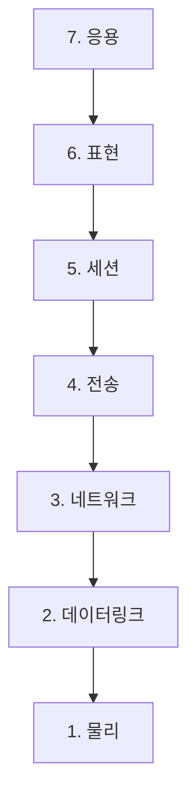

> 📦 "물리 데이터 네전 세표응" 같은 두문자로 억지로 외웠다가 면접에서 각 계층이 뭘 하는지
> 물어보면 말문이 막힌 적 있나요? OSI 7계층은 암기과목이 아니라 **택배 시스템**에 비유하면 훨씬 쉽습니다.

## OSI 7계층이 뭔가요

**OSI(Open Systems Interconnection) 7계층 모델**은 국제표준화기구(ISO)가 정의한, 서로 다른 컴퓨터가 네트워크로 통신하는 과정을 **7단계 역할**로 나눈 개념 모델입니다(표준 문서는 ISO/IEC 7498-1). 실제 인터넷은 TCP/IP 4계층으로 동작하지만, OSI 7계층은 "어떤 역할이 어디서 일어나는지" 개념적으로 이해하기에 훨씬 세밀하고 유용합니다.

## 택배로 비유하기

물건을 택배로 보낼 때를 생각해보세요.

1. 물건을 포장한다 (표현/응용 계층)
2. 배송 계약을 맺는다 (세션/전송 계층)
3. 주소를 적는다 (네트워크 계층)
4. 트럭에 싣는다 (데이터링크 계층)
5. 도로를 달린다 (물리 계층)

OSI 7계층도 이렇게 **위에서 아래로 데이터를 감싸가며(캡슐화)** 전송하고, 받는 쪽에서는 **아래에서 위로 하나씩 풀면서(역캡슐화)** 원래 데이터를 복원합니다. (다만 이 비유는 "각 계층이 순서대로 완료된 뒤 다음 계층으로 넘어간다"는 느낌을 주는데, 실제로는 전송 계층이 데이터를 여러 세그먼트로 쪼개 병렬적으로 흘려보내는 등 훨씬 동적입니다 — 택배 비유로는 이 부분까지 담기 어렵습니다.)


## 7계층 한눈에 보기

| 계층 | 이름 | 역할 | 대표 프로토콜/장비 |
| --- | --- | --- | --- |
| 7 | 응용 (Application) | 사용자와 맞닿는 서비스 | HTTP, FTP, DNS |
| 6 | 표현 (Presentation) | 데이터 형식 변환, 암호화/압축 | TLS, JPEG |
| 5 | 세션 (Session) | 통신 연결의 시작/유지/종료 관리 | 세션 관리(API) |
| 4 | 전송 (Transport) | 신뢰성 있는 전달, 포트 구분 | TCP, UDP |
| 3 | 네트워크 (Network) | 목적지까지 경로 찾기(라우팅) | IP, 라우터 |
| 2 | 데이터링크 (Data Link) | 같은 네트워크 내 정확한 전달 | MAC 주소, 스위치 |
| 1 | 물리 (Physical) | 전기 신호/빛으로 실제 전송 | 케이블, 허브 |



## 계층별로 조금 더 자세히

- **응용 계층**: 우리가 흔히 쓰는 프로그램이 직접 다루는 계층입니다. 브라우저가 `GET /index.html`을 요청하는 게 바로 여기.
- **표현 계층**: 데이터를 어떤 형식으로 표현할지(문자 인코딩, 암호화)를 다룹니다. HTTPS의 TLS 암호화가 여기서 이뤄진다고 보면 됩니다.
- **세션 계층**: 통신 주체 간 "대화 세션"을 관리합니다. 실무에서는 전송 계층과 묶어서 설명되는 경우가 많습니다.
- **전송 계층**: **포트 번호**로 어떤 애플리케이션에 데이터를 전달할지 결정하고, TCP는 신뢰성(순서·재전송)을, UDP는 속도를 우선합니다.
- **네트워크 계층**: **IP 주소**로 "어느 네트워크의 어느 호스트로 가야 하는지" 경로를 정합니다. 라우터가 이 계층에서 동작합니다.
- **데이터링크 계층**: 같은 네트워크(LAN) 안에서 **MAC 주소**로 정확한 다음 장비를 찾아 전달합니다. 스위치가 여기서 동작합니다.
- **물리 계층**: 0과 1을 실제 전기 신호, 빛, 전파로 바꿔 케이블/공기 중으로 실어 보냅니다.

## 캡슐화(Encapsulation) 흐름

데이터를 보낼 땐 각 계층을 지나며 **헤더가 하나씩 덧붙습니다.**

```
[응용 데이터]
→ [세그먼트 헤더 | 응용 데이터]              (전송 계층)
→ [IP 헤더 | 세그먼트 헤더 | 응용 데이터]     (네트워크 계층)
→ [MAC 헤더 | IP 헤더 | ... | FCS]           (데이터링크 계층)
→ 전기 신호로 변환                           (물리 계층)
```

받는 쪽에서는 이 과정을 반대로(아래→위) 진행하며 헤더를 하나씩 벗겨내 원본 데이터를 복원합니다. 이걸 **역캡슐화(Decapsulation)**라고 합니다.


## 안티패턴 vs 권장 패턴 — 장애 원인을 어느 계층에서 찾을까

```text
❌ 안티패턴: "인터넷이 안 돼요"라는 증상만 보고 무작정 애플리케이션 코드부터 디버깅

✅ 권장 패턴: 계층을 낮은 순서부터(혹은 높은 순서부터) 하나씩 좁혀가며 원인을 격리
   1. 물리/데이터링크: 케이블/와이파이 연결됐는가? (ping 게이트웨이)
   2. 네트워크: IP 할당은 정상인가? (ipconfig / ip addr)
   3. 전송: 해당 포트가 열려 있는가? (telnet, nc -zv)
   4. 응용: HTTP 상태 코드/응답 본문은 정상인가? (curl -v)
```

계층 모델을 실전에서 써먹는 대표적인 방법이 이겁니다. "안 된다"는 증상 하나로 바로 코드를 뒤지는 대신, **어느 계층까지는 정상이고 어느 계층부터 깨지는지**를 순서대로 좁혀가면 원인 파악 시간이 훨씬 줄어듭니다.

## 왜 굳이 계층으로 나눴을까

각 계층은 **자신의 역할만 신경 쓰고, 아래/위 계층이 어떻게 동작하는지는 몰라도 됩니다.** 예를 들어 애플리케이션 개발자는 물리적으로 광케이블을 쓰든 와이파이를 쓰든 신경 쓸 필요가 없습니다. 이렇게 **관심사를 분리**해두면 특정 계층만 바꾸거나 개선해도 나머지에 영향을 주지 않아 유지보수와 확장이 쉬워집니다.

## 흔한 오해 바로잡기

1. **"실제 네트워크 장비/소프트웨어가 정확히 7개 계층으로 딱 나뉘어 동작한다"** — 아닙니다. OSI는 개념 모델이고, 실제 구현(TCP/IP)은 4계층입니다. 세션·표현 계층은 실무 프로토콜에서 애플리케이션 계층에 흡수되는 경우가 많습니다.
2. **"계층이 낮을수록 덜 중요하다"** — 아닙니다. 물리/데이터링크 계층 장애(케이블 단선, 와이파이 신호 문제)는 그 위 모든 계층을 무력화시킵니다. 계층은 중요도 순서가 아니라 역할 순서입니다.
3. **"HTTPS는 응용 계층 기술이다"** — 절반만 맞습니다. HTTPS의 HTTP 부분은 응용 계층이지만, 암호화(TLS)는 표현 계층 역할에 해당합니다. 실무에서는 TLS를 전송 계층과 응용 계층 "사이"에 있는 별도 계층처럼 다루기도 합니다.

## 셀프 체크 질문

1. OSI 7계층 중 포트 번호로 애플리케이션을 구분하는 계층은 몇 계층인가요?
2. 캡슐화와 역캡슐화의 차이를 설명할 수 있나요?
3. "와이파이가 끊겨서 인터넷이 안 된다"는 증상은 어느 계층의 문제일까요?

:::toggle 정답 보기
1. 4계층(전송 계층)입니다. TCP/UDP가 포트 번호로 목적지 애플리케이션을 구분합니다.
2. 캡슐화는 데이터를 보낼 때 상위 계층에서 하위 계층으로 내려가며 각 계층의 헤더를 덧붙이는 과정이고, 역캡슐화는 받는 쪽에서 하위 계층부터 상위 계층으로 올라가며 헤더를 하나씩 벗겨 원본 데이터를 복원하는 과정입니다.
3. 물리 계층(1계층) 또는 데이터링크 계층(2계층)의 문제입니다. 무선 신호 자체가 끊긴 것이므로, 그 위의 IP/포트/애플리케이션이 아무리 정상이어도 통신이 불가능합니다.
:::

## 더 깊이 파고들기

- [OSI model — Wikipedia](https://en.wikipedia.org/wiki/OSI_model) — 7계층의 정의와 역사적 배경, TCP/IP와의 비교가 잘 정리돼 있습니다.
- [RFC 1122 — Requirements for Internet Hosts](https://datatracker.ietf.org/doc/html/rfc1122) — 실제 인터넷 호스트가 지켜야 할 통신 계층 요구사항을 정의한 표준 문서로, OSI 개념이 실제 구현에서 어떻게 반영되는지 대조해보기 좋습니다.

## 마치며

OSI 7계층은 두문자 암기가 아니라, **"내가 보낸 데이터가 어떤 역할들을 거쳐 상대방에게 도착하는가"**의 지도라고 생각하면 훨씬 오래 기억에 남습니다. 다음 글에서는 실제 인터넷이 쓰는 더 실용적인 모델인 **TCP/IP 4계층**을 OSI와 비교하며 다뤄보겠습니다. 📦
