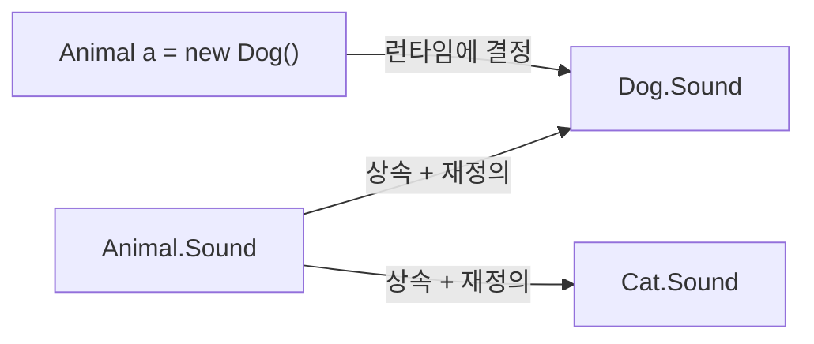

> 🤔 "오버로딩이랑 오버라이딩 차이가 뭐예요?"는 신입 면접 단골 질문입니다.
> 이름이 비슷해서 헷갈리지만, 사실은 완전히 다른 시점에 일어나는 완전히 다른 개념이에요.
> (C# 12 / .NET 8 기준으로 씁니다.)

## 한 문장 정리

- **오버로딩(Overloading)**: **같은 이름**의 메서드를 **매개변수를 다르게** 해서 **여러 개** 만드는 것 (한 클래스 안).
- **오버라이딩(Overriding)**: 부모 클래스의 메서드를 자식 클래스에서 **같은 시그니처로 재정의**하는 것 (상속 관계).

오버로딩은 "이름은 같지만 다른 메서드 여러 개를 만드는 것"이고, 오버라이딩은 "이미 있는 메서드의 내용을 새로 덮어쓰는 것"입니다. (계단을 오르내리는 비유로 치면, 오버로딩은 "같은 이름의 방이 여러 개", 오버라이딩은 "이미 있는 방을 자식이 새로 꾸미는 것"에 가깝습니다 — 다만 이 비유는 "왜 시점이 다른가(컴파일 타임 vs 런타임)"까지는 설명해주지 못하니 아래 본문에서 정확히 짚습니다.)


## 오버로딩(Overloading) — 매개변수만 다른 형제들

```csharp
class Calculator
{
    public int Add(int a, int b) => a + b;

    public double Add(double a, double b) => a + b;

    public int Add(int a, int b, int c) => a + b + c;
}
```

같은 이름 `Add`지만, **매개변수의 개수나 타입**이 다르면 서로 다른 메서드로 취급됩니다. 어떤 걸 호출할지는 컴파일러가 **컴파일 타임(정적 바인딩)**에 결정합니다.

> ⚠️ **주의**: [공식 문서](https://learn.microsoft.com/en-us/dotnet/csharp/programming-guide/classes-and-structs/methods)에 명시돼 있듯, **반환 타입은 오버로딩을 구분하는 시그니처에 포함되지 않습니다.** 매개변수가 같고 반환 타입만 다르면 컴파일 에러가 납니다.

### 참고: JavaScript는 오버로딩을 지원하지 않는다

같은 개념이 언어마다 다르게 취급되는 대표적인 예입니다. JavaScript는 함수 오버로딩 문법 자체가 없어서, 같은 이름으로 함수를 두 번 선언하면 **나중 선언이 앞의 것을 덮어씁니다.**

```javascript
function add(a, b) { return a + b; }
function add(a, b, c) { return a + b + c; } // 위 함수를 덮어씀 — 오버로딩 아님

add(1, 2); // NaN (c가 undefined라서)
```

JS에서 비슷한 효과를 내려면 매개변수 개수를 직접 체크하거나 옵션 객체를 받는 방식으로 우회해야 합니다. **"오버로딩이 모든 언어의 기본 기능은 아니다"**라는 걸 보여주는 좋은 사례입니다.

## 오버라이딩(Overriding) — 부모 것을 자식이 새로 정의

```csharp
class Animal
{
    public virtual string Sound() => "...";
}

class Dog : Animal
{
    public override string Sound() => "멍멍";
}
```

`Dog`는 `Animal`을 상속받으면서 `Sound()`를 **똑같은 시그니처(이름 + 매개변수)**로 재정의했습니다. C#에서는 **부모의 메서드가 `virtual`(또는 `abstract`)로 선언돼 있어야만** 자식이 `override`로 재정의할 수 있습니다. 이때 실제로 어떤 `Sound()`가 호출될지는 **런타임(동적 바인딩)**에 결정됩니다.

```csharp
Animal a = new Dog();
Console.WriteLine(a.Sound()); // "멍멍" — 선언 타입이 아니라 실제 객체 타입 기준
```

변수 `a`는 `Animal` 타입으로 선언됐지만, 실제 담긴 객체는 `Dog`이기 때문에 `Dog`의 `Sound()`가 호출됩니다. 이게 바로 **다형성(polymorphism)**의 핵심 동작 원리이며, [Microsoft 공식 문서](https://learn.microsoft.com/en-us/dotnet/csharp/fundamentals/object-oriented/polymorphism)에서도 이 예시로 설명합니다.



### Unity를 다뤄봤다면 이미 매일 쓰고 있는 패턴

Unity로 게임을 만들어봤다면 `MonoBehaviour`의 `Start()`, `Update()`를 정의해본 적이 있을 텐데, 그게 바로 오버라이딩입니다(정확히는 `virtual` 메서드를 재정의하는 `override`는 아니고, Unity가 리플렉션으로 메시지를 호출하는 방식이라 오버로딩·오버라이딩과는 다른 메커니즘입니다). 다만 커스텀 컴포넌트를 상속 구조로 설계할 때, 예를 들어 `abstract class Weapon { public abstract void Fire(); }`를 만들고 `Sword`, `Gun`이 각자 `Fire()`를 `override`하는 패턴은 이 글에서 다룬 오버라이딩과 정확히 같은 개념입니다.

## 오버라이딩 규칙 (C# 기준)

1. **메서드 시그니처(이름+매개변수)가 완전히 같아야** 합니다.
2. **접근 제어자는 부모보다 좁힐 수 없습니다** (`public` → `protected`로 좁히면 컴파일 에러).
3. **반환 타입은 같거나 자식 타입(공변 반환 타입)**이어야 합니다.
4. 부모 메서드는 반드시 `virtual`, `abstract`, `override` 중 하나로 선언돼 있어야 자식이 재정의할 수 있습니다.
5. `sealed override`로 선언하면 그 아래로는 더 이상 재정의할 수 없습니다.

## 안티패턴 vs 권장 패턴

```csharp
// ❌ 안티패턴: new 키워드로 "숨기기" — 다형성이 깨진다
class Base
{
    public void Greet() => Console.WriteLine("Base");
}
class Derived : Base
{
    public new void Greet() => Console.WriteLine("Derived"); // override 아님, 숨김
}

Base b = new Derived();
b.Greet(); // "Base" 출력 — 의도한 "Derived"가 아님, 헷갈리는 버그의 원인
```

```csharp
// ✅ 권장 패턴: virtual/override로 다형성을 명확히 표현
class Base
{
    public virtual void Greet() => Console.WriteLine("Base");
}
class Derived : Base
{
    public override void Greet() => Console.WriteLine("Derived");
}

Base b = new Derived();
b.Greet(); // "Derived" 출력 — 실제 객체 타입 기준으로 동작, 의도대로
```

`new`로 숨기면 컴파일은 되지만, **선언된 변수 타입에 따라 다른 메서드가 호출되는 예측 불가능한 동작**이 생깁니다. 이런 코드는 나중에 "왜 이 메서드가 안 불리지?" 같은 디버깅 시간을 낭비하게 만드는 대표적인 원인입니다. 의도적으로 다형성을 끊고 싶은 게 아니라면 `virtual`/`override`를 쓰는 게 맞습니다.

## 표로 한눈에 비교

| 구분 | 오버로딩 | 오버라이딩 |
| --- | --- | --- |
| 관계 | 같은 클래스 내부 | 부모-자식 상속 관계 |
| 메서드 이름 | 같음 | 같음 |
| 매개변수 | 반드시 다름 | 반드시 같음 |
| 바인딩 시점 | 컴파일 타임(정적) | 런타임(동적) |
| 필요 키워드(C#) | 없음 | 부모 `virtual`/`abstract`, 자식 `override` |
| 목적 | 같은 동작을 다양한 입력으로 제공 | 부모의 동작을 자식에 맞게 변경 |
| 관련 키워드 | 다형성 중 "정적 다형성" | 다형성 중 "동적 다형성" |

## 흔한 오해 바로잡기

1. **"오버로딩은 다형성이 아니다"** — 흔히 오버라이딩만 다형성으로 오해하지만, 오버로딩은 **컴파일 타임 다형성(정적 다형성)**, 오버라이딩은 **런타임 다형성(동적 다형성)**으로 둘 다 다형성의 종류입니다.
2. **"C#에서는 아무 메서드나 오버라이딩할 수 있다"** — 아닙니다. 부모 메서드가 `virtual`/`abstract`로 선언돼 있지 않으면 오버라이딩 자체가 불가능합니다. 일반 메서드를 자식에서 같은 이름으로 다시 쓰면 오버라이딩이 아니라 `new`로 **숨기는** 것입니다.
3. **"private 메서드도 오버라이딩할 수 있다"** — 안 됩니다. `private`은 자식 클래스에서 아예 보이지 않기 때문에, 같은 이름의 메서드를 자식에 만들어도 그건 완전히 새로운 메서드입니다.

## 셀프 체크 질문

1. 오버로딩과 오버라이딩은 각각 컴파일 타임과 런타임 중 언제 호출할 메서드가 결정되나요?
2. C#에서 부모 클래스의 메서드를 자식이 `override`하려면 부모 메서드에 어떤 키워드가 필요한가요?
3. 위 "안티패턴" 예제에서 `new` 키워드로 메서드를 숨겼을 때, `Base b = new Derived(); b.Greet();`은 왜 "Base"를 출력할까요?

:::toggle 정답 보기
1. 오버로딩은 매개변수 타입/개수만으로 어떤 메서드인지 컴파일 시점에 확정되는 **정적 바인딩**이고, 오버라이딩은 실제 객체의 런타임 타입을 보고 결정되는 **동적 바인딩**입니다.
2. 부모 메서드가 `virtual`(또는 `abstract`)로 선언돼 있어야 합니다. 그래야 자식이 `override` 키워드로 재정의할 수 있습니다.
3. `new`로 선언한 메서드는 오버라이딩이 아니라 "숨김"이라, 호출이 **변수의 선언 타입**(`Base`)을 기준으로 정적으로 결정됩니다. 실제 객체가 `Derived`여도 다형성이 적용되지 않아 `Base.Greet()`가 호출됩니다.
:::

## 더 깊이 파고들기

- [C# Methods — 공식 문서](https://learn.microsoft.com/en-us/dotnet/csharp/programming-guide/classes-and-structs/methods) — 메서드 시그니처와 오버로딩 규칙의 1차 출처입니다.
- [C# Polymorphism — 공식 문서](https://learn.microsoft.com/en-us/dotnet/csharp/fundamentals/object-oriented/polymorphism) — `virtual`/`override`/`new`의 차이를 공식 예제로 확인할 수 있습니다.

## 마치며

오버로딩과 오버라이딩을 구분하는 가장 확실한 질문은 딱 하나입니다. **"상속 관계가 있는가, 그리고 시그니처가 완전히 같은가?"** 상속 관계 없이 이름만 같고 매개변수가 다르면 오버로딩, 상속 관계에서 시그니처까지 똑같이 재정의하면 오버라이딩입니다. 다음에 헷갈리면 이 질문 하나만 떠올려 보세요. 🙂
