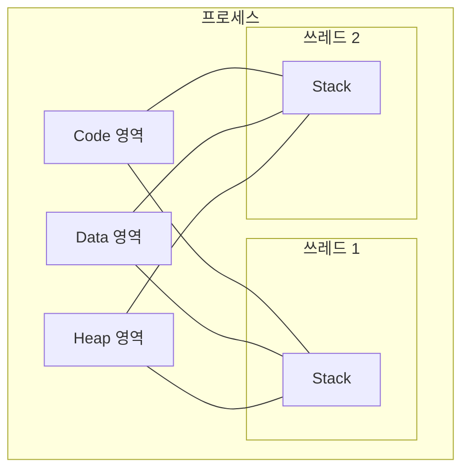

> "프로세스랑 쓰레드 차이가 뭔가요?"라는 질문에 "프로세스는 크고 쓰레드는 가볍습니다"까지만
> 답했다가, "그래서 메모리 구조상 정확히 뭐가 다른데요?"라는 후속 질문에 말문이 막히는
> 경우가 흔합니다. 이 글에서 그 빈틈을 메모리 구조로 채워 드립니다.

---

## 집과 사람: 첫 번째 감각 잡기

프로세스는 **집**, 쓰레드는 그 집에 사는 **사람**에 비유하면 감이 빨리 잡힙니다.
집(프로세스)은 옆집에 무슨 일이 생기든 완전히 독립된 공간입니다.

반면 같은 집에 사는 사람들(쓰레드)은 거실과 주방(자원)을 함께 쓰면서 각자 자기 할 일을
합니다. 다만 이 비유는 "자원을 공유하며 각자 움직인다"는 느낌만 전달할 뿐, 정확히 무엇을
공유하고 무엇을 안 하는지는 메모리 구조를 봐야 알 수 있습니다.


## 메모리 구조로 뜯어보기: Code·Data·Heap·Stack

프로세스는 실행에 필요한 **Code(코드), Data(전역 변수), Heap(동적 할당), Stack(함수 호출)**
네 영역을 전부 독립적으로 가집니다. 그래서 프로세스끼리는 서로의 메모리를 직접 들여다볼 수
없고, 대화하려면 IPC(Inter-Process Communication) 같은 별도 통로가 필요합니다.

같은 프로세스 안의 쓰레드들은 이야기가 다릅니다. Code, Data, Heap은 **함께 쓰지만**,
Stack만큼은 쓰레드마다 **따로** 할당받습니다.



Stack이 독립적이라는 건 각 쓰레드가 **독립적인 함수 호출 흐름**을 가진다는 뜻입니다.
"지금 어떤 함수를 호출한 상태인지"를 쓰레드마다 따로 기록할 수 있어야, 한 쓰레드가
어디까지 실행했는지와 무관하게 다른 쓰레드가 자기 할 일을 계속할 수 있기 때문입니다.

## 컨텍스트 스위칭: 비용이 갈리는 진짜 이유

프로세스 대신 쓰레드를 쓰는 실질적인 이유는 **문맥 교환(Context Switching) 비용** 때문입니다.

프로세스 전환은 이사를 가는 것과 같습니다. 실행 흐름을 옮길 주소 공간 자체가 통째로
바뀌므로, 일반적으로 페이지 테이블 교체나 캐시(TLB) 무효화 같은 무거운 작업이 함께
따라온다고 알려져 있습니다.

쓰레드 전환은 같은 집 안에서 방만 옮기는 것에 가깝습니다. Code·Data·Heap이 가리키는
주소 공간은 그대로 두고, 레지스터 값과 Stack 포인터 같은 실행 흐름 정보만 바꿔치기하면
되므로 상대적으로 가볍습니다.

---

## 언제 멀티 프로세스, 언제 멀티 쓰레드인가

| 구분 | 멀티 프로세스 | 멀티 쓰레드 |
| --- | --- | --- |
| 메모리 | Code/Data/Heap/Stack 모두 독립 | Code/Data/Heap 공유, Stack만 독립 |
| 장애 격리 | 하나가 죽어도 나머지는 안전 | 한 쓰레드의 치명적 오류가 프로세스 전체를 죽일 수 있음 |
| 통신 비용 | IPC 필요, 상대적으로 무거움 | 같은 메모리에 바로 접근, 가벼움 |
| 컨텍스트 스위칭 | 주소 공간 전환 비용이 큼 | 주소 공간을 유지해 비용이 작음 |
| 적합한 상황 | 장애 격리가 중요할 때 | 다수 요청을 동시 처리할 때 |

"장애 격리"와 "자원 효율" 중 이번 기능에서 더 중요한 쪽이 무엇인지가 선택 기준입니다.
둘 다 필요하면 두 모델을 섞어 쓰는 것도 흔한 선택지입니다.

### 실제 사례로 보는 하이브리드 구조: 크롬

크롬은 탭(정확히는 사이트 인스턴스)마다 별도의 렌더러 프로세스를 띄웁니다. 무거운
페이지 하나가 멎어도 다른 탭이나 브라우저 전체가 함께 죽지 않도록 하기 위해서입니다.

다만 그 프로세스 내부는 다시 여러 쓰레드로 나뉘어 동작합니다(예: 메인 스레드,
컴포지터 스레드 등). 즉 "프로세스로 격리하고, 쓰레드로 병렬화하는" 하이브리드
구조입니다. 자세한 구조는 아래 [더 깊이 파고들기](#더-깊이-파고들기)에 걸어둔
크로미움 공식 설계 문서에서 확인할 수 있습니다.

## 안티패턴 vs 권장 패턴: 공유 자원 다루기

쓰레드가 Data·Heap을 공유한다는 건, 여러 쓰레드가 같은 변수를 동시에 건드릴 수 있다는
뜻이기도 합니다. 락 없이 공유 변수를 수정하면 **경쟁 상태(Race Condition)**가 생깁니다.

```csharp
// 안티패턴: 여러 쓰레드가 락 없이 공유 변수를 수정
static int counter = 0;

void Increment()
{
    for (int i = 0; i < 100000; i++)
    {
        counter++; // 읽기-증가-쓰기가 하나의 원자적 연산이 아니라서 값이 유실될 수 있음
    }
}
```

```csharp
// 권장 패턴: 임계 구역을 락(모니터)으로 보호
static int counter = 0;
static readonly object _lock = new object();

void Increment()
{
    for (int i = 0; i < 100000; i++)
    {
        lock (_lock)
        {
            counter++; // 한 번에 하나의 쓰레드만 진입 가능
        }
    }
}
```

`lock`은 내부적으로 모니터(뮤텍스와 유사한 상호 배제 기법)를 사용해, 한 시점에 하나의
쓰레드만 임계 구역에 들어가도록 보장합니다. 그 결과 카운터 값이 유실되지 않습니다.

## 흔한 오해 바로잡기

1. **"쓰레드는 Stack만 빼고 다 공유하니까 거의 프로세스처럼 독립적이다"** — 절반만
   맞습니다. 각 쓰레드는 Stack뿐 아니라 자신만의 **레지스터 집합**(특히 프로그램
   카운터·스택 포인터)도 따로 가집니다. "지금 어디를 실행 중인지"를 쓰레드마다 다르게
   유지할 수 있어야 비로소 독립적인 실행 흐름이 성립합니다.
2. **"크롬은 무조건 멀티 프로세스다"** — 프로세스 간에는 격리를, 프로세스 내부는
   다시 멀티 쓰레드로 병렬화하는 하이브리드 구조입니다. 한쪽만 기억하면 절반만
   맞는 설명이 됩니다.
3. **"쓰레드를 늘리면 무조건 빨라진다"** — CPU 코어 수보다 훨씬 많은 쓰레드를
   띄우면 컨텍스트 스위칭 오버헤드만 늘어날 수 있습니다. 언어/런타임 제약도
   있는데, 예를 들어 CPython은 GIL(Global Interpreter Lock) 때문에 한 시점에
   하나의 쓰레드만 파이썬 바이트코드를 실행하므로, CPU 바운드 작업에서는
   멀티쓰레딩만으로 기대한 성능이 안 나올 수 있습니다.

---

## 면접 꼬리 질문, 표준 답안으로 정리하기

"프로세스와 쓰레드 차이"를 잘 답하면 보통 아래 세 질문이 이어집니다. 미리 답을
준비해두면 당황할 일이 줄어듭니다.

**멀티 프로세스와 멀티 쓰레드는 각각 언제 쓰나요?** 장애 격리가 중요하면(하나가
죽어도 나머지는 살아야 하면) 멀티 프로세스를, 다수의 요청을 자원 효율적으로 동시에
처리해야 하면(웹 서버 등) 멀티 쓰레드를 선택합니다.

**크롬은 프로세스 기반인가요, 쓰레드 기반인가요?** 탭(사이트 인스턴스) 단위로는
프로세스로 격리하고, 각 프로세스 내부는 다시 멀티 쓰레드로 동작하는 하이브리드
구조입니다.

**멀티 쓰레드의 자원 경쟁·동기화·데드락은 어떻게 다루나요?** Data·Heap을 공유하는
여러 쓰레드가 동시에 같은 값을 바꾸려 하면 경쟁 상태가 발생합니다. 임계 구역에
**뮤텍스(Mutex)**나 접근 가능한 개수를 제어하는 **세마포어(Semaphore)**로 락을 걸어
막습니다. 다만 락을 잘못 걸면 서로 상대의 락 해제만 기다리는 **데드락(Deadlock)**에
빠질 수 있으므로, 락을 얻는 순서를 일관되게 정하는 등의 설계 원칙이 필요합니다.

## 셀프 체크 질문

1. 쓰레드는 프로세스의 어떤 메모리 영역을 공유하고, 어떤 영역을 독립적으로 가지나요?
2. 프로세스 전환이 쓰레드 전환보다 무거운 이유를 메모리 관점에서 설명할 수 있나요?
3. 크롬이 "멀티 프로세스다"라는 말이 왜 절반만 맞는 설명인가요?

:::toggle 정답 보기
1. Code·Data·Heap은 같은 프로세스 내 쓰레드끼리 공유하고, Stack과 레지스터
   집합(프로그램 카운터·스택 포인터 포함)은 쓰레드마다 독립적으로 가집니다.
2. 프로세스 전환은 주소 공간 자체를 바꾸는 작업이라 페이지 테이블 교체나 캐시(TLB)
   무효화 같은 무거운 작업이 따라온다고 알려져 있는 반면, 쓰레드 전환은 같은
   주소 공간 안에서 실행 흐름 정보(레지스터·Stack 포인터)만 바꾸면 되므로 상대적으로
   가볍습니다.
3. 크롬은 탭(사이트 인스턴스) 단위로는 프로세스를 분리해 장애를 격리하지만, 각
   프로세스 내부는 다시 여러 쓰레드로 나뉘어 동작하는 하이브리드 구조이기 때문입니다.
:::

## 더 깊이 파고들기

- [Chromium 멀티 프로세스 아키텍처 설계 문서](https://www.chromium.org/developers/design-documents/multi-process-architecture/) — 탭을 프로세스로 격리하는 실제 설계 의도를 1차 출처로 확인할 수 있습니다.
- [Linux pthreads(7) man page](https://man7.org/linux/man-pages/man7/pthreads.7.html) — POSIX 쓰레드가 실제로 무엇을 공유하고 무엇을 독립적으로 갖는지 규격 수준에서 정리돼 있습니다.
- [Node.js worker_threads 공식 문서](https://nodejs.org/api/worker_threads.html) — OS 쓰레드 모델과 달리 각 워커가 독립된 힙(V8 isolate)을 갖는 런타임 사례를 비교해보기 좋습니다.

## 마치며

프로세스는 "자원을 할당받는 단위"인 집, 쓰레드는 그 집 안에서 실제로 움직이는
실행 흐름인 사람입니다. 메모리 관점에서는 **Code·Data·Heap을 공유하고 Stack(과
레지스터)만 독립적으로 갖는다**는 한 문장이 핵심이고, 이 한 문장에서 컨텍스트
스위칭 비용 차이와 크롬 같은 하이브리드 구조까지 자연스럽게 풀려나옵니다. 면접장에서
이 흐름대로 설명하면 꼬리 질문에도 무너지지 않을 거예요. 🏠
