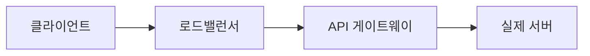

> 📐 "REST API 만들어봤어요"라고 말하는 사람은 많지만, "REST가 지켜야 할 제약 조건이 뭔가요?"에
> 바로 답하는 사람은 의외로 적습니다. REST는 사실 규칙이 꽤 명확한 **아키텍처 스타일**입니다.

## REST는 프로토콜이 아니라 "스타일"입니다

**REST(REpresentational State Transfer)**는 2000년 로이 필딩(Roy Fielding)의 박사 논문 [5장](https://roy.gbiv.com/pubs/dissertation/rest_arch_style.htm)에서 처음 정의된 **아키텍처 스타일**입니다. HTTP 같은 특정 프로토콜이 아니라, "분산 시스템을 어떻게 설계하면 확장성 좋고 단순해지는가"에 대한 **원칙들의 모음**이에요.

우리가 흔히 말하는 "REST API"는 이 원칙들을 HTTP 위에서 구현한 결과물입니다. (아래 예제의 HTTP 시맨틱스는 [RFC 9110](https://datatracker.ietf.org/doc/html/rfc9110) 기준입니다.)


## 6가지 제약 조건

REST 아키텍처 스타일은 아래 6가지 제약 조건을 만족해야 한다고 정의됩니다. 5개는 필수, 1개는 선택입니다.

### 1. 클라이언트-서버 (Client-Server)

클라이언트(UI, 사용자 상태 관리)와 서버(데이터 저장, 비즈니스 로직)의 역할을 분리합니다. 덕분에 클라이언트와 서버는 독립적으로 발전할 수 있습니다. 예를 들어 프론트엔드를 웹에서 앱으로 바꿔도 서버 API는 그대로 재사용 가능하죠.

### 2. 무상태성 (Stateless)

서버는 클라이언트의 **이전 요청 상태를 기억하지 않습니다.** 매 요청에는 그 요청을 처리하는 데 필요한 모든 정보가 담겨 있어야 합니다.

```http
GET /orders/42
Authorization: Bearer eyJhbGciOi...
```

세션을 서버 메모리에 저장하는 대신, 이렇게 토큰을 매 요청마다 함께 보내는 방식이 무상태성의 대표적인 구현입니다. 서버가 상태를 안 가지니 **수평 확장(서버를 여러 대로 늘리기)**이 훨씬 쉬워집니다.

### 3. 캐시 가능성 (Cacheable)

서버의 응답은 캐시 가능 여부를 명시해야 하고, 가능하다면 클라이언트나 중간 서버가 응답을 캐싱해서 같은 요청을 반복하지 않도록 합니다.

```http
Cache-Control: max-age=3600
```

### 4. 계층화 시스템 (Layered System)

클라이언트는 자신이 서버와 직접 통신하는지, 아니면 로드밸런서·프록시·게이트웨이를 거쳐 통신하는지 알 필요가 없습니다. 중간에 계층이 추가돼도 클라이언트 입장에서는 동일하게 동작해야 합니다.



### 5. 통일 인터페이스 (Uniform Interface) — 가장 핵심

REST를 REST답게 만드는 가장 중요한 제약입니다. 아래 4개의 세부 원칙으로 나뉩니다.

- **리소스 식별**: URI로 리소스를 식별합니다. (`/users/1`)
- **표현을 통한 리소스 조작**: 클라이언트는 리소스의 "표현(JSON 등)"을 주고받으며 조작합니다.
- **자기 서술적 메시지**: 메시지 자체에 그것을 처리하는 방법이 담겨 있어야 합니다 (`Content-Type` 등).
- **HATEOAS (Hypermedia as the Engine of Application State)**: 응답에 다음에 할 수 있는 행동의 링크를 포함시킵니다. (실무에서 가장 지켜지지 않는 원칙이기도 합니다.)

```json
{
  "id": 42,
  "status": "PENDING",
  "links": [
    { "rel": "cancel", "href": "/orders/42/cancel" }
  ]
}
```

### 6. 주문형 코드 (Code-On-Demand) — 유일한 선택 사항

서버가 실행 가능한 코드(예: 자바스크립트)를 클라이언트에 보내 기능을 확장할 수 있게 하는 제약입니다. 유일하게 **선택 사항**이며, 실무에서는 거의 논의되지 않습니다.


## 안티패턴 vs 권장 패턴

```http
# ❌ 안티패턴: URI에 동사를 쓰고, HTTP 메서드를 무시
POST /getUser?id=1
POST /deleteUser?id=1
```

```http
# ✅ 권장 패턴: 리소스는 명사로, 행위는 HTTP 메서드로
GET    /users/1
DELETE /users/1
```

URI에 동사를 넣기 시작하면 `/getUser`, `/updateUserInfo`, `/removeUserById` 처럼 엔드포인트마다 제각각인 이름이 늘어나고, 클라이언트는 매번 "이 동작을 하려면 무슨 URL을 쳐야 하지"를 문서에서 찾아야 합니다. 리소스를 명사로 고정하고 행위를 HTTP 메서드(`GET`/`POST`/`PUT`/`DELETE`)로 표현하면, URI 개수가 리소스 개수만큼으로 줄어들고 API 전체의 패턴을 예측할 수 있게 됩니다.

## "REST API"라고 부르지만 진짜 RESTful한가?

재밌게도, 실무에서 "REST API"라고 부르는 대부분의 API는 **HATEOAS를 지키지 않습니다.** 그래서 엄밀히는 "REST 원칙을 일부만 따르는 HTTP API"에 가깝다는 지적도 많습니다. 로이 필딩 본인도 훗날 "링크 없이 REST라고 부르지 말라"는 취지의 글을 쓰기도 했어요.

실무 관점에서는 이렇게 정리하면 됩니다.

| 지켜지는 경우가 많음 | 지켜지지 않는 경우가 많음 |
| --- | --- |
| 클라이언트-서버 분리 | HATEOAS |
| 무상태성 | 완전한 자기서술성 |
| 캐시 가능성 | 주문형 코드(애초에 선택사항) |
| 계층화 | — |

## 흔한 오해 바로잡기

1. **"REST는 곧 JSON이다"** — 아닙니다. REST는 표현 형식을 JSON으로 못박지 않습니다. XML이든 JSON이든 "자기 서술적 메시지" 원칙만 지키면 됩니다. JSON이 흔히 쓰이는 건 단지 실무 관례입니다.
2. **"URI에 리소스 계층을 깊게 중첩할수록 좋다"** — `/users/1/orders/42/items/7/reviews/3`처럼 과도하게 깊어지면 오히려 클라이언트가 URI를 조립하기 어려워집니다. 일반적으로 2~3단계 이내로 유지하는 것이 권장됩니다.
3. **"REST를 안 지키면 API가 아니다"** — REST는 여러 API 설계 스타일 중 하나입니다. GraphQL, gRPC도 유효한 대안이며, 상황에 따라 REST가 아닌 스타일이 더 적합할 수도 있습니다.

## 셀프 체크 질문

1. REST의 6가지 제약 조건 중 필수가 아닌 유일한 것은 무엇인가요?
2. 무상태성(Stateless) 제약이 서버 확장성에 어떤 이점을 주나요?
3. 실무의 "REST API"가 왜 엄밀히는 완전한 REST가 아닌 경우가 많은가요?

:::toggle 정답 보기
1. 주문형 코드(Code-On-Demand)입니다. 나머지 다섯 개(클라이언트-서버, 무상태성, 캐시 가능성, 계층화, 통일 인터페이스)는 필수입니다.
2. 서버가 클라이언트별 상태를 메모리에 들고 있지 않으므로, 어떤 요청이든 어느 서버 인스턴스로 가도 동일하게 처리할 수 있습니다. 이 덕분에 서버를 여러 대로 늘리는 수평 확장이 쉬워집니다.
3. 통일 인터페이스의 세부 원칙 중 하나인 HATEOAS(응답에 다음 행동의 링크를 포함시키는 것)를 지키지 않는 경우가 대부분이기 때문입니다.
:::

## 더 깊이 파고들기

- [로이 필딩 박사 논문 5장 — REST](https://roy.gbiv.com/pubs/dissertation/rest_arch_style.htm) — REST가 처음 정의된 원문입니다. 6가지 제약이 어떻게 단계적으로 유도되는지 보여줍니다.
- [RFC 9110 — HTTP Semantics](https://datatracker.ietf.org/doc/html/rfc9110) — REST API가 실제로 올라타는 HTTP의 메서드/상태코드 의미를 정의하는 표준 문서입니다.

## 마치며

REST는 "URL에 동사 쓰지 말고 명사 써라" 수준의 스타일 가이드가 아니라, **분산 시스템을 확장 가능하고 단순하게 설계하기 위한 원칙 6가지**입니다. 면접에서 "REST가 뭔가요?"라는 질문을 받으면, "자원을 URI로 표현하고 HTTP 메서드로 조작하는 것"이라는 답에서 한 걸음 더 나아가 이 6가지 제약 조건, 특히 **무상태성과 통일 인터페이스**를 짚어주면 훨씬 인상 깊은 답변이 됩니다. 📐
