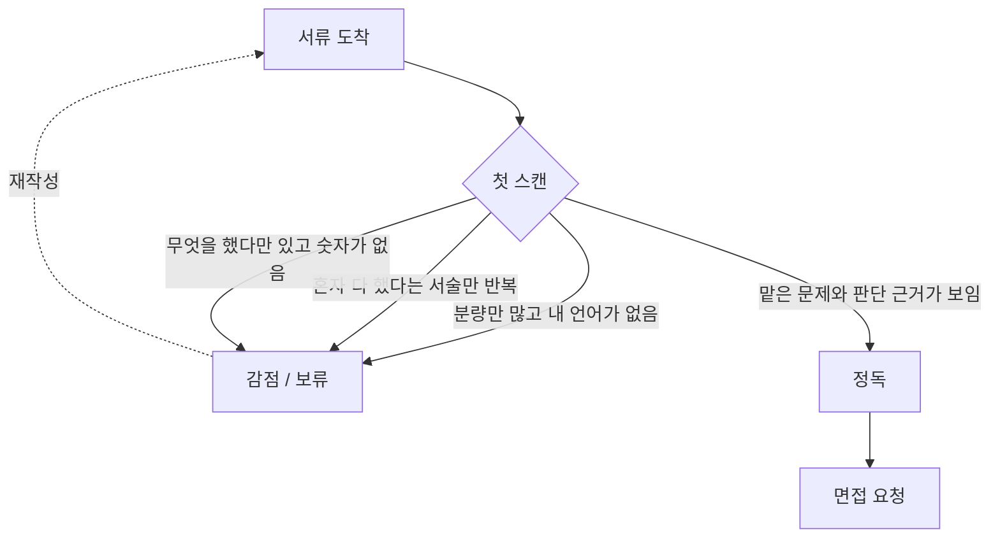

> 📄 "프로젝트도 많고, 설명도 A4 열 장을 썼는데 왜 서류에서 떨어질까요?"
> 슬프게도 서류는 **많이 쓴 사람**이 아니라 **읽히는 사람**이 통과합니다.

---

## 이 글의 출처와 전제

이 글은 비전공 풀스택 개발자의 이력서·포트폴리오·자기소개서를 현직자가 공개 첨삭한 영상([유튜브 링크](https://youtu.be/7L-UHYghHh8))에서 나온 지적을 출발점으로 삼아 정리한 것입니다.

한 사람의 관점이므로 모든 회사에 그대로 적용되지는 않습니다. 다만 지적된 항목들이 **채용 담당자가 짧은 시간에 판단해야 하는 구조**에서 나온다는 점은 대체로 공통적입니다. 그래서 "누가 말했나"보다 "왜 그렇게 읽히나"에 초점을 맞춰 정리했습니다.

서류 심사는 대체로 이런 흐름을 탑니다.



핵심은 **정독 단계까지 못 가면 내용의 질은 평가조차 되지 않는다**는 것입니다.

<!-- 이미지 없음: hero (output/resume-portfolio-red-flags/images/hero.* 확인) -->

---

## 신호 1 — 분량은 많은데 '내 언어'가 없다

첫 번째로 지적된 것은 **프로젝트 설명 분량이 혼자 다 했다고 보기 어려울 만큼 많다**는 점이었습니다. 그런데 문제는 분량 자체가 아닙니다.

분량이 많은데 **아키텍처를 왜 그렇게 잡았는지에 대한 본인의 설명이 없을 때**, 읽는 사람은 "이건 생성형 AI가 채운 문장이구나"라고 판단합니다. 그리고 그 판단은 곧 "이 사람이 실제로 이해한 범위를 알 수 없다"로 이어집니다.

2026년 현재 AI 도구를 쓰는 것 자체는 감점 요소가 아닙니다. 오히려 안 쓰는 쪽이 이상하죠. 문제는 **도구를 썼다는 사실을 숨긴 채, 도구가 만든 결과물만 제출하는 것**입니다.

### 안티패턴 vs 권장 패턴

```text
[안티패턴]
본 프로젝트는 확장성과 유지보수성을 고려한 마이크로서비스 아키텍처를
채택하였으며, 이벤트 기반 비동기 처리를 통해 시스템 전반의 결합도를
낮추고 안정성을 확보하였습니다.
→ 어떤 프로젝트에 붙여도 말이 되는 문장. 판단의 흔적이 없다.

[권장 패턴]
초기엔 단일 서버로 시작했는데, 정산 배치가 도는 새벽 시간대에 API 응답이
같이 느려지는 문제가 있었습니다. 정산만 별도 워커로 분리했고,
큐는 운영 부담 때문에 Kafka 대신 Redis 기반으로 골랐습니다.
설계 초안은 AI로 여러 안을 뽑아 비교했고, 최종 선택 근거는 아래와 같습니다.
→ 문제 → 대안 → 선택 근거 → 도구 사용 명시.
```

권장 패턴 쪽이 더 짧습니다. 그런데도 정보량은 더 많죠. **판단 근거 한 줄이 미사여구 열 줄을 이깁니다.**

## 신호 2 — 전부 혼자 했다는 서술

"모든 걸 혼자 개발했다"는 문장은 본인 입장에서는 실력 증명이지만, 읽는 사람 입장에서는 **협업 데이터가 0인 지원자**입니다.

채용은 "잘하는 사람"을 뽑는 절차가 아니라 **"우리 팀에 넣을 사람"을 고르는 절차**입니다. 팀에 넣었을 때 어떻게 행동할지 예측할 근거가 없으면, 결과물이 좋아도 리스크로 분류되기 쉽습니다.

혼자 한 프로젝트라도 협업 흔적은 만들 수 있습니다.

- 이슈를 어떻게 쪼개고 우선순위를 매겼는지 (이슈 트래커 화면 한 장)
- PR을 셀프 리뷰하며 남긴 코멘트, 리뷰 체크리스트
- 사용자·클라이언트와 주고받은 요구사항 조율 과정과 그 결과 바뀐 스펙
- 오픈소스 이슈 등록이나 기술 블로그로 남에게 설명해본 경험

혼자 했더라도 **"다른 사람이 읽을 것을 전제로 남긴 기록"**이 있으면 협업 신호로 읽힙니다.

<!-- 이미지 없음: solo (output/resume-portfolio-red-flags/images/solo.* 확인) -->

## 신호 3 — 나만 아는 용어를 남발한다

영상에서 지적된 또 하나는 **본인만 아는 용어를 그대로 쓴다**는 점이었습니다. 이건 어휘력 문제가 아니라 **소통 능력의 대리 지표**로 읽힙니다.

읽는 사람이 그 프로젝트의 맥락을 모른다는 전제를 못 세우는 사람은, 팀에서도 같은 방식으로 말할 가능성이 높다고 추정되는 거죠.

간단한 규칙 하나면 대부분 해결됩니다. **사내/개인 프로젝트 고유 명사가 처음 나올 때는 반드시 한 줄 정의를 붙인다.**

```text
[안티패턴] "정산 파이프라인에서 RSM 큐 지연이 발생하여..."
[권장 패턴] "정산 파이프라인(주문 데이터를 매일 새벽 집계해 정산서를 만드는 배치)에서..."
```

---

## 신호 4 — '무엇을 했다'만 있고 숫자가 없다

경력자 서류인데 부트캠프 수료생 포트폴리오처럼 보이는 가장 큰 이유입니다. **기능 나열은 신입의 언어고, 지표와 판단은 경력자의 언어입니다.**

| 구분 | 신입형 서술 | 경력형 서술 |
| --- | --- | --- |
| 기능 | "결제 기능을 구현했다" | "PG 연동 결제 구현, 일 평균 N건 처리, 결제 실패율 X% → Y%" |
| 장애 | "버그를 수정했다" | "중복 결제 원인은 재시도 로직의 멱등키 누락. 멱등키 도입 후 재발 0건" |
| 협업 | "팀과 협업했다" | "리뷰 규칙을 문서화해 PR 첫 리뷰까지 대기 시간을 N일 → M시간으로 단축" |
| 운영 | "서비스를 운영했다" | "월 활성 사용자 N명 규모, 배포 주기 주 1회 → 주 3회" |

중요한 주의사항이 하나 있습니다. **없는 숫자를 만들어 넣으면 면접에서 무너집니다.** 정확한 수치가 없다면 "정확한 집계는 없지만 체감상 절반 이하로 줄었습니다" 처럼 **불확실성을 밝힌 채 쓰는 편**이 안전합니다. 면접관이 확인하는 건 숫자의 크기가 아니라 **그 숫자를 만든 과정을 설명할 수 있는가**입니다.

<!-- 이미지 없음: metrics (output/resume-portfolio-red-flags/images/metrics.* 확인) -->

## 신호 5 — 외주 위주 커리어와 설명 없는 공백기

정규직 재직 기간이 짧고 프리랜서·외주 중심인 커리어는 **조직 융화에 대한 의구심**을 만듭니다. 그리고 커리어 전환 과정의 공백기가 아무 설명 없이 비어 있으면, 면접관은 그 빈칸을 자기 방식대로 채워 넣습니다. 대체로 지원자에게 불리한 쪽으로요.

여기서 오해하면 안 되는 게 있습니다. **외주 경력이 나쁘다는 뜻이 아닙니다.** 외주에는 정규직이 얻기 힘든 경험이 있습니다. 요구사항이 계속 바뀌는 상황에서 범위를 협상해본 경험, 납기를 맞추려 기술 부채를 의도적으로 감수하고 나중에 갚아본 경험 같은 것들이죠.

문제는 그 경험을 **"짧게 여러 곳"이라는 형태로만 보여주는 것**입니다. 같은 이력이라도 이렇게 묶으면 다르게 읽힙니다.

- 프로젝트를 시간순 나열 대신 **도메인/역할 기준으로 묶기** (예: "커머스 정산·결제 3건, 총 N개월")
- 각 건마다 계약 형태가 아니라 **해결한 문제**를 제목으로 달기
- 공백기는 숨기지 말고 **한 줄로 사실만** 적기 (전환 준비, 학습, 개인 사정 등)

공백기 설명은 길수록 변명처럼 읽힙니다. 짧고 담담하게 쓰는 게 낫습니다.

## 신호 6 — 자신 없는 문장

"~하는 편입니다", "~인 것 같습니다", "~하려고 노력했습니다" 같은 표현은 겸손이 아니라 **판단 회피**로 읽힙니다. 기술 문서에서 단정을 못 하는 사람은 설계 회의에서도 결론을 못 낼 거라고 추정되니까요.

```text
[안티패턴] "성능 개선에도 어느 정도 기여한 것 같습니다."
[권장 패턴] "N+1 쿼리를 제거해 목록 API 응답 시간을 절반 수준으로 줄였습니다."

[안티패턴] "새로운 기술을 배우는 것을 좋아하는 편입니다."
[권장 패턴] "매주 공식 문서를 하나씩 읽고 정리한 글 N편을 블로그에 공개하고 있습니다."
```

단, 사실 자체가 불확실할 때까지 단정하라는 뜻은 아닙니다. **모르는 것은 "확인이 필요하다"고 단정적으로 쓰는 것**이 올바른 방향입니다. 애매해야 할 대상은 표현이 아니라 근거니까요.

---

## 포지셔닝을 뒤집기 — "뽑아주면 잘하겠다"의 함정

지금까지가 감점 요인이었다면, 여기서부터는 방향의 문제입니다.

영상에서 가장 강하게 지적된 태도는 **"기회를 주시면 열심히 하겠습니다"**였습니다. 이 문장은 선의로 쓰이지만, 구조적으로는 **"저는 아직 준비가 안 됐으니 회사가 그 비용을 부담해 주세요"**로 번역됩니다.

뒤집는 방법은 의외로 단순합니다. **회사가 앞으로 겪을 문제를, 내가 이미 겪어봤다고 말하는 것**입니다.

```text
[Before]
결제 시스템 경험이 있습니다. 기회를 주시면 빠르게 적응하겠습니다.

[After]
결제·환불을 직접 운영하면서 부분 환불 금액과 PG 정산 내역이 어긋나는
문제를 겪었습니다. 원인은 환불 시점의 금액 반올림 처리였고,
정산 대사(對査) 배치를 붙여 잡았습니다.
같은 문제는 결제 도메인에서 초기에 한 번은 터지는 편이라,
입사 후 이 부분부터 점검해볼 수 있습니다.
```

After 쪽에는 "열심히"라는 단어가 없습니다. 대신 **입사 첫 달에 무엇을 할 수 있는지**가 적혀 있죠. 채용하는 쪽이 사고 싶은 건 의욕이 아니라 **이미 값을 치르고 얻은 경험**입니다.

## 트레이드오프 — 포트폴리오는 깊게 하나인가, 넓게 여러 개인가

이 지점에서 자주 갈리는 선택이 있습니다.

| 구분 | 깊게 1~2개 | 넓게 4~6개 |
| --- | --- | --- |
| 보여주는 것 | 문제 해결의 깊이, 설계 판단 | 기술 스택의 폭, 도메인 경험 |
| 유리한 상황 | 경력 채용, 특정 도메인 전문 포지션 | 신입/주니어, 요구 스택이 넓은 공고 |
| 위험 | 그 도메인이 안 맞으면 어필 실패 | "다 얕게 해봤다"로 읽힘 |
| 분량 | 프로젝트당 1~2페이지 | 프로젝트당 5~10줄 + 대표 1개만 상세 |

**경력을 주장하는 서류라면 깊게 쪽이 기본값입니다.** 경력자에게 기대되는 건 "무엇을 다뤄봤나"가 아니라 "어려운 문제를 어떻게 풀었나"이기 때문입니다.

반대로 신입이거나 커리어 전환 직후라 도메인 경험이 얇다면, 넓게 나열하되 **대표 프로젝트 하나만 깊게 파는 하이브리드**가 안전합니다. 대표 하나가 깊으면 나머지가 얕아도 "이 사람은 깊게 팔 줄 아는 사람"으로 읽히거든요.

## 읽는 사람을 배려한다는 것

마지막은 사소해 보이지만 의외로 크게 작용하는 부분입니다.

서류는 **다양한 환경에서 읽힙니다.** 인쇄물로, 노트북 화면으로, 회의 중 태블릿으로요. 글꼴이 지나치게 작거나 여백 없이 빽빽하면, 내용과 무관하게 "읽기 싫은 문서"가 됩니다.

- 본문 글꼴은 인쇄해도 편하게 읽히는 크기로 (화면에서만 확인하고 끝내지 않기)
- 한 문단은 2~4문장까지. 그 이상 길어지면 끊기
- 핵심 문장은 굵게 하나만. 전부 굵으면 아무것도 안 굵은 것과 같습니다
- PDF로 내보낸 뒤 **인쇄해서 한 번 읽어보기** — 화면에서 안 보이던 문제가 보입니다

글쓰기 자체를 키우는 방법에 대해서는 영상에서 "꾸준히 책을 읽으라"는 조언이 나왔습니다. 즉효약은 아니지만, **남이 읽기 쉬운 문장을 쓰는 능력은 결국 읽은 양에서 나온다**는 점에서 방향은 타당합니다.

---

## 흔한 오해 바로잡기

**오해 1 — "AI 썼다고 밝히면 감점이다."**
반대입니다. 지금 서류에서 감점되는 건 AI 사용이 아니라 **AI 결과물을 검증 없이 제출한 흔적**입니다. 어디에 썼고 무엇을 검증했는지 밝히면 오히려 도구를 다룰 줄 아는 사람으로 읽힙니다. 숨겼다가 면접에서 설명하지 못하는 쪽이 훨씬 치명적입니다.

**오해 2 — "혼자 다 만들었다는 게 강력한 실력 증명이다."**
실력 증명은 맞지만 **채용 판단에 필요한 정보는 아닙니다.** 회사는 혼자 일할 사람을 뽑는 게 아니니까요. 혼자 만들었다면, 그 과정을 남이 읽을 수 있게 기록했는지를 함께 보여줘야 비로소 정보가 됩니다.

**오해 3 — "분량이 많으면 성실해 보인다."**
읽히지 않은 페이지의 가치는 0입니다. 게다가 분량이 늘수록 **검증 안 된 문장이 섞일 확률**이 올라가고, 그게 하나만 걸려도 전체 신뢰도가 떨어집니다. 줄이는 건 성의가 없는 게 아니라 **편집을 했다는 증거**입니다.

---

## 오늘 바로 해볼 수 있는 것

1. 포트폴리오에서 **아무 프로젝트에나 붙여도 말이 되는 문장**을 전부 찾아 지우기
2. 남은 문장 중 **숫자나 판단 근거가 없는 것**에 표시하고, 하나씩 근거 붙이기
3. 대표 프로젝트 하나를 골라 **"문제 → 대안 → 선택 근거 → 결과"** 4단 구조로 다시 쓰기
4. PDF로 뽑아 인쇄한 뒤, **처음 보는 사람이라 생각하고** 30초만 훑어보기

## 셀프 체크 질문

1. 포트폴리오에 AI를 사용했다면, 그 사실을 서류에 어떻게 적는 것이 유리하고 그 이유는 무엇인가요?
2. 혼자 진행한 개인 프로젝트에서 '협업 능력'을 보여주려면 무엇을 근거로 제시할 수 있나요?
3. "기회를 주시면 열심히 하겠습니다"라는 문장이 채용하는 쪽에 불리하게 읽히는 이유는 무엇인가요?

:::toggle 정답 보기
1. **사용 사실과 검증 과정을 함께 밝히는 것**이 유리합니다. AI 사용 자체는 이제 기본 도구에 가까워 감점 요인이 아니지만, 숨긴 채 제출하면 "본인이 이해한 범위를 알 수 없다"는 신뢰 문제로 번집니다. "설계 초안은 AI로 여러 안을 뽑아 비교했고, 최종 선택 근거는 이것이다" 처럼 **판단의 주체가 나였음**을 보여주는 형태가 가장 안전합니다.

2. 협업의 본질은 "여러 명이 있었는가"가 아니라 **"다른 사람이 읽을 것을 전제로 일했는가"**입니다. 그래서 혼자 한 프로젝트라도 이슈를 쪼갠 방식과 우선순위 기준, PR 셀프 리뷰 코멘트, 요구사항 조율로 스펙이 바뀐 기록, README와 기술 문서, 오픈소스 이슈 등록 경험이 근거가 됩니다. 결과물보다 **과정을 남긴 흔적**이 협업 신호로 읽힙니다.

3. 그 문장은 **아직 준비되지 않았으니 회사가 학습 비용을 부담해 달라**는 요청으로 번역되기 때문입니다. 채용은 육성 프로그램이 아니라 문제 해결 인력을 구하는 거래에 가깝습니다. 그래서 "열심히 하겠다"(미래의 의욕) 대신 "이 문제를 이미 겪었고 이렇게 해결했다"(이미 지불한 비용)로 바꿔야 합니다. 후자는 검증 가능하지만 전자는 검증 자체가 불가능합니다.
:::

---

## 더 깊이 파고들기

- [원본 영상 — 비전공 풀스택 개발자 이력서 첨삭](https://youtu.be/7L-UHYghHh8) — 이 글의 출발점입니다. 요약본보다 어조와 맥락이 훨씬 많은 정보를 줍니다. 지적이 꽤 직설적이니 마음의 준비를 하고 보세요.
- [GitHub Docs — Pull requests](https://docs.github.com/en/pull-requests) — 리뷰·이슈 연결·변경 이력이 실제로 어떤 형태로 남는지 확인해두면, 혼자 하는 프로젝트에서도 협업 흔적을 어떻게 남길지 감이 잡힙니다.
- [Google — How we hire](https://careers.google.com/how-we-hire/) — 채용 절차를 회사가 직접 공개한 자료입니다. 단계별로 무엇을 검증하려 하는지 보면, 서류가 어떤 정보를 담아야 하는지 역산할 수 있습니다.
- **STAR 기법**(Situation–Task–Action–Result) — 경험을 상황·과제·행동·결과 순으로 쓰는 서술 틀입니다. 위에서 다룬 "문제 → 대안 → 선택 근거 → 결과"와 사실상 같은 구조이니, 자기소개서 문단을 다듬을 때 체크리스트로 쓰기 좋습니다.

---

서류는 나를 소개하는 문서가 아니라, **읽는 사람이 나를 팀에 넣었을 때를 상상하게 만드는 문서**입니다. 그 상상에 필요한 재료는 의욕이 아니라 판단의 흔적이고요.

오늘 포트폴리오를 열어서, 아무 프로젝트에나 붙여도 말이 되는 문장부터 지워보시길 권합니다. 지우고 나면 남는 게 생각보다 적을 텐데 — 그 남은 게 진짜 내 무기입니다. 💪
