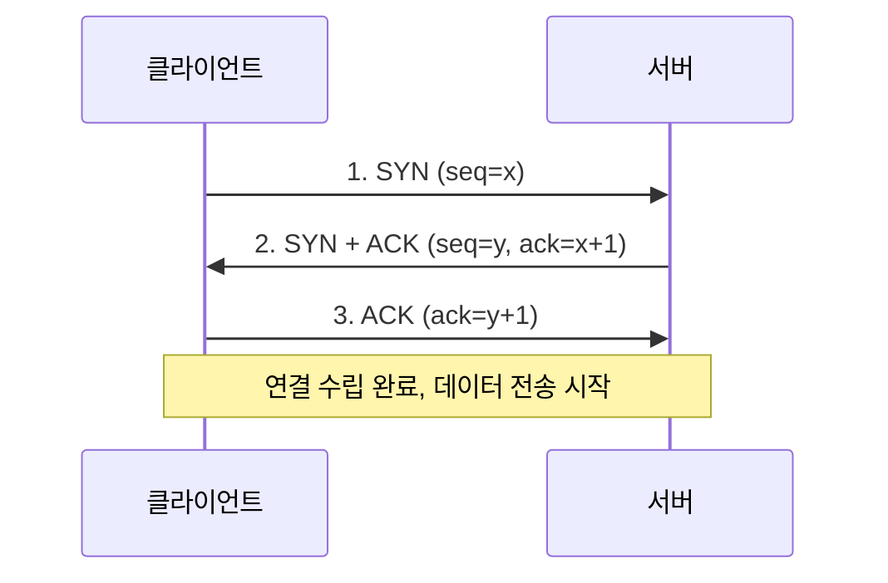
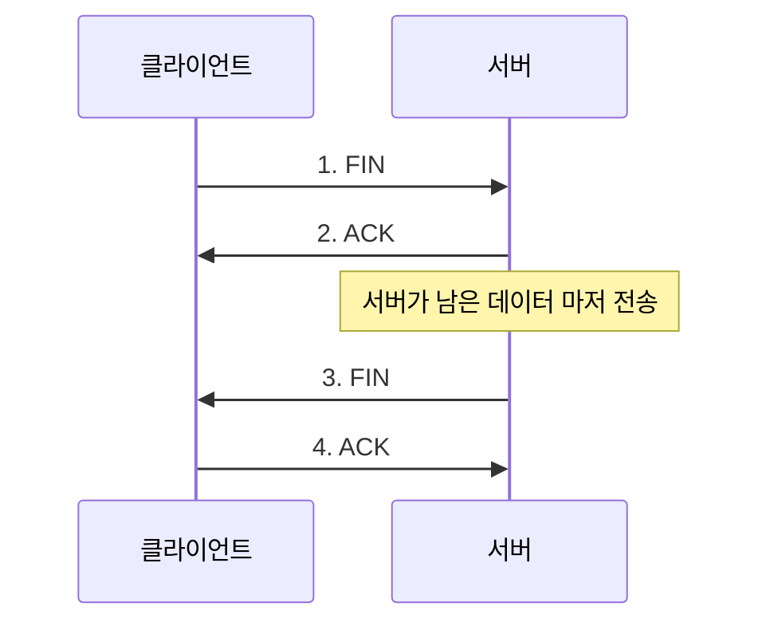

> 🤝 "TCP는 신뢰성 있는 연결이다"라는 말, 많이 들어보셨죠? 그 신뢰성의 시작이 바로
> **3-Way Handshake**입니다. 왜 딱 세 번인지, 두 번이나 네 번이면 안 되는지부터 살펴봅시다.
> ([RFC 9293](https://datatracker.ietf.org/doc/html/rfc9293) 기준으로 씁니다.)

## TCP가 "연결형" 프로토콜인 이유

TCP는 실제 데이터를 보내기 전에 **먼저 통신 상대와 "연결"을 맺습니다.** 전화를 걸 때 상대가 받아야 대화가 시작되는 것과 비슷해요(단, 이 비유는 "왜 하필 세 번의 확인이 필요한지"까지는 설명하지 못하니 아래에서 정확히 짚습니다). 이 연결을 맺는 과정이 바로 **3-Way Handshake**입니다. (UDP는 이 과정 없이 그냥 던지듯 보내는 "비연결형"이라 더 빠르지만 신뢰성이 없죠.)

## 3단계, 순서대로



1. **SYN**: 클라이언트가 "연결하고 싶어요"라는 의미로 `SYN` 플래그와 임의의 시작 순서번호(`seq=x`)를 보냅니다.
2. **SYN + ACK**: 서버가 "받았어요, 저도 연결할게요"라는 의미로 자신의 `SYN`과 함께, 클라이언트 순서번호를 잘 받았다는 `ACK(x+1)`을 함께 보냅니다.
3. **ACK**: 클라이언트가 "확인했어요"라는 의미로 서버 순서번호에 대한 `ACK(y+1)`을 보내며 연결이 완성됩니다.


## 왜 하필 세 번일까

- **한 번(SYN만)**: 클라이언트가 보낸 요청이 서버에 잘 도착했는지 클라이언트가 확인할 방법이 없습니다.
- **두 번(SYN, SYN+ACK)**: 서버는 자신이 보낸 `SYN+ACK`을 클라이언트가 잘 받았는지 확인할 수 없습니다. 만약 유실됐다면 서버는 연결됐다고 착각한 채 자원을 낭비하게 됩니다.
- **세 번(SYN, SYN+ACK, ACK)**: 양쪽 모두가 "내가 보낸 것을 상대가 받았다"는 사실을 확인한 상태가 됩니다. 즉 **양방향 신뢰**가 확보되는 최소 횟수가 3번입니다.

핵심은 이겁니다. **"내 말을 상대가 들었다"뿐 아니라 "상대가 들었다는 걸 나도 확인했다"까지** 필요하기 때문에 최소 3번의 주고받음이 필요합니다.

## 순서번호(Sequence Number)는 왜 필요한가

TCP는 데이터를 여러 패킷(세그먼트)으로 쪼개 보내는데, 네트워크 특성상 **순서가 뒤바뀌거나 일부가 유실**될 수 있습니다. 핸드셰이크 때 교환한 순서번호를 기준으로 이후 각 패킷에 번호를 매기기 때문에, 수신 측은 이 번호로 **순서를 재조립**하고 **빠진 패킷을 감지해 재전송을 요청**할 수 있습니다. 이게 TCP가 "신뢰성 있다"고 불리는 핵심 이유 중 하나입니다.

## 연결을 끊을 때는 4-Way Handshake

연결을 맺을 땐 3번이지만, 끊을 땐 보통 **4번**을 주고받습니다.



연결 종료가 4번인 이유는, 서버가 `FIN`을 받아도 **아직 클라이언트에 보낼 데이터가 남아있을 수 있기 때문**입니다. 그래서 일단 `ACK`로 "알겠다"고만 답하고, 자기 할 일을 마친 뒤 별도로 `FIN`을 보냅니다. 연결 수립은 "동시에 준비"만 하면 되지만, 종료는 "각자 할 일을 마쳐야" 하기 때문에 한 단계가 더 필요한 셈이죠.


## 안티패턴 vs 권장 패턴 — 짧은 요청마다 새 연결을 맺는 문제

```text
❌ 안티패턴: API 요청 100개를 보낼 때마다 매번 새 TCP 연결을 맺고 끊음
   → 매 요청마다 3-way handshake(연결) + 4-way handshake(종료) 왕복 비용 발생

✅ 권장 패턴: Keep-Alive / 커넥션 풀로 TCP 연결을 재사용
   → 한 번 맺은 연결로 여러 요청을 흘려보내 핸드셰이크 비용을 요청 1개에만 지불
```

HTTP/1.1부터는 `Connection: keep-alive`가 기본값이라 별도 설정 없이도 연결이 재사용되는 경우가 많지만, 직접 소켓을 다루거나 커넥션 풀 설정을 건드릴 때는 이 비용을 의식해야 합니다. 특히 지연시간(RTT)이 큰 네트워크에서는 연결마다 발생하는 핸드셰이크 왕복이 누적되어 전체 응답 속도에 영향을 주는 경향이 있습니다.

## 면접에서 자주 나오는 질문

- **"왜 2-way가 아니라 3-way인가요?"** → 양방향 신뢰(내가 보낸 걸 상대가 받았는지 확인) 확보를 위한 최소 횟수이기 때문입니다.
- **"SYN Flooding이 뭔가요?"** → 공격자가 `SYN`만 잔뜩 보내고 마지막 `ACK`을 보내지 않아, 서버가 "반쯤 열린 연결(half-open)" 상태를 계속 대기하며 자원을 소모하게 만드는 공격입니다. 3-way handshake의 구조적 특성을 악용한 대표적인 DoS 공격 유형입니다.
- **"연결 종료는 왜 3-way가 아니라 4-way인가요?"** → 연결 수립은 서로 동시에 준비만 되면 되지만, 종료는 각자 남은 데이터를 다 보낸 뒤에 끝내야 하므로 `ACK`과 `FIN`이 분리되기 때문입니다.

## 흔한 오해 바로잡기

1. **"3-way handshake가 끝나야 데이터가 전송된다는 건, 그 전엔 아무 데이터도 못 보낸다는 뜻이다"** — 대체로 맞지만, TCP Fast Open(TFO)처럼 초기 SYN 패킷에 데이터를 실어보내 지연을 줄이는 확장 기능도 존재합니다. 다만 이는 표준 handshake와 별개의 확장 기능이라는 점을 구분해야 합니다.
2. **"HTTPS는 TCP handshake만 거치면 된다"** — 아닙니다. HTTPS는 TCP 3-way handshake 이후에 **TLS handshake**를 추가로 거쳐야 암호화 연결이 완성됩니다. 그래서 HTTP보다 초기 연결이 한 단계 더 걸립니다.
3. **"handshake는 매 요청마다 반드시 새로 일어난다"** — 아닙니다. Keep-Alive나 커넥션 풀을 쓰면 한 번 맺은 TCP 연결을 여러 요청에 재사용할 수 있습니다.

## 셀프 체크 질문

1. TCP 연결 수립이 2번이 아니라 3번의 패킷 교환을 필요로 하는 이유를 설명할 수 있나요?
2. SYN Flooding 공격이 3-way handshake의 어떤 특성을 악용하나요?
3. 연결 종료가 4-way인 이유를 연결 수립(3-way)과 비교해서 설명할 수 있나요?

:::toggle 정답 보기
1. 한쪽만 확인해서는 "내가 보낸 걸 상대가 받았는지"까지는 알 수 없습니다. 양쪽 모두가 "상대가 내 메시지를 받았다"는 사실을 확인하려면 최소 3번의 주고받음(SYN → SYN+ACK → ACK)이 필요합니다.
2. 서버가 `SYN+ACK`을 보낸 뒤 클라이언트의 마지막 `ACK`을 기다리는 "반쯤 열린 연결(half-open)" 상태를 이용합니다. 공격자가 `ACK`을 보내지 않고 `SYN`만 계속 보내면, 서버는 응답을 계속 대기하며 자원을 소모하게 됩니다.
3. 연결 수립은 양쪽이 "준비됐다"는 것만 확인하면 되지만, 종료는 각자 아직 보낼 데이터가 남아있을 수 있어 "내가 받았다는 확인(ACK)"과 "나도 이제 끝낼게(FIN)"를 분리해서 보내야 하기 때문에 한 단계가 더 필요합니다.
:::

## 더 깊이 파고들기

- [RFC 9293 — Transmission Control Protocol (TCP)](https://datatracker.ietf.org/doc/html/rfc9293) — 3-way handshake와 연결 종료 절차가 정의된 현재 TCP 표준 문서입니다.

## 마치며

3-Way Handshake는 "TCP가 왜 느리지만 신뢰성 있는가"를 설명하는 가장 근본적인 메커니즘입니다. 실제 요청 하나를 보내기 전에 이 세 번의 패킷 교환이 먼저 일어난다는 걸 이해하면, HTTPS 연결이 왜 TCP handshake + TLS handshake까지 겹쳐서 "느리게 느껴지는지"도 자연스럽게 이해가 됩니다. 🤝
