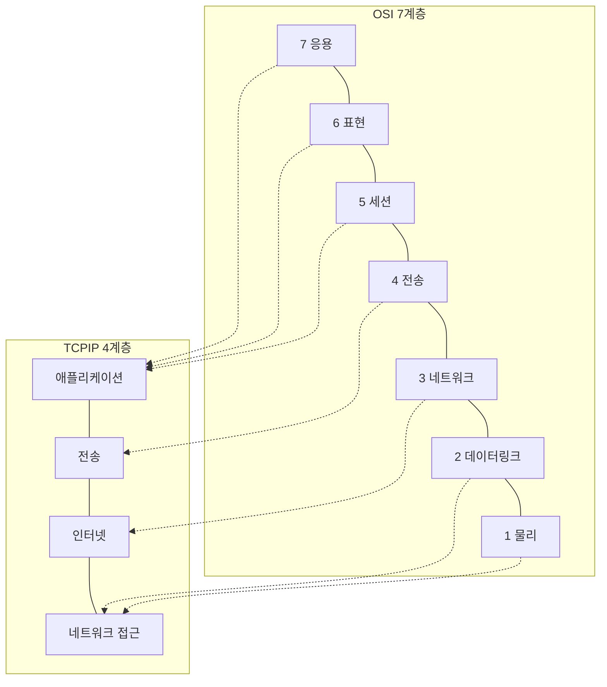
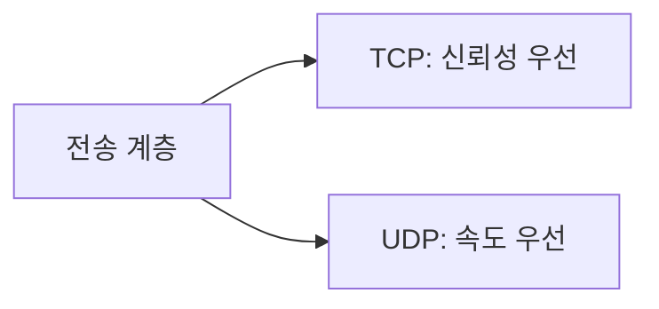

> 🌐 OSI 7계층은 교과서 모델이고, **실제 인터넷은 TCP/IP 4계층**으로 동작합니다.
> 둘의 차이를 모르면 "그래서 실무에선 뭘 봐야 하나요?"에서 막히기 쉽습니다.
> (계층 구조와 요구사항은 [RFC 1122](https://datatracker.ietf.org/doc/html/rfc1122) 기준으로 씁니다.)

## TCP/IP 4계층이란

**TCP/IP 모델**은 실제로 인터넷이 표준으로 삼고 있는 네트워크 모델입니다. OSI 7계층이 개념적/이론적 모델이라면, TCP/IP 4계층은 **실제 구현을 기준으로 정리된 실용 모델**이에요. 계층 수는 다르지만 하는 일은 OSI 7계층과 상당 부분 겹칩니다.

| TCP/IP 4계층 | 대응하는 OSI 계층 | 역할 | 대표 프로토콜 |
| --- | --- | --- | --- |
| 애플리케이션 계층 | 응용+표현+세션 (5~7) | 사용자 서비스 제공 | HTTP, DNS, FTP |
| 전송 계층 | 전송 (4) | 포트 기반 전달, 신뢰성 제어 | TCP, UDP |
| 인터넷 계층 | 네트워크 (3) | IP 기반 경로 탐색 | IP, ICMP |
| 네트워크 접근 계층 | 데이터링크+물리 (1~2) | 실제 물리적 전송 | Ethernet, Wi-Fi |




## 계층별로 조금 더 자세히

### 1. 네트워크 접근 계층 (Network Access / Link Layer)

물리적인 케이블, 이더넷, 와이파이를 통해 실제로 비트를 주고받는 가장 아래 계층입니다. **MAC 주소**로 같은 네트워크 안의 장비를 식별합니다.

### 2. 인터넷 계층 (Internet Layer)

**IP 주소**를 이용해 데이터를 목적지까지 어떻게 보낼지 **경로(라우팅)**를 결정합니다. 이 계층의 핵심 프로토콜이 바로 **IP(Internet Protocol)**입니다. `192.168.0.1` 같은 주소가 여기서 쓰입니다.

### 3. 전송 계층 (Transport Layer)

**포트 번호**로 같은 컴퓨터 안에서도 어떤 애플리케이션에 데이터를 전달할지 결정합니다. 대표 프로토콜은 둘입니다.

- **TCP**: 순서 보장 + 재전송 + 흐름/혼잡 제어. 신뢰성이 중요한 웹, 이메일, 파일 전송에 사용.
- **UDP**: 순서·재전송 보장 없이 빠르게 전송. 실시간 스트리밍, 온라인 게임처럼 속도가 더 중요한 경우 사용.



### 4. 애플리케이션 계층 (Application Layer)

우리가 실제로 개발하는 대부분의 로직이 여기 있습니다. **HTTP**로 웹 요청을 주고받고, **DNS**로 도메인을 IP로 변환하고, **FTP**로 파일을 전송하는 등, 사람이 직접 다루는 서비스 프로토콜이 이 계층에 속합니다.

## 실제 예시: 브라우저에서 사이트 접속할 때

```
1. 애플리케이션 계층: 브라우저가 "GET / HTTP/1.1" 요청 생성
2. 전송 계층: TCP가 포트(443) 붙이고 3-way handshake로 연결 수립
3. 인터넷 계층: IP가 목적지 IP 주소를 붙이고 라우팅 경로 결정
4. 네트워크 접근 계층: 실제 이더넷/와이파이 신호로 전송
```

## OSI vs TCP/IP, 왜 계층 수가 다를까

OSI는 **표준화 논의를 위한 이론 모델**로 먼저 설계되어 역할을 세밀하게 7개로 쪼갰습니다. 반면 TCP/IP는 **먼저 구현되고 실제로 인터넷의 표준이 된 실용 모델**이라, 세션·표현 계층처럼 실무에서 굳이 분리할 필요가 적은 역할들을 애플리케이션 계층에 뭉뚱그려 넣었습니다.

그래서 실무 대화에서는 "전송 계층", "IP 계층" 같은 TCP/IP 용어가 훨씬 자주 쓰이고, OSI는 "개념 설명"이나 "면접"에서 더 자주 등장합니다.


앞서 쓴 OSI 건물 비유는 "계층 수가 다르다"는 느낌은 잘 전달하지만, **왜** TCP/IP가 세션·표현 계층을 따로 안 나눴는지는 설명해주지 않습니다. 그건 "표준을 먼저 설계했느냐, 구현을 먼저 하고 나중에 모델링했느냐"라는 역사적 배경의 차이입니다 — 비유보다는 이 배경을 기억하는 게 더 정확합니다.

## 안티패턴 vs 권장 패턴 — 계층을 헷갈려서 생기는 디버깅 실수

```text
❌ 안티패턴: "핑(ping)은 되는데 사이트가 안 열려요" → 계속 네트워크 케이블/와이파이만 점검

✅ 권장 패턴: ping이 된다는 건 인터넷 계층(IP)까지는 정상이라는 뜻 →
   전송 계층(포트가 막혀있진 않은지)과 애플리케이션 계층(HTTP 응답이 정상인지)으로
   점검 범위를 좁혀 올라간다
```

ping은 ICMP를 이용해 인터넷 계층까지의 연결을 확인하는 도구입니다. ping이 성공했다는 건 그 위 계층(전송/애플리케이션)에 문제가 있다는 뜻인데, 계층 구분 없이 "네트워크 문제"로 뭉뚱그리면 애먼 곳(케이블, 와이파이 재설정)을 반복해서 건드리게 됩니다.

## 흔한 오해 바로잡기

1. **"TCP/IP는 TCP와 IP, 이 두 개의 프로토콜만 가리키는 말이다"** — 아닙니다. "TCP/IP"는 대표 프로토콜 두 개의 이름을 땄을 뿐, 실제로는 HTTP·DNS·UDP 등을 포함한 **프로토콜 모음(스택) 전체**를 가리키는 용어입니다.
2. **"IP 주소만 있으면 통신이 된다"** — 아닙니다. IP는 "어느 호스트로 갈지"만 정할 뿐, 그 호스트 안에서 "어느 애플리케이션으로 갈지"는 전송 계층의 포트 번호가 결정합니다. 둘 다 있어야 완전한 통신이 됩니다.
3. **"UDP는 TCP보다 열등한 프로토콜이다"** — 아닙니다. UDP는 신뢰성 보장을 포기한 대신 오버헤드가 적어 더 빠릅니다. 실시간 스트리밍, 온라인 게임, DNS 조회처럼 약간의 손실보다 속도가 더 중요한 상황에 의도적으로 선택됩니다.

## 셀프 체크 질문

1. TCP/IP 4계층에서 OSI의 세션·표현·응용 계층이 하나로 합쳐진 이유는 무엇인가요?
2. ping 명령이 성공했다면, 어느 계층까지 정상 동작한다고 볼 수 있나요?
3. TCP와 UDP 중 실시간 온라인 게임에 더 적합한 프로토콜은 무엇이고, 그 이유는 무엇인가요?

:::toggle 정답 보기
1. TCP/IP는 먼저 실제 구현되고 인터넷 표준이 된 실용 모델이라, 실무에서 굳이 세밀하게 나눌 필요가 적었던 세션·표현 계층의 역할을 애플리케이션 계층에 통합했습니다. OSI는 반대로 이론이 먼저 설계되어 역할을 세밀하게 쪼갰습니다.
2. 인터넷 계층(IP)까지는 정상입니다. ping은 ICMP를 이용해 목적지 호스트까지 IP 경로가 살아있는지 확인하는 도구이기 때문입니다.
3. UDP가 더 적합합니다. 온라인 게임은 손실된 패킷을 재전송 받느라 지연되는 것보다, 약간의 데이터 손실을 감수하더라도 최신 상태를 빠르게 받는 게 더 중요하기 때문입니다.
:::

## 더 깊이 파고들기

- [RFC 1122 — Requirements for Internet Hosts](https://datatracker.ietf.org/doc/html/rfc1122) — 인터넷 호스트가 지켜야 할 링크/IP/전송 계층 요구사항을 정의한 표준 문서입니다.
- [RFC 9293 — Transmission Control Protocol (TCP)](https://datatracker.ietf.org/doc/html/rfc9293) — 전송 계층의 핵심 프로토콜인 TCP의 최신 스펙입니다.

## 마치며

두 모델을 굳이 경쟁 관계로 볼 필요는 없습니다. **OSI 7계층은 개념을 세밀하게 이해하기 위한 지도**, **TCP/IP 4계층은 실제로 인터넷이 돌아가는 방식**이라고 구분해서 기억하면 됩니다. 다음 글에서는 전송 계층의 핵심 동작인 **TCP 3-way handshake**를 자세히 다뤄보겠습니다. 🌐
