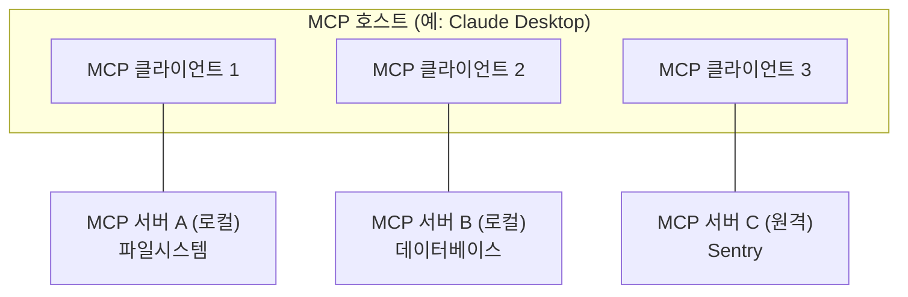
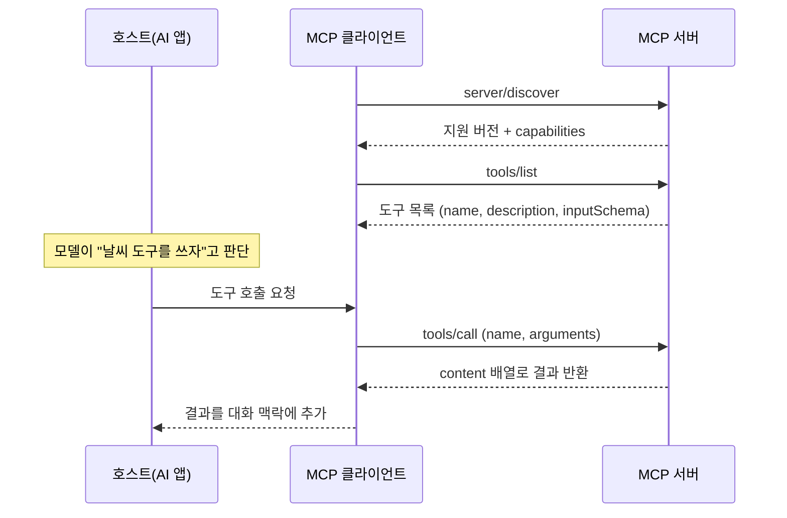

> 🔌 "AI한테 우리 회사 DB랑 슬랙을 붙이고 싶은데, 어떻게 붙이지?"
> 이 질문에 대한 업계 공통의 대답이 **MCP(Model Context Protocol)** 입니다.
> 이 글은 MCP가 무엇이고, 왜 생겼고, 안에서 무슨 일이 벌어지는지를 **2026-07-28 스펙 기준**으로 정리합니다.

---

## LLM은 똑똑한데 왜 아무것도 못 할까

언어 모델 자체는 대화만 할 수 있습니다. 내 파일을 읽지도, DB를 조회하지도, 슬랙에 메시지를 보내지도 못합니다.

그래서 우리는 모델에 "도구"를 붙입니다. 문제는 **붙이는 방식이 제품마다 전부 달랐다**는 점입니다.

챗봇 A에 깃허브를 붙이는 코드, 에디터 B에 깃허브를 붙이는 코드, 에이전트 C에 깃허브를 붙이는 코드가 전부 따로 존재했습니다. AI 애플리케이션이 M개, 붙일 시스템이 N개면 **M×N개의 연결 코드**가 필요한 셈이죠.


**MCP는 이 M×N을 M+N으로 바꾸자는 제안입니다.** 공식 문서는 MCP를 이렇게 소개합니다.

> AI 애플리케이션을 위한 USB-C 포트

USB-C를 하나 표준으로 정해두니 노트북 제조사와 주변기기 제조사가 서로를 신경 쓰지 않아도 되는 것처럼, 도구를 만드는 쪽은 **MCP 서버** 하나만 만들고 AI 앱을 만드는 쪽은 **MCP 클라이언트** 하나만 구현하면 됩니다.

이 발상은 새로운 게 아닙니다. 공식 스펙 문서도 **LSP(Language Server Protocol)** 에서 영감을 받았다고 밝히고 있습니다. 에디터마다 언어별 지원을 따로 만들던 시대를 LSP가 끝냈듯, MCP는 AI 앱마다 연동을 따로 만들던 시대를 겨냥합니다.

---

## 등장인물 셋: 호스트, 클라이언트, 서버

MCP는 클라이언트–서버 구조입니다. 다만 이름이 헷갈리기 쉬우니 한 번에 정리하고 갑시다.

| 이름 | 정체 | 예시 |
| --- | --- | --- |
| **MCP 호스트(Host)** | 사용자가 쓰는 AI 애플리케이션. 클라이언트들을 관리한다 | Claude Desktop, Claude Code, VS Code |
| **MCP 클라이언트(Client)** | 호스트 안에서 **서버 하나와 1:1 연결**을 담당하는 부품 | 호스트가 서버 수만큼 만들어 냄 |
| **MCP 서버(Server)** | 도구·데이터를 제공하는 프로그램 | 파일시스템 서버, 노션 서버, Sentry 서버 |

핵심은 **연결이 1:1**이라는 점입니다. 호스트가 서버 세 개에 붙는다면, 호스트 안에 클라이언트 객체가 세 개 생깁니다.



여기서 자주 하는 오해 하나. **"서버"라는 말이 붙었다고 꼭 어딘가 원격에 떠 있는 게 아닙니다.** 내 노트북에서 프로세스로 실행되는 것도 엄연히 MCP 서버입니다. 로컬이냐 원격이냐를 가르는 건 위치가 아니라 **전송 방식**입니다.

## 두 개의 층 — 데이터 계층과 전송 계층

MCP는 두 층으로 나뉩니다.

- **데이터 계층**: 무슨 말을 주고받는가. **JSON-RPC 2.0** 기반이며 프리미티브(도구·리소스·프롬프트)와 알림을 정의합니다.
- **전송 계층**: 그 말을 어떻게 실어 나르는가. 연결 수립, 메시지 프레이밍, 인증을 담당합니다.

중요한 성질은 **전송 방식이 달라져도 메시지의 의미는 똑같다**는 것입니다. 전송 계층은 "바인딩"일 뿐이라, stdio로 붙이든 HTTP로 붙이든 `tools/call`은 똑같은 `tools/call`입니다.

표준 전송 방식은 두 가지입니다.

| | **stdio** | **Streamable HTTP** |
| --- | --- | --- |
| 동작 | 클라이언트가 서버를 **자식 프로세스로 실행**하고 표준 입출력으로 줄바꿈 구분 메시지를 주고받음 | 메시지를 단일 엔드포인트로 **HTTP POST**, 응답은 JSON 또는 요청 범위의 SSE 스트림 |
| 위치 | 같은 머신(로컬) | 원격 가능 |
| 인증 | 별도 없음(프로세스 권한을 그대로 물려받음) | Bearer 토큰·API 키 등 표준 HTTP 인증, **OAuth 권장** |
| 보통 섬기는 클라이언트 수 | 1개 | 여러 개 |
| 언제 쓰나 | 내 파일·로컬 DB처럼 **내 머신 안의 것**을 붙일 때 | 팀이 함께 쓰는 SaaS·사내 서비스를 붙일 때 |

**선택 기준은 단순합니다.** 붙이려는 대상이 내 컴퓨터 안에 있으면 stdio, 네트워크 너머에 있고 여러 사람이 함께 쓰면 Streamable HTTP입니다. 로컬 도구를 굳이 HTTP 서버로 띄우면 인증·네트워크 문제를 공짜로 얻게 되고, 반대로 팀 공용 서비스를 stdio로 만들면 사람마다 프로세스를 따로 띄워야 합니다.

---

## 프리미티브 — MCP가 실제로 주고받는 것

MCP에서 가장 중요한 개념은 **프리미티브(primitive)** 입니다. 서버와 클라이언트가 서로에게 무엇을 제공할 수 있는지를 정의합니다.


**서버가 제공하는 세 가지:**

- **Tools(도구)**: AI가 **실행**할 수 있는 함수. 파일 쓰기, API 호출, DB 쿼리처럼 행동을 일으킵니다.
- **Resources(리소스)**: AI에게 **읽히는** 데이터. 파일 내용, DB 레코드, API 응답 같은 맥락 정보입니다.
- **Prompts(프롬프트)**: 재사용 가능한 **템플릿**. 정해진 작업을 위한 시스템 프롬프트나 few-shot 예시를 서버가 제공합니다.

셋의 차이는 **누가 주도하느냐**로 갈립니다. 도구는 모델이 판단해서 호출하고, 리소스는 맥락으로 주입되며, 프롬프트는 사용자가 골라서 씁니다.

**클라이언트가 제공하는 것:**

- **Elicitation**: 서버가 사용자에게 **추가 정보를 되묻는** 기능. "이 작업 진행할까요?" 같은 확인이나 부족한 입력값을 받아낼 때 씁니다.

> ⚠️ 오래된 MCP 글에는 클라이언트 기능으로 **Sampling**(서버가 클라이언트의 LLM을 빌려 쓰는 기능)과 **Logging**이 자주 등장합니다. 이 둘은 프로토콜 버전 `2026-07-28` 기준 **deprecated** 입니다. 새로 만든다면 LLM은 각 제공사 API에 직접 붙이고, 로그는 stderr나 OpenTelemetry로 보내라고 안내합니다.

각 프리미티브에는 발견용 `*/list`, 조회용 `*/get`, 그리고 도구의 경우 실행용 `tools/call` 메서드가 짝지어져 있습니다. 클라이언트는 먼저 목록을 물어보고, 그다음에 실행합니다.

## 실제 대화 들여다보기

말로만 보면 추상적이니 오가는 메시지를 봅시다. 흐름은 이렇습니다.



서버가 도구 목록을 돌려줄 때는 이런 모양입니다. **`inputSchema`가 JSON Schema라는 점**이 핵심인데, 덕분에 모델이 인자 형태를 정확히 알고 호출할 수 있습니다.

```json
{
  "name": "weather_current",
  "title": "Weather Information",
  "description": "Get current weather information for any location worldwide",
  "inputSchema": {
    "type": "object",
    "properties": {
      "location": {
        "type": "string",
        "description": "City name, address, or coordinates (latitude,longitude)"
      },
      "units": {
        "type": "string",
        "enum": ["metric", "imperial", "kelvin"],
        "default": "metric"
      }
    },
    "required": ["location"]
  }
}
```

실제 호출과 응답은 평범한 JSON-RPC 2.0입니다.

```json
{
  "jsonrpc": "2.0",
  "id": 3,
  "method": "tools/call",
  "params": {
    "name": "weather_current",
    "arguments": { "location": "San Francisco", "units": "imperial" }
  }
}
```

응답은 `content` 배열로 옵니다. 텍스트뿐 아니라 이미지·리소스 등 여러 타입을 담을 수 있어서, 한 번의 호출로 풍부한 결과를 돌려줄 수 있습니다.

> 💡 `2026-07-28` 스펙의 MCP는 **상태 없는(stateless) 프로토콜**입니다. 모든 요청이 `_meta` 필드에 프로토콜 버전과 클라이언트 capability를 실어 보내기 때문에, 서버는 이전 요청을 기억하지 않아도 각 요청을 독립적으로 처리할 수 있습니다. 예전 버전의 `initialize` 핸드셰이크 기반 세션을 기억하고 있다면 이 부분이 바뀐 지점입니다.

---

## 직접 만들어 보기 — 30줄이면 뼈대가 선다

개념만 보면 거창하지만 서버 하나 만드는 건 생각보다 짧습니다. TypeScript 기준 뼈대입니다.

```bash
npm install @modelcontextprotocol/server zod
npm install -D @types/node typescript
```

```typescript
import { McpServer } from "@modelcontextprotocol/server";
import { StdioServerTransport } from "@modelcontextprotocol/server/stdio";
import { z } from "zod";

const server = new McpServer({
  name: "weather",
  version: "1.0.0",
});

server.registerTool(
  "get_alerts",
  {
    description: "Get weather alerts for a state",
    inputSchema: z.object({
      state: z.string().length(2).describe("Two-letter state code (e.g. CA, NY)"),
    }),
  },
  async ({ state }) => {
    // 실제 조회 로직
    return {
      content: [{ type: "text", text: `Active alerts for ${state.toUpperCase()}: ...` }],
    };
  }
);

async function main() {
  const transport = new StdioServerTransport();
  await server.connect(transport);
  console.error("Weather MCP Server running on stdio");
}

main().catch((error) => {
  console.error("Fatal error in main():", error);
  process.exit(1);
});
```

여기서 눈여겨볼 점 하나. **stdio 전송에서는 표준 출력이 프로토콜 통신 채널입니다.** 그래서 로그를 `console.log`로 찍으면 JSON-RPC 메시지 스트림을 오염시켜 연결이 깨집니다. 위 코드가 `console.error`(stderr)를 쓰는 게 그 이유입니다.

> SDK의 패키지명과 API는 버전에 따라 달라질 수 있습니다. 위 예시는 `2026-07-28` 문서 기준이며, 실제로 만들 때는 공식 SDK 문서를 확인하세요.

## 안티패턴 vs 권장 패턴 — 도구 설명은 문서가 아니라 인터페이스다

MCP 서버를 처음 만들면 대개 여기서 품질이 갈립니다. 도구의 `name`과 `description`은 사람이 읽는 주석이 아니라 **모델이 읽고 판단하는 유일한 근거**입니다.

**❌ 안티패턴**

```json
{
  "name": "search",
  "description": "검색",
  "inputSchema": {
    "type": "object",
    "properties": { "q": { "type": "string" } }
  }
}
```

무엇을 검색하는지, 언제 써야 하는지, `q`에 뭘 넣어야 하는지가 전부 비어 있습니다. 서버가 여러 개 붙어 `search` 도구가 두 개 이상이 되면 모델은 사실상 찍게 됩니다.

**✅ 권장 패턴**

```json
{
  "name": "sentry_search_issues",
  "title": "Sentry 이슈 검색",
  "description": "Sentry 프로젝트에서 에러 이슈를 검색한다. 특정 에러의 발생 빈도나 최근 발생 여부를 확인할 때 사용한다. 이슈 상세 내용이 필요하면 sentry_get_issue를 이어서 호출한다.",
  "inputSchema": {
    "type": "object",
    "properties": {
      "query": { "type": "string", "description": "검색어. 에러 메시지나 예외 클래스명" },
      "period": { "type": "string", "enum": ["24h", "7d", "30d"], "default": "7d" }
    },
    "required": ["query"]
  }
}
```

차이가 만드는 결과는 명확합니다. 이름에 네임스페이스를 붙이면 서버 간 충돌이 줄고, 설명에 **"언제 쓰는지"와 "다음에 무엇을 호출할지"** 를 적으면 모델이 도구를 잘못 고르거나 엉뚱한 인자를 넣는 일이 줄어듭니다.

도구 개수도 트레이드오프입니다. 하나에 옵션을 몰아넣으면 모델이 인자를 조합하다 틀리고, 잘게 쪼개면 목록이 길어져 선택 실패와 토큰 비용이 늘어납니다. 기준은 **"사용자가 한 번에 의도하는 행동 단위"** 로 자르는 것입니다.

---

## 흔한 오해 세 가지

**오해 1. "MCP는 함수 호출(function calling)을 대체하는 기술이다."**

층이 다릅니다. 함수 호출은 *모델이 도구를 쓰겠다고 표현하는 방식*이고, MCP는 *그 도구를 애플리케이션에 연결하는 방식*입니다. MCP 서버가 노출한 도구는 결국 호스트가 모델에게 함수 목록으로 전달합니다. 경쟁 관계가 아니라 위아래 관계입니다.

**오해 2. "MCP 서버를 만들면 아무 AI에서나 쓸 수 있다."**

**클라이언트가 지원해야** 쓸 수 있습니다. Claude, ChatGPT, VS Code, Cursor 등 지원 범위가 넓어진 건 사실이지만, 지원하는 프로토콜 버전과 구현한 프리미티브는 제품마다 다릅니다. 리소스나 elicitation은 도구만큼 널리 구현돼 있지 않을 수 있으니, 붙이려는 호스트의 문서를 확인하세요.

**오해 3. "서버만 붙이면 안전하게 알아서 돌아간다."**

가장 위험한 오해입니다. 스펙 문서가 직접 경고합니다 — **도구는 임의 코드 실행이며, 도구의 설명이나 애노테이션은 신뢰할 수 있는 서버에서 온 게 아니라면 신뢰하지 말 것.**

## 보안 — 프로토콜이 대신 지켜주지 않는다

MCP 스펙은 보안 원칙을 명시하지만, **프로토콜 수준에서 강제하지는 못한다**고 스스로 밝힙니다. 구현하는 쪽이 지켜야 한다는 뜻입니다.

핵심 원칙 셋은 이렇습니다.

1. **사용자 동의와 통제** — 어떤 데이터에 접근하고 어떤 작업을 하는지 사용자가 이해하고 승인해야 합니다.
2. **데이터 프라이버시** — 호스트는 사용자 동의 없이 사용자 데이터를 서버에 노출하면 안 됩니다.
3. **도구 안전성** — 호스트는 **도구를 호출하기 전에 명시적 동의**를 받아야 합니다.

실무에서 이게 왜 중요한지는 한 문장으로 요약됩니다. **서버를 붙이는 순간, 그 서버가 노출한 도구 설명이 모델의 판단에 직접 영향을 줍니다.** 출처가 불분명한 MCP 서버는 설치하지 않는 편이 좋고, 사내에서 쓴다면 어떤 도구가 어떤 권한으로 무엇을 하는지 리뷰하는 절차가 필요합니다.

---

## 마무리 — 지금 뭘 하면 될까

MCP는 화려한 기술이라기보다 **지루하고 유용한 표준**에 가깝습니다. LSP가 그랬던 것처럼, 잘 되면 눈에 안 보이는 배관이 되는 게 목표입니다.

당장 해볼 수 있는 건 두 가지입니다. 하나는 쓰는 쪽 — 내가 매일 쓰는 서비스의 공식 MCP 서버를 AI 앱에 붙여보는 것. 다른 하나는 만드는 쪽 — 반복해서 열어보는 사내 API 하나를 도구 하나짜리 서버로 감싸보는 것입니다.

만들어 보면 알게 되는 사실이 하나 있습니다. 어려운 건 프로토콜이 아니라, **"이 도구를 언제 써야 하는지"를 모델이 알아들을 수 있게 쓰는 일**입니다.

## 셀프 체크 질문

1. MCP 호스트, 클라이언트, 서버의 관계를 설명하고, 서버 3개를 붙였을 때 클라이언트가 몇 개 생기는지 말해보세요.
2. stdio와 Streamable HTTP는 각각 어떤 상황에 쓰나요? 판단 기준 하나로 답해보세요.
3. Tools, Resources, Prompts는 무엇이 다른가요? "누가 주도하는가"로 구분해 설명해보세요.

:::toggle 정답 보기
1. **호스트**는 사용자가 쓰는 AI 애플리케이션이고, 그 안에서 서버 하나당 **클라이언트 하나**를 만들어 1:1 전용 연결을 유지합니다. 서버 3개를 붙이면 클라이언트도 3개가 생깁니다. 서버는 도구·데이터를 제공하는 프로그램이며, 로컬에서 프로세스로 돌든 원격에 떠 있든 모두 "서버"입니다.
2. 기준은 **붙이려는 대상이 내 머신 안에 있는가**입니다. 내 파일이나 로컬 DB처럼 같은 머신의 것이면 stdio(클라이언트가 자식 프로세스로 실행), 네트워크 너머에서 여러 사용자가 함께 쓰는 서비스면 Streamable HTTP(HTTP POST + 필요 시 SSE 스트림, OAuth 등 표준 인증)를 씁니다.
3. **Tools**는 모델이 판단해 호출하는 실행 가능한 함수(행동), **Resources**는 맥락으로 읽히는 데이터(정보), **Prompts**는 사용자가 골라 쓰는 재사용 템플릿입니다. 즉 주도권이 각각 모델·애플리케이션·사용자에게 있습니다.
:::

## 더 깊이 파고들기

- [MCP 공식 스펙](https://modelcontextprotocol.io/specification/latest) — 프로토콜의 1차 출처. 버전이 날짜(예: `2026-07-28`)로 관리되니, 글이나 블로그를 읽을 땐 어느 버전 기준인지부터 확인하는 습관이 필요합니다.
- [아키텍처 개요](https://modelcontextprotocol.io/docs/2026-07-28/learn/architecture) — 데이터 계층/전송 계층과 프리미티브를 실제 JSON-RPC 메시지 예제와 함께 설명합니다. 이 글에서 다룬 흐름의 원문입니다.
- [MCP 서버 만들기 튜토리얼](https://modelcontextprotocol.io/docs/2026-07-28/develop/build-server) — Python·TypeScript 등 언어별 실습. 날씨 서버를 만들어 실제 호스트에 붙이는 것까지 다룹니다.
- [레퍼런스 서버 모음](https://github.com/modelcontextprotocol/servers) — 공식 예제 구현들. 남이 만든 서버의 도구 설명과 스키마를 읽어보는 게 설계 감각을 익히는 가장 빠른 길입니다.
- [JSON-RPC 2.0 명세](https://www.jsonrpc.org/specification) — MCP 메시지의 바탕이 되는 규격. 짧으니 한 번 훑어두면 요청·응답·알림의 구분이 선명해집니다.
